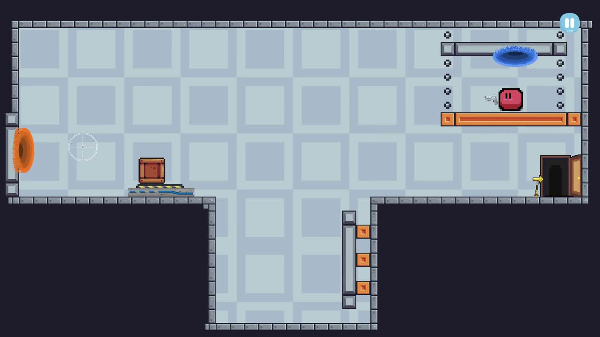

{/* _class: title-slide */}

<header>

# COMP3540/6540

Game Development

</header>

## Course Intro

TODO: convenor name

---

## Country of the Ngunnawal and Ngambri People

We acknowledge and celebrate the First Australians on whose traditional lands
we meet, and pay our respect to the elders past and present.

---

## What we do here

1. work out what makes play *work*
2. generate ideas and prototype them fast
3. playtest with real players and listen
4. build and ship a game with a team

---

{/* _class: impact */}

## You will make games

---

{/* _class: activity */}

## Activity: name a game that changed how you think

Two minutes. Tell the person next to you what it did and how.

---

## This semester

| week | theory | studio |
| ---- | ------ | ------ |
| 1 | play and formal elements | TODO |
| 2 | playcentric design, prototyping | TODO |
| 3 | engaging the player | TODO |

TODO: fill out from the learning outline.

---

## Questions?

TODO: contact and forum details.
