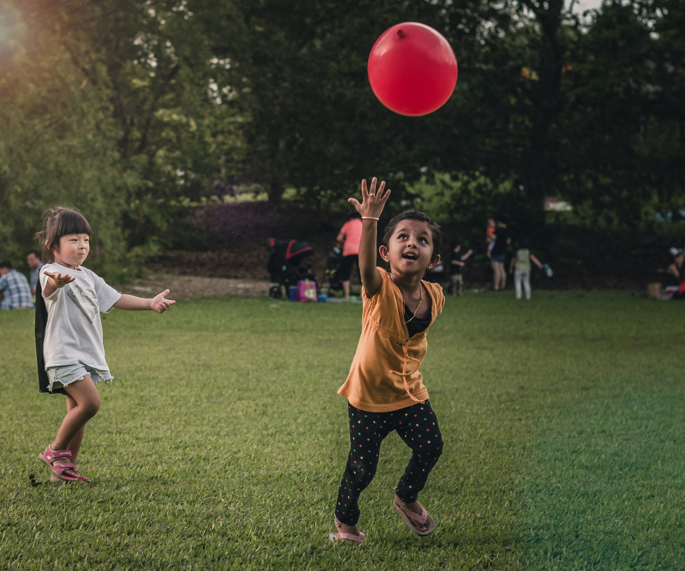
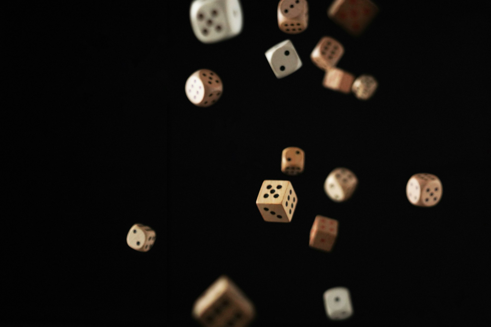
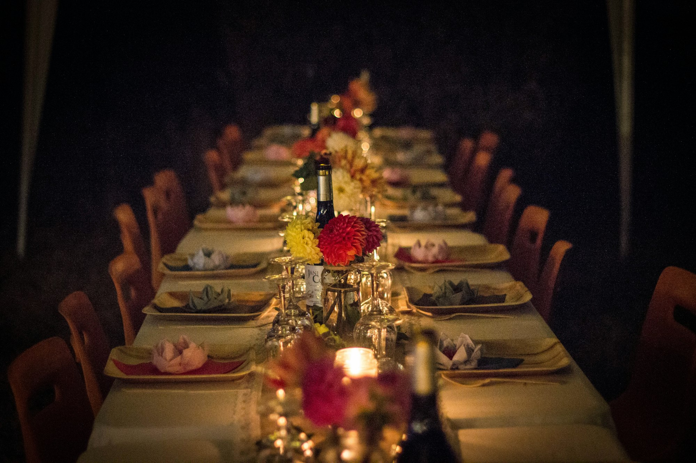

{/* Generated by scripts/convert-pptx-decks.py from the 2024 theory PowerPoints. Do not hand-edit: change the converter and re-run it. */}

{/* _class: title-slide */}

<header>

# Play & Games

COMP3540/6540 Game Development — Week 1 theory

Slides by Professor Penny Kyburz

</header>

---

## This lecture


- 01 — What is play?
- 02 — What is a game?
- 03 — How are they related/different?
- 04 — What is a game experience?

<div class="image-credit">Fullerton Ch. 1, 2, 4 — Schell Ch. 2, 4</div>

```comment
cut: the `Theory: ...` title block is the deck title and its readings, not a heading
```


---

## What is play?

- Loud, boisterous, physical
- Non-directed, not scripted
- Fun — and a child's work
- Not work; "meaningless behaviour"
- [Promise of Play (1 of 12): play in animals and children](https://www.youtube.com/watch?v=OkH9AE3y55Y)



<p class="deck-sr-only">Two small children in a park, one reaching up to catch a red balloon.</p>

<div class="image-credit">Fullerton p.102-103 — Photo by Alaric Sim on Unsplash</div>

```comment
cut: the nine loose text boxes were the slide's whole content — a word cloud around the question — and are now its bullets; the bare YouTube URL becomes the named video link; the children photograph moves from a full-bleed slide into the column
```


---

## Playful animals

- Play comes naturally to animals of a certain intelligence — pets
  - Easy to start playing on simple, understandable rules
  - Catch the ball, retrieve the stick, my hand is prey, obstacle course


<p class="deck-sr-only">A retriever standing in a muddy track carrying a branch far longer than itself.</p>

<div class="image-credit">Photo by Jamie Street on Unsplash</div>

```comment
cut: "(e.g., pets)" becomes a dash clause and "and many other activities that are key to survival as an adult" is shortened; all four of Penny's animal-play examples kept; the dog photograph moves from a full-bleed slide into the column
```


---

## Play and survival

- Young animals are particularly playful
  - Almost anything in their environment is an excuse to start gameplay
  - Without anyone teaching the animal the behaviour
- Play is fundamental to development and survival
  - Young animals refine the skills they need to hunt, fight, mate and hide as adults


---

## A playful approach

- Play helps us learn skills, acquire knowledge, socialise, problem solve, relax, see things differently — "fun"
- A process of experimentation, pushing boundaries, trying new things
  - Relevant to children, artists, scientists
- Not one thing — a state of mind, a "playful approach"

<div class="image-credit">Fullerton p.102-103</div>

```comment
cut: nothing dropped; the dash list is set as one bullet
```


---

## Types of play (Caillois)

- Roger Caillois. 1961. Man, Play, and Games — four fundamental types:
- Competitive (agon) — unregulated athletics: foot racing, wrestling
- Chance-based (alea) — counting-out rhymes: ini mini miny moe
- Make-believe (mimicry) — children's initiations, masks, disguises
- Vertigo (ilinx) — children "whirling", horseback riding, waltzing

<div class="image-credit">Fullerton p.102-103</div>

```comment
cut: the four types were loose text boxes off Caillois's table and are now the list, so the table is dropped; the translator and publisher of the 1961 edition are dropped from the citation; "Freeform play (paidia)" is a column head, not a type, and moves to the paidia/ludus slide
```


---

{/* _class: hero */}


<p class="deck-sr-only">Runners in lanes on a track, one ahead of the field.</p>

<div class="photo-caption">
Agon: competition. The contest is the point, and the rules make it fair enough to be worth winning.
<span class="photo-credit">Photo by Nicholas Wilson on Unsplash</span>
</div>


---

{/* _class: hero */}



<p class="deck-sr-only">Wooden dice tumbling in mid-air against a black background.</p>

<div class="photo-caption">
Alea: chance. The player submits to the roll, which is exactly why it is exciting.
<span class="photo-credit">Photo by Jonathan Greenaway on Unsplash</span>
</div>


---

{/* _class: hero */}


<p class="deck-sr-only">A stall of ornate Venetian carnival masks in reds, golds and blues.</p>

<div class="photo-caption">
Mimicry: make-believe. The mask is permission to be someone else for a while.
<span class="photo-credit">Photo by Llanydd Lloyd on Unsplash</span>
</div>


---

{/* _class: hero */}


<p class="deck-sr-only">A swing carousel spinning at night, its lights drawn into streaks.</p>

<div class="photo-caption">
Ilinx: vertigo. Play that works on the body by disturbing it.
<span class="photo-credit">Photo by Kiko Camaclang on Unsplash</span>
</div>


---

## Paidia and ludus

- "Paidia" and "ludus" for playing and gaming (Caillois, 1961) — two poles of play activities
  - Paidia — uncontrolled, free-form, improvisational: freeform play
  - Ludus — restricted, structured, goal-focused: rule-based play
- The same four types, played by rules:
  - Agon — boxing, billiards, fencing, checkers, football, chess
  - Alea — betting, roulette, lotteries
  - Mimicry — theatre, spectatorship
  - Ilinx — skiing, mountain climbing, tightrope walking

<div class="image-credit">Fullerton p.102-103</div>

```comment
cut: the slide's section header ("What is a game? How are games/play related/different?") is the next two slides' headings and is dropped here; the table is written out as bullets, and its paidia column repeats slide 6, so only the ludus examples are listed
```


---

{/* _class: impact */}

## How are games and play related?

- Games are a form of play with structure

<div class="image-credit">Fullerton p.102-103</div>

```comment
cut: the source slide's own question heads it as the deck's impact slide, answered in one line; nothing else dropped
```


---

## Rules and freedom

- Salen & Zimmerman (2003):
  - Games — the constraints of the rules are the rigid structure
  - Play — the freedom of players to act within those rules
- Rule-bound activities with goals, and at least one player who tries to fulfil them
- Games provide a safe context in which lessons can be learned through play

<div class="image-credit">Fullerton p.102-103</div>


---

{/* _class: hero */}


<p class="deck-sr-only">Two people leaning over a brightly coloured board game, mid-turn, cards and money spread around it.</p>

<div class="photo-caption">
A game is play with structure: the rules are the rigid part, and the freedom to act inside them is the play.
<span class="photo-credit">Photo by 2H Media on Unsplash</span>
</div>


---

## What is a game?

- A game is:
  - A closed, formal system, that
  - engages players in structured conflict, and
  - resolves its uncertainty in an unequal outcome


<p class="deck-sr-only">A black chess knight and a white chess knight facing each other on a board.</p>

<div class="image-credit">Fullerton p.48 — Schell p.45 — Photo by Hassan Pasha on Unsplash</div>

```comment
cut: Fullerton's definition and the seven properties are unchanged, one to a slide; the chess photograph moves from a full-bleed slide into the column beside the definition
```


---

## What every game has

- Games:
  - Are entered wilfully
  - Have goals, conflict, rules, challenge
  - Can be won and lost
  - Are interactive
  - Can create their own internal value
  - Engage players
  - Are closed, formal systems

<div class="image-credit">Fullerton p.48 — Schell p.45</div>


---

## The magic circle

- Games involve accepting imposed boundaries and rules to your behaviour — "suspension of disbelief", the "magic circle"
  - The gameplay experience is an artificial one
  - Games are an abstract construct, governed by a set of formalised rules
  - The rules that govern reality differ from those that govern the make-believe world
  - Also crucial to the enjoyment of film, literature, art, music

<aside class="slide-aside">

- Bernard Suits. 1978. The Grasshopper: Games, Life and Utopia.
- Johan Huizinga. 1938. Homo Ludens.

</aside>

```comment
cut: "Understand/accept" dropped as a lead-in from three bullets; "Lusory attitude" becomes the second slide's heading so the bullet does not repeat it; both definitions kept word for word, and Suits and Huizinga stay in the sidebar
```


---

## The lusory attitude

- Suits (1978): the psychological attitude required of a player entering into the play of a game
- To adopt a lusory attitude is to accept the arbitrary rules of a game, to facilitate the resulting experience of play


---

{/* _class: hero */}


<p class="deck-sr-only">Two players reaching across a dark table strewn with tokens and cards mid-game.</p>

<div class="photo-caption">
Inside the magic circle a piece of cardboard is a territory worth fighting over. The lusory attitude is what puts it there.
<span class="photo-credit">Photo by 2H Media on Unsplash</span>
</div>


---

## The game experience

- Designing a game is like being a party host (Fullerton)
  - Get everything ready — food, drinks, music — then open the doors and see what happens
  - Results are not always predictable, or what you envisioned
  - Only fully realised after your guests arrive
  - The party will vary based on your guests



<p class="deck-sr-only">A long dining table laid with candles and flowers in a dark room, before the guests arrive.</p>

<div class="image-credit">Fullerton p.4 — Schell p.11 — Photo by M F on Unsplash</div>

```comment
cut: "An interactive experience that is" dropped as a lead-in; "The game is not the experience" becomes the second slide's heading rather than repeating as its first bullet; both of Penny's framings kept; the laid-table photograph moves from a full-bleed slide into the column beside the party-host metaphor
```


---

## The game is not the experience

- The game enables and affords the experience (Schell)
- We cannot create experiences, we can only create games
- The experience exists between the player and the game

<div class="image-credit">Fullerton p.4 — Schell p.11</div>


---

{/* _class: impact */}

## Questions?

See the [course website](/) for everything else: workshops, assessments and resources.