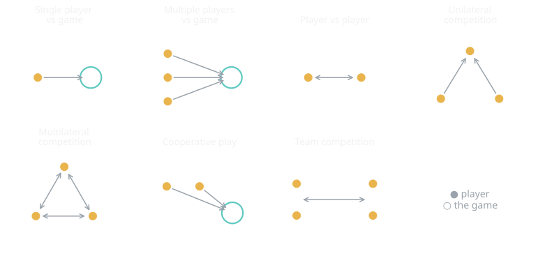
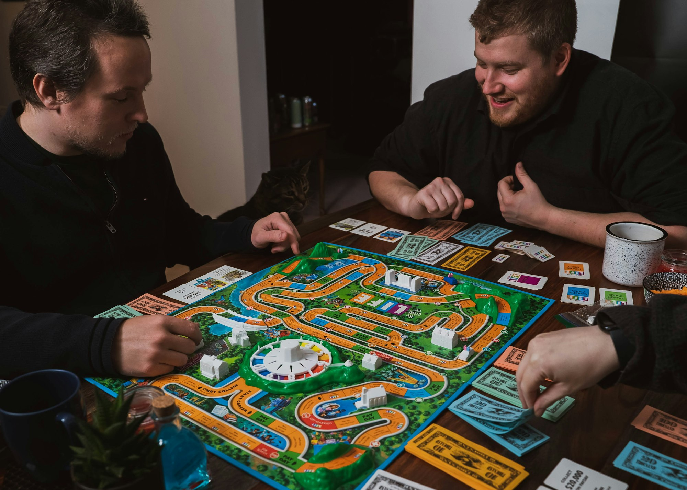

{/* Generated by scripts/convert-pptx-decks.py from the 2024 theory PowerPoints. Do not hand-edit: change the converter and re-run it. */}

{/* _class: title-slide */}

<header>

# Formal Elements

COMP3540/6540 Game Development — Week 1 theory

Slides by Professor Penny Kyburz

</header>

---

## This lecture


- 01 — Players
- 02 — Objectives
- 03 — Procedures
- 04 — Rules
- 05 — Resources
- 06 — Conflict
- 07 — Boundaries
- 08 — Outcome

<div class="image-credit">Fullerton Ch. 2, 3</div>

```comment
cut: the `Theory: Formal Elements Fullerton Ch. 2, 3` text box is the deck title plus its reading, not slide content; the eight-item agenda is unchanged
```


---

## The structure of games

- Players — the active participants
- Objectives — what players try to achieve
- Procedures — how players achieve the objectives
- Rules — govern the game; players abide by them
- Resources — what is valuable to the players
- Conflict — arises between the rules and the objectives
- Boundaries — the game takes place within them
- Outcome — the game drives towards an unequal one

<div class="image-credit">Fullerton Chapter 2 (p.33-38, 50), Chapter 3</div>

```comment
cut: the eight elements were full sentences all beginning "Games have" or "Players"; each is now the element and what it is. The lead-in "Formal elements form the structure of a game" is the heading
```


---

## Players

- Number of players — single or multiple, set or variable
- Roles of players — uniform or different; balance
  - Sports, Mastermind and Team Fortress give players different roles


<p class="deck-sr-only">Two players seen from behind, side by side, watching a split-screen game on a television.</p>

<div class="image-credit">Fullerton Chapter 2 (p.33-38, 50), Chapter 3 — Photo by Emily Wade on Unsplash</div>

```comment
cut: "Games are designed for players" dropped as a restatement of the heading; the one example and the seven interaction-pattern examples come from Penny's speaker notes for this slide, which the deck otherwise only kept in a comment; the notes' fuller glosses (bingo as "a single-player game in the company of other players", tag, Mortal Kombat as head-to-head) are compressed to the game names
```

```comment
Some games have different roles (e.g., sports, mastermind, Team Fortress)
Player interaction patterns: needs to consider structure of interaction between a player, the game system and other players
Single player versus game – a player competes against game system
Multiple individual players versus the game – action is not directed toward each other, no interaction between participants is required / necessary, essentially a single-player game in the company of other players – but there can still be competition (more like a race) - e.g., bingo
Player versus player – two players directly compete, makes it a personal contest, focused head-to-head play – e.g., fighting games – Mortal Combat
Unilateral competition – two or more players compete against one player – e.g., tag
Multilateral competition – three or more players directly compete (most multiplayer computer games) - e.g., StarCraft, poker
Cooperative play – two or more players cooperate against the game system – Portal 2
Team competition – two or more groups compete – e.g., team sports, DOTA
```


---

## Players: interaction patterns

- Interaction patterns structure play between a player, the game system and other players
  - Single player vs. game
  - Multiple individual players vs. game — bingo
  - Player vs. player, 2 head to head — Mortal Kombat
  - Unilateral competition, 2+ vs. 1 — tag
  - Multilateral competition, 3+ players — StarCraft, poker
  - Cooperative play, 2+ vs. the game — Portal 2
  - Team competition, 2+ groups — team sports, DOTA

<div class="image-credit">Fullerton Chapter 2 (p.33-38, 50), Chapter 3</div>


---

## Players

<figure class="deck-figure">



<figcaption>After Fullerton ch. 3; redrawn with our own notation</figcaption>

</figure>


---

## Objectives

- What players are trying to accomplish within the game rules
- Challenging but achievable
- Can set the tone of the game
- Different objectives for different players
- Players choose from several objectives
- Partial objectives help players achieve the main objective

<div class="image-credit">Fullerton Chapter 2 (p.33-38, 50), Chapter 3</div>

```comment
cut: "Define" dropped from the definition, which the heading supplies; "For you to think about:" becomes the second slide's heading instead of a bullet, and all five of Penny's questions are kept word for word
```


---

## Objectives: for you to think about

- What are some objectives of games you've played?
- What impact do these objectives have on the tone of the game?
- Do certain game types lend themselves to certain objectives?
- What about multiple objectives? Or player-defined objectives?
- Do objectives need to be explicit?

<div class="image-credit">Fullerton Chapter 2 (p.33-38, 50), Chapter 3</div>


---

## Common objective categories

- Capture — take the opponent's terrain or units without being captured or killed (chess, checkers, capture the flag)
- Chase — catch or elude an opponent
- Race — reach a goal, physical or conceptual, before other players
- Alignment — arrange game pieces (puzzles, Tetris, tic-tac-toe)
- Rescue or Escape — get defined units to safety (Super Mario Bros)

<div class="image-credit">Fullerton Chapter 2 (p.33-38, 50), Chapter 3</div>

```comment
cut: the ten categories are Fullerton's and all stay, with every game Penny named; only the "e.g.," hedges and "or" chains are cut
```


---

## Five more objective categories

- Forbidden Act — get the competition to "break the rules" (Twister)
- Construction — build, maintain or manage objects (Minecraft)
- Exploration — explore game areas (Zelda, GTA)
- Solution — solve a puzzle before the competition (Tetris, Zelda)
- Outwit — gain and use knowledge to defeat players (trivia)

<div class="image-credit">Fullerton Chapter 2 (p.33-38, 50), Chapter 3</div>


---

## Procedures

- Methods of play, and the actions players take to achieve the objectives
- Who does what, when and how
  - Who can use the procedure?
  - What exactly does the player do?
  - Where (location) does the procedure occur?
  - When (turn, time, game state) does it take place?
  - How (input) does the player access the procedure?



<p class="deck-sr-only">Two people leaning over a brightly coloured board game, mid-turn, cards and money spread around it.</p>

<div class="image-credit">Fullerton Chapter 2 (p.33-38, 50), Chapter 3 — Photo by 2H Media on Unsplash</div>

```comment
cut: nothing cut: the five questions and the four kinds of procedure are Fullerton's and are unchanged, with the source's own sub-heading carried onto the second slide
```


---

## Most games have these procedures

- Starting action — how to put the game into play
- Progression of action — ongoing procedures after the start
- Special actions — conditional on other elements or game state
- Resolving actions — bring gameplay to a close

<div class="image-credit">Fullerton Chapter 2 (p.33-38, 50), Chapter 3</div>


---

## Procedures: Connect Four

- Choose a player to go first
- On their turn, each player drops one of their colour checkers down any slot in the top of the grid
- Play alternates until a player gets four checkers of their colour in a row — horizontal, vertical or diagonal

<div class="image-credit">Fullerton Chapter 2 (p.33-38, 50), Chapter 3</div>

```comment
cut: the System procedures text box was loose on the source slide and is restored here as the second slide; the Connect Four rules are unchanged
```

```comment
figure omitted pending copyright review (see Fullerton Chapter 2 (p.33-38, 50), Chapter 3)
```


---

## System procedures

- Work behind the scenes, responding to situations and player actions
  - Combat system — calculate the damage taken, from character and weapon attributes
  - Board and paper games — the players calculate this themselves
  - Digital games can have far more complex system procedures

<div class="image-credit">Fullerton Chapter 2 (p.33-38, 50), Chapter 3</div>


---

## Rules

- Define the game objects, and the actions allowed to the player
  - How do players learn the rules?
  - How are the rules enforced?
  - What kinds of rules work best in certain situations?
  - Are there patterns to rule sets? What can we learn from those patterns?
- Too many rules — unplayable; too few rules — too simple
- The more complex the rules, the harder to understand

<div class="image-credit">Fullerton Chapter 2 (p.33-38, 50), Chapter 3</div>

```comment
cut: the source's sub-heading "Rules define objects/concepts, restrict actions, determine effects" is too long for a heading and becomes the second slide's short form; nothing else cut
```


---

## Rules: objects, actions, effects

- Objects and concepts can be entirely made up, or based on the real world — chess objects are abstractions of real ones, poker's are not
  - Digital game objects can be more complex and more numerous
  - How will players learn the nature of objects? Do they evolve?
- Restrictions — can overlap with players or boundaries
- Effects — triggered by certain circumstances

<div class="image-credit">Fullerton Chapter 2 (p.33-38, 50), Chapter 3</div>


---

{/* _class: impact */}

## What resources do you offer players?

- And how do you control access to them, to maintain the challenge?

<div class="image-credit">Fullerton Chapter 2 (p.33-38, 50), Chapter 3</div>

```comment
cut: reordered: the slide's own two designer questions are moved ahead of the definition so they can head the deck's impact slide; the definition and the utility/scarcity rule follow on the second slide, unchanged
```


---

## Resources

- Resources are assets that can be used to accomplish goals
  - Most games use some form of resources
- The designer manages resources, and how and when players reach them
- Resources need utility and scarcity
  - Otherwise they are useless or worthless

<div class="image-credit">Fullerton Chapter 2 (p.33-38, 50), Chapter 3</div>


---

## Common resource categories

- Lives — action and arcade games: a limited number to complete the goals
- Units — strategy: same or different, static or evolving, finite or renewable, at a cost
- Health — dramatises the loss of life; increased by pickups or rest
- Currency — an in-game economy that allows trade, common in role-playing
- Actions — moves or turns in card and board games; special, powerful actions

<div class="image-credit">Fullerton Chapter 2 (p.33-38, 50), Chapter 3</div>

```comment
cut: all nine of Fullerton's categories stay, each expanded from its parenthesis into a clause; nothing cut
```


---

## More resource categories

- Power-ups — boost the player's variables; scarce, limited in time or number
- Inventory — items for objectives, purchased or found; power balanced against scarcity
- Special Terrain — strategy and board games: occupy or control it
- Time — restricts actions and phases; an inherently dramatic force

<div class="image-credit">Fullerton Chapter 2 (p.33-38, 50), Chapter 3</div>


---

## Conflict

- Emerges from players pursuing the game's goals within its rules and boundaries
  - Rules and procedures block the direct route to the goals
  - They offer only inefficient means to the objectives
  - Challenge players, forcing them to employ skills
  - Creates competition and play — enjoyable, and a sense of achievement


<p class="deck-sr-only">Hands gripping a thick rope in a tug of war, pulling in opposite directions.</p>

<div class="image-credit">Fullerton Chapter 2 (p.33-38, 50), Chapter 3 — Photo by Joaquin Arenas on Unsplash</div>

```comment
cut: "trying to accomplish the goals of the game" compressed to "pursuing the game's goals"; the three consequences of challenge (competition/play, enjoyable, achievement) are one bullet instead of three, with the verb kept; the tug-of-war photograph is reused from the conflict material elsewhere in the course
```


---

## Sources of conflict

- Obstacles — physical and mental challenges, puzzles
- Opponents — the primary conflict in multiplayer games
- Dilemmas — choices the player has to make

<div class="image-credit">Fullerton Chapter 2 (p.33-38, 50), Chapter 3</div>


---

## Boundaries

- Separates the game from everything that is not the game
  - Physical — a playing field
  - Conceptual — a social agreement to play
  - Emotional — act differently, with no external consequences
- Players agree to play and enter the "magic circle"
  - Temporary — you can leave, which is the feeling of safety
- The designer defines them, and how the player enters and exits


<p class="deck-sr-only">A painted white line across a sports ground, grass on one side and bare dirt on the other.</p>

<div class="image-credit">Fullerton Chapter 2 (p.33-38, 50), Chapter 3 — Photo by Scott Greer on Unsplash</div>

```comment
cut: reordered: the three kinds of boundary (physical, conceptual, emotional) are nested under the definition, ahead of the magic circle and the designer, so the slide reads definition-then-kinds rather than the source's interleaving; "separate game from life (permission to act differently...)" compressed to the permission clause; the source's own question "Why are boundaries important?" becomes the second slide's heading and keeps both of Penny's examples
```


---

## Why are boundaries important?

- What if you played football with no boundaries?
- What if you could add money to Monopoly? Or extra cards to poker?

<div class="image-credit">Fullerton Chapter 2 (p.33-38, 50), Chapter 3</div>


---

## Outcome

- A measurable and unequal win condition
  - Producing a winner is the end state in most games
  - Simulation, sandpit, open world, ongoing worlds
- The outcome must be uncertain to hold attention

<div class="image-credit">Fullerton Chapter 2 (p.33-38, 50), Chapter 3</div>

```comment
cut: nothing cut; the four types move to their own slide so the win condition is not crowded
```


---

## Types of outcome

- Relate to interaction patterns and objectives
  - Zero-sum games
  - Ranking systems
  - Statistics
  - Multiple objectives

<div class="image-credit">Fullerton Chapter 2 (p.33-38, 50), Chapter 3</div>


---

## The formal elements, as questions

- Players — how many? Requirements? Roles?
- Objectives — what is the objective of the game?
- Procedures — what are the required actions for play?
- Rules — any limits on player actions? Rules for behaviour?
- Resources — what objects are valuable to players? Why?
- Conflict — what causes conflict in the game?
- Boundaries — what are they? Physical or conceptual?
- Outcome — what are the potential outcomes?

<div class="image-credit">Fullerton Chapter 2 (p.33-38, 50), Chapter 3</div>

```comment
cut: the repeated sub-heading "Formal elements form the structure of a game" is folded into a heading that distinguishes this recap from the opening slide; all eight questions unchanged
```


---

{/* _class: impact */}

## Questions?

See the [course website](/) for everything else: workshops, assessments and resources.