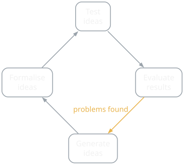

{/* Generated by scripts/convert-pptx-decks.py from the 2024 theory PowerPoints. Do not hand-edit: change the converter and re-run it. */}

{/* _class: title-slide */}

<header>

# Playcentric Design Process

COMP3540/6540 Game Development — Week 2 theory

Slides by Professor Penny Kyburz

</header>

---

## Theory: Playcentric Design Process

- 01 — Player Experience Goals
- 02 — Prototyping and Playtesting
- 03 — Iteration
- 04 — Innovation

Fullerton Ch. 1 — Schell Ch. 4, 7, 8

---

## Continually keeping the player experience in mind and testing with target players at every phase of development

### Setting player experience goals

- First way to bring the player into the design
- Goals for type of experience player will have, not features
- Don't include how the goals will be implemented
- Features are later brainstormed to meet the goals, and then playtested to see if experience goals are being met
- Start by thinking at a very high level about what is interesting and engaging about your game to players
- What experiences will players describe to their friends?
- Going beyond features is difficult – What are players thinking when they make choices? How are they feeling? Are the choices offered rich and interesting?

<aside class="slide-aside">

- "Players will have to cooperate to win, but the game will be structured so that they can never trust each other"
- "Players will have the freedom to pursue the goals of the game in any order they choose"
- "Players will feel a sense happiness and playfulness rather than competitiveness"

</aside>

Playcentric Design Process — Fullerton p.12

---

## The Lens of Emotion (lens 1)

- What emotions would I like my player to experience? Why?
- What emotions are players having when they play? Why?
- How can I bridge the gap between emotions players are having and the emotions I'd like them to have?
- \#2 The Lens of Essential Experience
- What experience do I want the player to have?
- What is essential to that experience?
- How can my game capture that essence?
- \#13 The Lens of Infinite Inspiration
- What is an experience I have had in my life that I would want to share with others?
- In what small way can I capture the essence of that experience and put it into my game?

Playcentric Design Process — Schell p.45, 75

---

## Prototyping and Playtesting

- Ideas should be prototyped and playtested early
  - Construct a playable version immediately after brainstorming
- Physical prototype of the core gameplay
- Paper/pen/cards/acted out – played by designer and friends
- Play and perfect simplistic model first, before development
- Instant feedback on game and player experience goals
- Start with a deep understanding of:
  - Player experience goals and core mechanics
  - Developers often leave this too late and the core issues with the gameplay cannot be fixed and the game is limited

<aside class="slide-aside">

- Prototyping a Game in under 7 Days: https://www.gamedeveloper.com/disciplines/how-to-prototype-a-game-in-under-7-days

</aside>

Playcentric Design Process — Fullerton p.12

- [https://www.gamedeveloper.com/disciplines/how-to-prototype-a-game-in-under-7-days](https://www.gamedeveloper.com/disciplines/how-to-prototype-a-game-in-under-7-days)

---

## Iteration – central to playcentric process

- Design, test, and evaluate results repeatedly throughout
- Improving gameplay until player experience meets criteria

### Flow of the iterative process (applies to all game design)

- Player experience goals are set
- An idea or system is conceived
- An idea or system is formalised (written down or prototyped)
- An idea or system is tested against player experience goals (playtested or exhibited for feedback)
- If results are negative and the idea/system appears to be fundamentally flawed, go back to the first step
- If results point to improvements, modify and test again
- If results are positive and idea/system appears to be successful, iterative process has been completed

Playcentric Design Process — Fullerton p.16

---

## Iteration – central to playcentric process (cont.)

<figure class="deck-figure">

<figcaption>Redrawn after Fullerton ch. 1</figcaption>

</figure>

---

## Iteration

### Step 1: Brainstorming

- Set player experience goals
- Come up with game concepts or mechanics that you think might achieve your player experience goals
- Narrow the list down to the top three
- Write up a short, one-page description for each of these ideas (concept document)
- Test your written concepts with potential players
  - Create rough visual mock-ups to help communicate ideas

Playcentric Design Process — Fullerton p.16-17

---

## Iteration

### Step 2: Physical Prototype

- Create a playable prototype using pen and paper or other craft materials
- Playtest the physical prototype using the process described in Chapter 7 and 9
- When the physical prototype demonstrates working gameplay that achieves your player experience goals, write a 3-6 page gameplay treatment describing how the game functions

Playcentric Design Process — Fullerton p.17

---

## Iteration

### Step 3: Presentation (Optional)

- Presentation to secure funds, can also be useful to help think through and communicate your game design
- Should include demo artwork and solid gameplay treatment
- If unsuccessful, can return to Step 1 or solicit feedback from funding sources to revise game

Playcentric Design Process — Fullerton p.17

---

## Iteration

### Step 4: Software Prototype

- Create rough digital models of the core gameplay
- Often several software prototypes are made, each focusing on different aspects of the system
- Digital prototyping is discussed in Chapter 8
- Try to do with temporary graphics (save time/money)
- When software prototypes demonstrate working gameplay that achieves your player experience goals
  - Move on to plans for the full feature set / levels of the game

Playcentric Design Process — Fullerton p.17

---

## Iteration

### Step 5: Design Documentation

- While prototyping, you probably compiled notes and ideas for the "real" game
  - Use this to develop a full list of goals for the game
- Most developers don't create large static documents
  - Smaller, online, as-needed documentation
  - Flexible, collaborative nature of modern design processes
- Documentation is a collaboration tool that changes and grows with production

Playcentric Design Process — Fullerton p.17

---

## Iteration

### Step 6: Production

- Work with team members to ensure goals are achievable and team is on board with priorities for goals
- Staff up with a full team and plan development "sprints"
- Evaluate game as a team after each sprint to keep on track
- Don't lose sight of the playcentric process during production
- Problems and changes should get smaller throughout
  - Major issues were resolved during prototyping
- Designing your game during production leads to problems related to time, money, and frustration

Playcentric Design Process — Fullerton p.17-21

---

## Iteration

### Step 7: Quality Assurance

- By this time, you should be very sure your gameplay is solid
- Continue playtesting, with an eye for usability

### Prototyping and Playtesting

- At every stage of game development
- You can't advocate for the player, if you don't know what they are thinking
- Playtesting is the best way to elicit feedback and gain insight
- Continually isolate and playtest all aspects of your game

Playcentric Design Process — Fullerton p.21

---

## Iteration – Rule of the Loop

- The more times you test and improve your design, the better your game will be (related to Agile – later)

### Informal Loop

- Think of an idea; Try it out; Keep changing and testing it until it seems good enough

### Formal Loop

  - State the problem
  - Brainstorm some possible solutions
  - Choose a solution
  - List the risks of using that solution
  - Build prototypes to mitigate the risks
  - Test the prototypes – if they are good enough, stop
  - State new problems you are trying to solve – go to 2

<aside class="slide-aside">

- Loop Questions
- How can I make every loop count?
- How can I loop as fast as possible?

</aside>

Playcentric Design Process — Schell p.100, 114-115

---

## Designing for Innovation

- Most games are variations of existing games
- Innovation is risky, but can be rewarding

### Opportunities for innovation

- Designing games with unique play mechanics / new genres
- Appealing to new players (not just "gamers")
- Designing for new platforms (gestural, AR/VR)
- Creating games that integrate into real-world spaces
  - Alternate reality games, location-based games
- Solving difficult problems in game design
  - Integrating story/gameplay, creating empathy, emotionally rich, games and learning
- Creating impactful games (culturally, individually)
- Innovation comes from long-term experimentation

Playcentric Design Process — Fullerton p.23

---

{/* _class: impact */}

## Questions?

See the [course website](/) for everything else: workshops, assessments and resources.