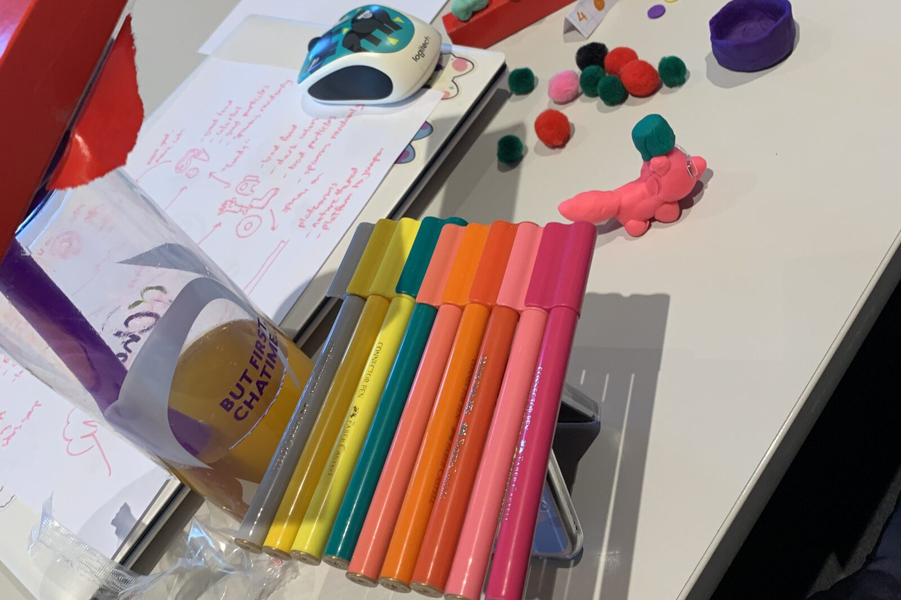
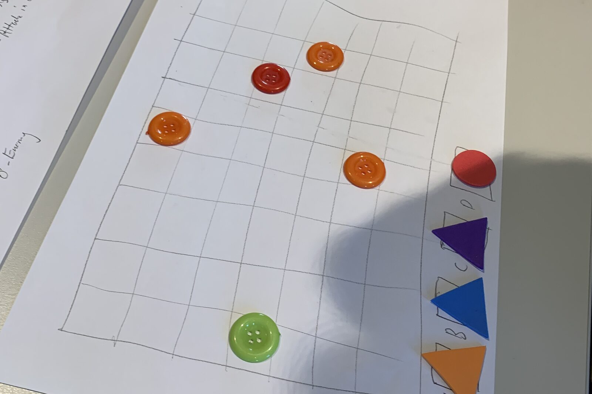
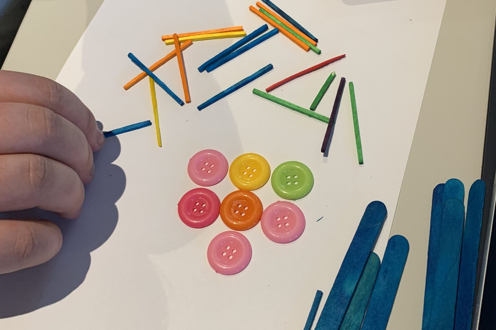
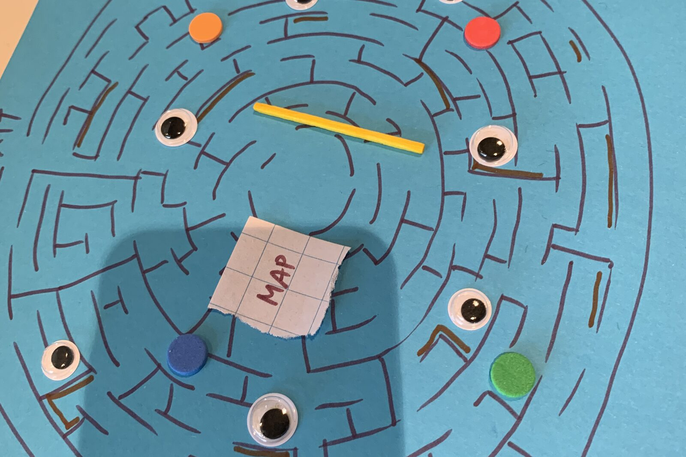
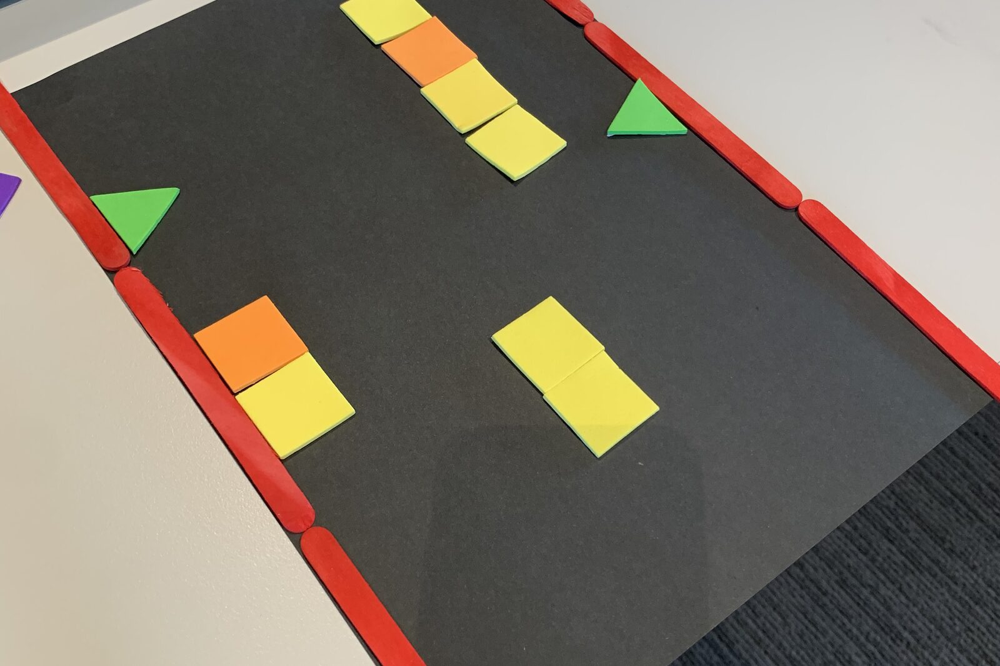
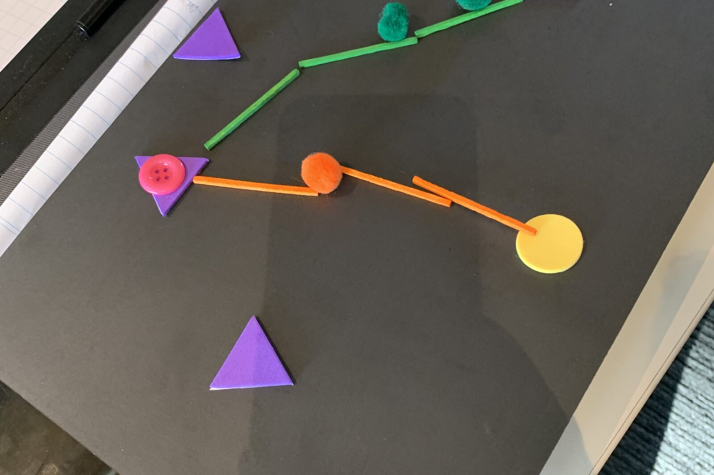
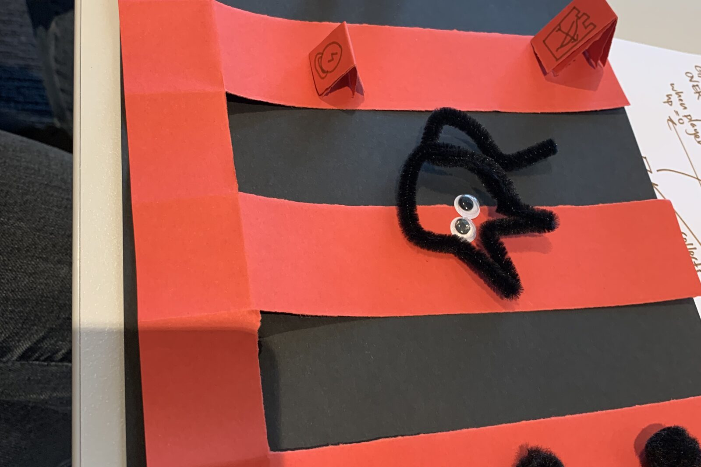
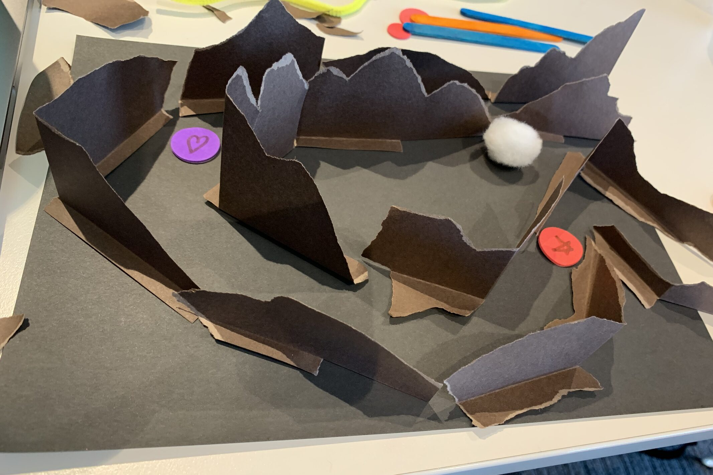
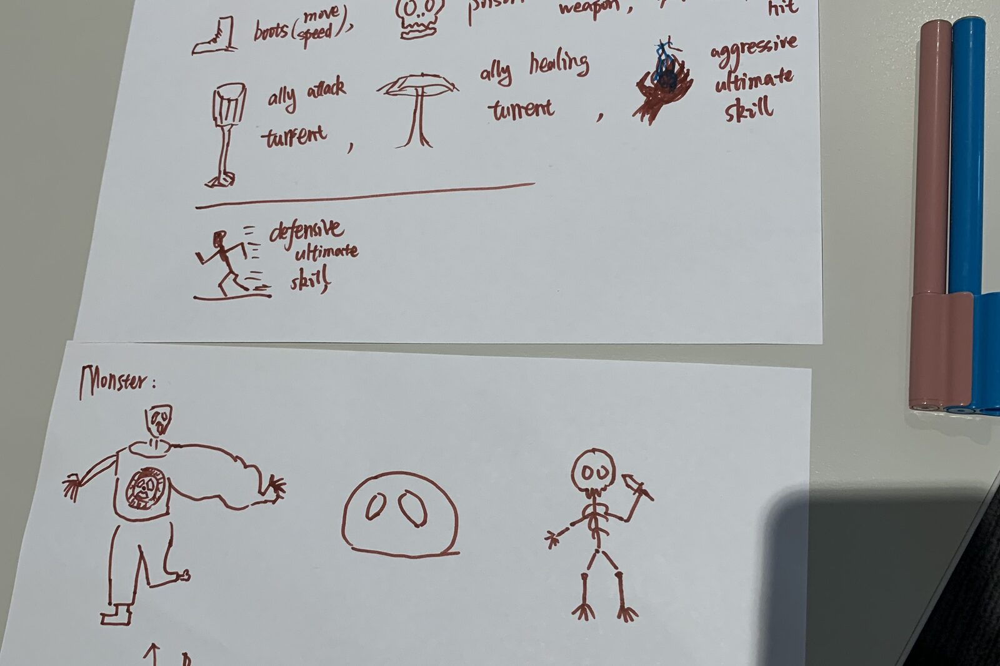
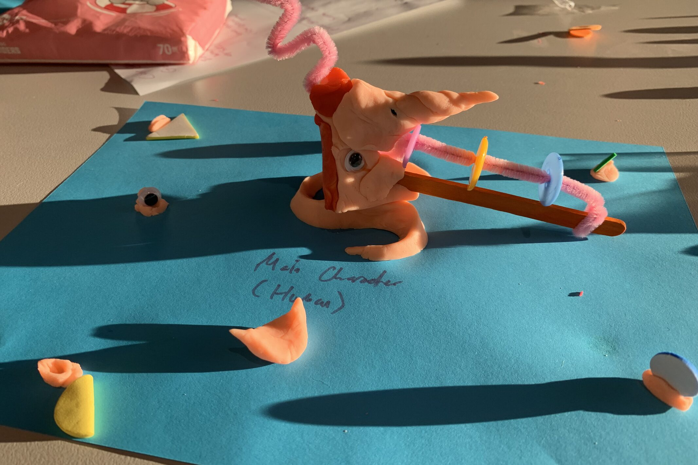

{/* Generated by scripts/convert-pptx-decks.py from the 2024 theory PowerPoints. Do not hand-edit: change the converter and re-run it. */}

{/* _class: title-slide */}

<header>

# Prototyping

COMP3540/6540 Game Development — Week 2 theory

Slides by Professor Penny Kyburz

</header>

---

## Overview


- 01 — Prototyping
- 02 — Physical Prototyping
- 03 — Digital Prototyping

<div class="image-credit">Fullerton Ch. 7, 8 — Schell Ch. 8</div>


---

## Game prototypes

- A prototype is a working model of your idea that lets you test its feasibility and improve it
- Usually a rough approximation of art, sound, features
- Like sketches: focus on a small set of mechanics and see how they function
- Methods of prototyping:
  - Physical prototypes
  - Visual prototypes
  - Video prototypes
  - Software prototypes

<div class="image-credit">Fullerton p.203</div>

```comment
cut: Fullerton's definition moves out of the sidebar and leads the slide; nothing dropped (the source's "protypes" typo corrected)
```

```comment
See Brainstorming exercises on Fullerton p.174 and 181
Revisit page 182 for choosing a prototype to build for teams in Week 7
See Exercise 6.7 (p.188) for workshop – describe your game
```


---

{/* _class: hero */}



<p class="deck-sr-only">A desk covered in felt pens, pom-poms, modelling clay and a sheet of sketched game ideas.</p>

<div class="photo-caption">
A prototype is made of whatever is on the table. Nothing here takes more than a minute to change.
<span class="photo-credit">COMP3540 workshop, 2024</span>
</div>


---

## Ten tips for productive prototyping

- Answer a question — articulate your questions clearly
- Forget quality — quick and dirty throwaway work
- Don't get attached — plan to throw them away
- Prioritise prototypes — consider dependencies and importance
- Parallelise prototypes productively — art, design, tech

<div class="image-credit">Schell p.109-114</div>

```comment
cut: Schell's ten tips unchanged, five to a slide
```


---

## Ten tips: build the toy first

- It doesn't have to be digital — paper prototyping
- It doesn't have to be interactive — sketches, animations
- Pick a "fast loop" game engine — change it while the game runs (Unity)
- Build the toy first — make it fun to play with
- Seize opportunities for more loops — if you have time

<div class="image-credit">Schell p.109-114</div>


---

{/* _class: impact */}

## \#17 The Lens of the Toy

- If my game had no goal, would it be fun at all? If not, how can I change that?
- When people see my game, do they want to start interacting with it, even before they know what to do? If not, how can I change that?

<div class="image-credit">Schell p.119</div>

```comment
cut: both lenses word for word; the two readings the source stranded in loose text boxes are now named links on their own slide, so the bare host links are gone; the "Interesting reading" label became the slide heading
```


---

## \#18 The Lens of Passion

- At the end of each prototype, check how you feel
  - Am I filled with blinding passion about how great this game will be?
  - If I've lost the passion, can I find it again?
  - If the passion isn't coming back, shouldn't I be doing something else?

<div class="image-credit">Schell p.119</div>


---

## Prototyping: further reading

- [Less Talk, More Rock](https://boingboing.net/features/morerock.html) by Superbrothers
- [The 4Fs of Game Design: Fail Faster, and Follow the Fun](https://www.darklorde.com/the-4-fs-of-game-design/) by Jason Vandenberghe

<div class="image-credit">Schell p.119</div>


---

## Physical prototypes

- Easy to construct, change or throw away
- Use paper, cardboard, household objects, drawings
- Focus on gameplay, not technology
- No special knowledge or expertise
- Low cost and use of resources
- Don't worry about look and feel or artwork



<p class="deck-sr-only">Coloured buttons and foam triangles placed on a grid drawn in pencil on a sheet of paper.</p>

<div class="image-credit">Fullerton p.203-206 — COMP3540 workshop, 2024</div>

```comment
cut: the source slide that overflowed becomes two; "easy to construct, easy to change" collapsed to one clause, and the paper-grid photograph moves out of its full-bleed slide into the column beside the list it illustrates
```


---

## Physical prototypes: what they give

- Play board games — you have to think through the mechanics
- Building and revising paper prototypes instills a deep understanding of game principles
- Allows you to:
  - Build a structure for a game
  - Think through how different elements interact
  - Formulate a systemic approach to how the game will function

<div class="image-credit">Fullerton p.203-206</div>


---

## Prototyping your game idea

- Start with the core gameplay mechanic
  - The actions a player repeats most often while striving for the game's overall goal
  - Games are repetitive by nature: core actions stay the same and are built on
  - Diagramming core game actions helps spot problems early, such as feedback loops



<p class="deck-sr-only">A hand laying out coloured matchsticks above a flower of buttons on white paper.</p>

<div class="image-credit">Fullerton p.216-217 — COMP3540 workshop, 2024</div>

```comment
cut: all four of Fullerton's core-gameplay examples are on the slide now — WarCraft III and Diablo III came out of the sidebar, Monopoly and Super Mario Bros. out of the loose text boxes the converter had hidden in a comment; each is trimmed to the player's repeated action. The matchsticks-and-counters photograph moves into the column; the "Core gameplay examples" label became the slide heading
```


---

## Core gameplay examples

- WarCraft III: build and move units in real time to destroy opposing units
- Diablo III: battle monsters, seek treasure, explore dungeons, amass wealth and power
- Monopoly: buy and improve properties, charging rent to players who land on them
- Super Mario Bros.: walk, run and jump, avoiding traps and obstacles, gathering treasure

<div class="image-credit">Fullerton p.216-217</div>


---

## Building the physical prototype

- Four stages: foundation, structure, formal details, refinement
- Basic game objects — physical setting, units, resources
- Key procedures — repetitive action cycles that keep the game in motion
- 1. Foundation: build a representation of core gameplay
  - Goal: designing basic game objects and key procedures
  - Draw a board layout or map, use arts and crafts to make pieces

<div class="image-credit">Fullerton p.217-218</div>

```comment
cut: the two sidebar definitions become bullets beside the four stages they belong to; the foundation stage keeps all of its questions
```


---

## Foundation: play it yourself

- Questions will arise as you go — put them aside for later:
  - How many squares should the player be allowed to move?
  - How will the player interact with objects?
  - How will the conflict be resolved?
- Try playing it on your own — does the concept work?
  - What questions arise?
  - Avoid adding new rules unless absolutely necessary
  - Keep the core gameplay down to as few rules as possible

<div class="image-credit">Fullerton p.217-218</div>


---

{/* _class: hero */}



<p class="deck-sr-only">A circular maze drawn on blue card, scattered with googly eyes, counters and a torn paper square labelled MAP.</p>

<div class="photo-caption">
Foundation: a space, the pieces that move in it, and one resource worth crossing it for.
<span class="photo-credit">COMP3540 workshop, 2024</span>
</div>


---

## 2. Structure: the framework

- Goal: a structure to support the full feature set
- Prioritise what is most essential to the game
- Decide which rules are essential, and which features they must support
- Features — attributes that make a game richer: weapons, vehicles, ways to navigate the space
- Rules — changes to game mechanics: winning conditions, conflict resolution, turn order



<p class="deck-sr-only">Yellow and orange paper tiles and green triangles arranged as platforms between two red rails on black card.</p>

<div class="image-credit">Fullerton p.231 — COMP3540 workshop, 2024</div>

```comment
cut: the sidebar's definitions of feature and rule become the bullets the slide was talking about; the block-layout photograph moves into the column instead of a full-bleed slide of its own; the "Features versus rules" label became the second slide's heading
```


---

## Features versus rules

- You can add rules without adding features, but not vice versa
- One new feature might add 10 or more new rules
- Focus on rules first and features later
- Rules tend to be linked to the core gameplay; features tend to be peripheral

<div class="image-credit">Fullerton p.231</div>


---

## 3. Formal details

- Goal: make a fully functional game
- Focus on formal elements to decide what the game needs:
  - Is the objective interesting and achievable?
  - Is the player interaction structure the best choice?
  - Are there rules or procedures to add outside the core mechanic?
- The challenge is finding the right level of detail — new designers usually add too much

<div class="image-credit">Fullerton p.231-232</div>

```comment
cut: two generated slides rebalanced; "add rules and procedures" dropped from the heading as the bullets say it
```


---

## Formal details: one rule at a time

- You want a small, important set of features that all serve your experience goal
- Add new rules one at a time and test:
  - If the game cannot function without it, leave it in
  - If you can build the game without it, leave it out
  - Rules can be added later if they are not essential

<div class="image-credit">Fullerton p.231-232</div>


---

{/* _class: hero */}



<p class="deck-sr-only">Pipe cleaners and foam shapes laid on black card as a branching path between a start token and a goal disc.</p>

<div class="photo-caption">
Formal details: add one rule, play it, keep it only if the game cannot work without it.
<span class="photo-credit">COMP3540 workshop, 2024</span>
</div>


---

## 4. Refinement

- Goal: to create a compelling game, over a number of iterations
- Time to add non-essential ideas and features
  - But don't add them all at once — rank your features by necessity
  - Introduce and test one at a time, then remove it
- Some great ideas will diminish playability; some that seemed dull add a new dimension
- After testing each one, write down an analysis
- Use your playtesters, incorporate their feedback

<div class="image-credit">Fullerton p.232-233</div>

```comment
cut: ten source lines become seven bullets within the eight-bullet cap; "testing in a controlled environment" dropped from the heading; nothing else
```


---

{/* _class: hero */}



<p class="deck-sr-only">Folded red paper strips over black card forming a side-on platform level, with a pipe-cleaner creature and hand-drawn pickup tokens.</p>

<div class="photo-caption">
Refinement: the pickups and the enemy come last, one at a time, each tested and written up.
<span class="photo-credit">COMP3540 workshop, 2024</span>
</div>


---

## Digital prototypes

- Physical prototypes formalise and test the foundation and the mechanics, but have limits
- They inform the design decisions you make; now test the essence of the game in its digital format
- Digital prototype — build models of core systems: game logic, physics, environments, levels



<p class="deck-sr-only">Torn paper mountains standing up from a grey card base, with counters marking positions in the valley between them.</p>

<div class="image-credit">Fullerton p.241 — COMP3540 workshop, 2024</div>

```comment
cut: the twelve-word heading becomes two words; "helped formalise and test" and "inform design decisions" merged into two bullets; the paper-terrain photograph moves into the column beside them
```


---

## Digital prototypes: devices, reasons

- Envision gameplay through input and output devices
- Control systems — keyboard, mouse, controller, touch, gesture
- Gameplay as an intuitive, responsive digital interface
- Consider the reason for each prototype:
  - Answering a game design or a technical question?
  - Establishing a production pipeline? Communicating the vision?

<div class="image-credit">Fullerton p.241</div>


---

## Types of digital prototypes

- Four kinds, each kept minimal and functional: game mechanics, aesthetics ("look, sound"), kinesthetics ("feel"), technology
- Mechanics — discrete features of formal aspects
  - Simple and focused on a particular question
  - Could be via a spreadsheet or other tool
- Aesthetics — visual and aural dramatic elements
  - Help articulate game mechanics or answer aesthetic questions
  - How will character animation work with the combat system?
  - How will a new interface idea work with the environments?

<div class="image-credit">Fullerton p.241-244</div>

```comment
cut: the four labels off the dropped diagram (game mechanics, aesthetics, kinesthetics, technology) become the slide's first bullet, and animatics, interface prototypes and audio sketches — content the converter had hidden in the same comment — become bullets too; the repeated "still focusing on minimal elements" sidebar is folded into the first bullet
```


---

## Aesthetic prototypes

- Storyboards — a series of drawings sketching a visual sequence
- Concept art — paintings or sketches of characters and environments, exploring looks and palettes
- Animatics — an animated mock-up of the game in action, without game technology
- Interface prototypes — a mock-up of the visual interface, paper or digital
- Audio sketches — an early draft of music and sound effects, to set the tone

<div class="image-credit">Fullerton p.241-244</div>


---

{/* _class: hero */}



<p class="deck-sr-only">Two sheets of marker sketches: labelled ability icons above, and three hand-drawn monster designs below.</p>

<div class="photo-caption">
An aesthetic prototype: icons and characters drawn in minutes, to settle what the game looks like before anything is modelled.
<span class="photo-credit">COMP3540 workshop, 2024</span>
</div>


---

## Kinesthetics and technology

- Kinesthetics — the feel of the game
  - How the controls feel, how responsive the interface is; must be prototyped digitally
  - Feel depends on the type of controls — keyboard versus touch
  - Some games are entirely about the control scheme, and it can lead to a whole new game idea
- Technology — making the game work technically
  - Graphics, AI, physics and other specific problems
  - Testing and debugging tools and workflow — quick and dirty, not the "real" code
- Fullerton pp. 245-247

<div class="image-credit">Fullerton p.245-247</div>

```comment
cut: two generated slides become one; the diagram labels repeated in the loose text boxes are gone (they are the first bullet of the previous slide), and the page reference that was only in a loose box is kept as a bullet because the converter never saw it as a citation
```


---

{/* _class: hero */}



<p class="deck-sr-only">A modelling-clay character with a pipe-cleaner weapon, standing on blue card labelled Main Character.</p>

<div class="photo-caption">
Build the toy first. If the character is not fun to pick up and move, no amount of technology will fix it.
<span class="photo-credit">COMP3540 workshop, 2024</span>
</div>


---

{/* _class: impact */}

## Questions?

See the [course website](/) for everything else: workshops, assessments and resources.