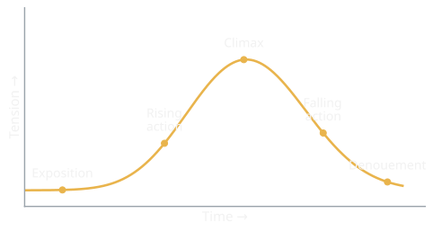
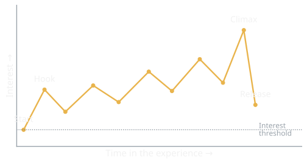
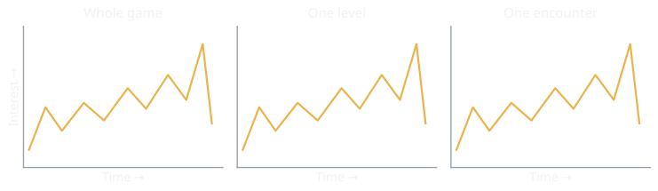

{/* Generated by scripts/convert-pptx-decks.py from the 2024 theory PowerPoints. Do not hand-edit: change the converter and re-run it. */}

{/* _class: title-slide */}

<header>

# Engaging the Player

COMP3540/6540 Game Development — Week 3 theory

Slides by Professor Penny Kyburz

</header>

---

## In this lecture


- 01 — What engages players?
- 02 — Challenge
- 03 — Conflict and Dramatic Arc
- 04 — Goals, Obstacles, and Conflict
- 05 — Interest Curves
- 06 — The Player’s Story (Machine)

<div class="image-credit">Fullerton Ch. 2, 4 — Schell Ch. 16, 17</div>

```comment
cut: the `Theory: Engaging the Player` title block is the deck title plus its two readings, which are in the credit line
```


---

## What engages players?

- Dramatic elements create a dramatic context for the formal elements
  - Engaging players emotionally
- Different things for different players
- Challenge — games create conflict the player resolves, creating tension
- Play — imagination, fantasy, inspiration, social skills, free-form interaction


<p class="deck-sr-only">Two players reaching across a table strewn with tokens and cards, mid-game.</p>

<div class="image-credit">Fullerton p.39, 45-46 — Photo by 2H Media on Unsplash</div>

```comment
cut: Story and Dramatic Elements were loose text boxes off the engagement diagram and are restored as bullets; Dramatic Elements opens the slide because in Fullerton it is the umbrella the others sit under, not a sixth sibling, and it is a bullet plus a sub-bullet to fit the narrow column; the Premise Examples aside becomes the two sub-bullets under Premise, so Monopoly and Space Invaders stay; for the same column Challenge loses "that players must work to resolve, this conflict challenges the player" and Play loses "games provide opportunities for players to use ... to engage with the challenges it offers"
```


---

## Premise, character and story

- Premise — context for the formal elements, even in simple, abstract games
  - Monopoly: players are landlords buying, selling and developing real estate to become the richest player
  - Space Invaders: a lone spaceship defending against an alien invasion, surviving as long as possible
- Character — agents through which dramatic stories are told, and our entry points into situations and conflicts
- Story — unfolds during the game, integrating with gameplay in different ways

<div class="image-credit">Fullerton p.39, 45-46</div>


---

## Challenge

- Not just difficult — tasks that are satisfying to complete
- The right amount and type of work to create accomplishment and enjoyment
- Individualised — determined by the abilities of the specific player
- Dynamic — what a player finds challenging changes as they play


<p class="deck-sr-only">A climber working a route on an indoor wall of coloured holds: a task set to the climber's own ability.</p>

<div class="image-credit">Fullerton p.97-98, 117-119 — Photo by Stacie Ong on Unsplash</div>

```comment
cut: the loose text boxes were scoping labels off the engagement diagram — Play covered in Week 1, Premise later, Character and Story not the focus apart from the player's story, Conflict in Week 1 and next — and are dropped rather than compressed into a bullet, because the deck does cover premise and the player's story; nothing from the slide's own list is cut
```


---

## Conflict and the dramatic arc

- Conflict is the heart of good drama
  - Keeps players from accomplishing their goals too easily
  - Creates tension about the outcome, drawing players in emotionally
- Traditional drama: conflict occurs when the protagonist faces an obstacle that keeps them from their goal
  - Character vs character, nature, machine, self, society or fate

<div class="image-credit">Fullerton p.97-98, 117-119</div>

```comment
cut: the whole of traditional drama, the conflict types and the dramatic arc were loose text boxes off the dropped diagram and are restored here as bullets; nothing cut
```


---

## Games and the dramatic arc

- Games: player vs player, player vs players, player vs game system, team vs team
  - Integrate the dramatic premise with the formal elements
- The dramatic arc is the backbone of dramatic media, including games
  - Once conflict is set in motion, it must escalate to be effective
  - Escalating conflict creates tension: it gets worse before it gets better

<div class="image-credit">Fullerton p.97-98, 117-119</div>


---

## Conflict and the dramatic arc

<figure class="deck-figure">



<figcaption>After Freytag (1863); see Fullerton ch. 4</figcaption>

</figure>


---

## The dramatic arc

- Exposition — the story or game begins here
  - Introduces settings, characters, important concepts
- Conflict is introduced — the point of attack
  - The protagonist's goal is opposed by the environment or an antagonist
- Rising action — a series of events caused by the conflict, and by the protagonist's attempts to resolve it
  - In games, rising action is linked to the dramatic and formal systems

<div class="image-credit">Fullerton p.97-98, 117-119</div>

```comment
cut: the aside on games and rising action becomes the sub-bullet under Rising action; the stage names move out of "Story/game begins with exposition" into the bullets themselves
```


---

## The arc after the climax

- Climax — the deciding factor or event is introduced
- Falling action — a series of events in which the conflict resolves
- Resolution, or denouement — the conflict is finally resolved

<div class="image-credit">Fullerton p.97-98, 117-119</div>


---

## The Lens of the Obstacle (lens 74)

- What is the relationship between the main character and the goal? Why does the character care about it?
- What are the obstacles between the character and the goal?
- Is there an antagonist who is behind the obstacles? What is the relationship between the protagonist and the antagonist?
- Do the obstacles gradually increase in difficulty?
- Some say "the bigger the obstacle, the better the story". Are your obstacles big enough? Can they be bigger?
- Great stories often involve the protagonist transforming in order to overcome the obstacle. How does your protagonist transform?

<div class="image-credit">Schell p.328</div>

```comment
cut: two of Schell's lens 74 questions were in loose text boxes, so all six are now on one slide word for word; the sidebar's story-ingredients aside becomes the slide after it, under the source slide's own title, because the converter always names the first slide of a lens source after the lens
```


---

## Goals, obstacles and conflict

- Main ingredients for a story:
  - A character with a goal
  - Obstacles that keep them from that goal
  - Conflicts arise when they try to reach that goal

<div class="image-credit">Schell p.328</div>


---

## Interest curves

- An experience is a series of moments
  - Some are more powerful than others
  - An interest curve charts the most powerful moments
  - How best to arrange the moments for your experience

<div class="image-credit">Schell p.300-301</div>

```comment
cut: the slide keeps the source's own heading; Schell's two lens 68 questions get their own slide instead of an h3 inside the list, and the A-H beats get a third, beside the curve; nothing cut
```


---

## The Lens of Moments (lens 68)

- What are the key moments in my game?
- How can I make each moment as powerful as possible?

<div class="image-credit">Schell p.300-301</div>


---

## Reading an interest curve

- A — enter the experience, at some level of interest
- B — "the hook": grabs attention and gets you excited
- C-F — interest continually rises, with temporary peaks
- G — climax
- H — resolved

<div class="image-credit">Schell p.300-301</div>


---

## Interest curves

<figure class="deck-figure">



<figcaption>Redrawn after Schell ch. 16; beats are our own</figcaption>

</figure>


---

## Interest curves at three scales

- Overall game — an introduction, a series of levels of rising interest, a major climax, and the player defeats the game
- Each level — new aesthetics and challenges engage the player at the start
  - A series of challenges (battles, puzzles) raise interest, ending in a "boss battle"
- Each challenge — an interesting introduction, then stepped rising challenges

<div class="image-credit">Schell p.305-306</div>

```comment
cut: Schell's lens 69 was a loose text box; its seven questions are restored word for word on a slide of their own; the 25-word "Each level" line becomes a bullet and a sub-bullet so that neither runs to three lines
```


---

## The Lens of the Interest Curve (lens 69)

- If I draw an interest curve of my experience, how is it generally shaped?
- Does it have a hook?
- Does it have a gradually rising interest, punctuated by periods of rest?
- Is there a grand finale, more interesting than everything else?
- What changes would give me a better interest curve?
- Is there a fractal structure to my interest curve? Should there be?
- Do my intuitions about the interest curve match the observed interest of the players? If I ask playtesters to draw an interest curve, what does it look like?

<div class="image-credit">Schell p.305-306</div>


---

## Interest curves at three scales

<figure class="deck-figure">



<figcaption>Redrawn after Schell ch. 16</figcaption>

</figure>


---

## Three interest factors

- Factor 1: Inherent Interest — some things are more interesting than others
- Factor 2: Poetry of Presentation — beauty
- Factor 3: Projection — empathy and imagination

<div class="image-credit">Schell p.306-311</div>

```comment
cut: Schell's lens 70 was a loose text box; its five questions are restored word for word on a slide of their own
```


---

## The Lens of Inherent Interest (lens 70)

- What aspects of my game will capture the interest of a player immediately?
- Does my game let the player see or do something they have never seen or done before?
- What base instincts does my game appeal to? Can it appeal to more of them?
- What higher instincts does my game appeal to? Can it appeal to more of those?
- Does dramatic change and anticipation of dramatic change happen in my game? How can it be more dramatic?

<div class="image-credit">Schell p.306-311</div>


---

## The Lens of Projection (lens 72)

- What is there in my game that players can relate to? What else can I do?
- What is there in my game that will capture a player's imagination? What else can I add?
- Are there places in the game that players have always wanted to visit?
- Does the player get to be a character they could imagine themselves to be?
- Are there other characters in the game that the players would be interested to meet (or to spy on)?

<div class="image-credit">Schell p.306-311</div>

```comment
cut: nothing cut; the seven lens 72 questions are word for word, and because seven two-line questions do not fit one slide the break gets a heading that says it is still the lens
```


---

## Lens of Projection: doing and staying

- Do the players get to do things they would like to do in real life, but can't?
- Is there an activity in the game that once a player starts doing, it is hard to stop?

<div class="image-credit">Schell p.306-311</div>


---

## The player's story

- Story in games is not necessarily scripted
  - The plot can be the sum of the player's actions
- Playing writes a story in the player's mind
  - It emerges from their actions, immersion and choices
  - That story is compelling and worthwhile for the player


<p class="deck-sr-only">Two players seen from behind watching a split-screen game: each of them is writing a different story.</p>

<div class="image-credit">Photo by Emily Wade on Unsplash</div>

```comment
cut: Sweetser's three positions were the aside and the last two bullets were loose text boxes; both are restored as bullets so the citation and the definitions stay. On the split slide "the act of playing a game", "a story emerges based on" and "the choices made while playing" are compressed to fit the narrow column
```


---

## Emotion through the filter of play

- Many of the themes are the emotions the player experiences, dealt with through the filter of play
  - Designers go wrong forcing these into a linear, developer-constructed "story"


---

## Three positions for the player

- Penny Sweetser. 2008. Emergence in Games — three positions for the player:
  - Player as Receiver — narrative is delivered to the player
  - Player as Discoverer — the player actively uncovers the plot
  - Player as Creator — the story is a function of the player's actions and interactions in the game world
- The game cannot tell the player how to feel, and the player is not the player character
- Give the player the chance to create experiences that form an interesting narrative, and a sense of control and ownership over their story


---

{/* _class: impact */}

## The story machine

- Have you ever told someone about a series of events in a game you played?

<div class="image-credit">Schell p.319-320</div>

```comment
cut: Schell's lens 73 was a loose text box; its five questions are restored word for word on a slide of their own. Penny's question is lifted ahead of the story definition — the deck's one reordering — so that it can carry the impact slide on its own; the campfire photograph is dropped from this source slide because the picture would land on that question slide
```


---

## Games as story generators

- A story is a sequence of events that someone relates to someone else
- Sports games and matches generate lots of stories
- Some games are designed as story generators — Minecraft, The Sims

<div class="image-credit">Schell p.319-320</div>


---

## The Lens of the Story Machine (lens 73)

- When players have different choices about how to achieve goals, new and different stories can arise. How can I add more of these choices?
- Different conflicts lead to different stories. How can I allow more types of conflict to arise from my game?
- When players can personalise the characters and setting, they will care more about story outcomes, and similar stories can start to feel very different. How can I let players personalise the story?
- Good stories have good interest curves. Do my rules lead to stories with good interest curves?
- A story is only good if you can tell it. Who can your players tell the story to that will actually care?

<div class="image-credit">Schell p.319-320</div>


---

{/* _class: impact */}

## Questions?

See the [course website](/) for everything else: workshops, assessments and resources.