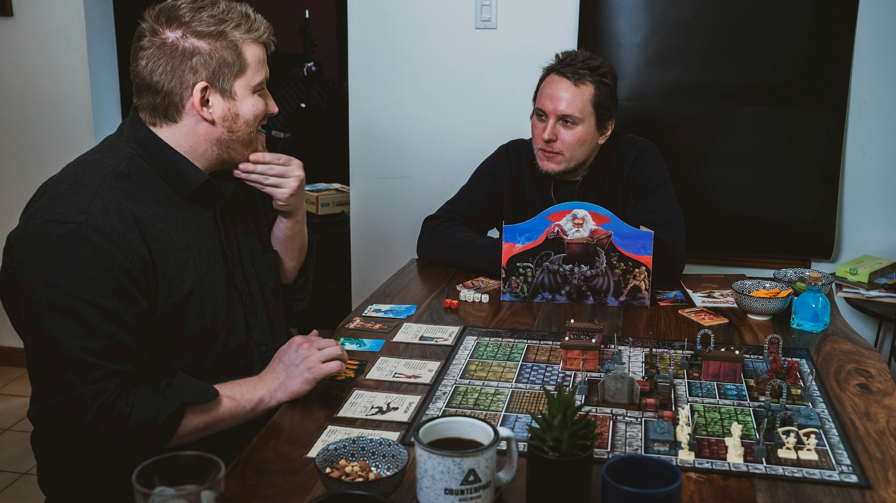
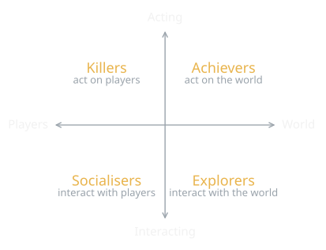

{/* Generated by scripts/convert-pptx-decks.py from the 2024 theory PowerPoints. Do not hand-edit: change the converter and re-run it. */}

{/* _class: title-slide */}

<header>

# Designing to Engage

COMP3540/6540 Game Development — Week 3 theory

Slides by Professor Penny Kyburz

</header>

---

## Overview


- 01 — Designing for Challenge
- 02 — Designing for Play
- 03 — Improving Player Choices
- 04 — Pleasures of Play

<div class="image-credit">Fullerton Ch. 4, 11 — Schell Ch. 4, 6, 9</div>


---

## Designing for Challenge

- Reaching and exceeding goals
  - One goal at the end, or subgoals along the way?
  - Are your goals too hard or easy to reach?
  - Are they clearly defined? Or hidden from view?
- Competing against opponents
  - What opportunities are there to create competition?
  - What is driving player competition?

<div class="image-credit">Fullerton p.349-350</div>

```comment
cut: dropped "in your game", which the slide says already; the two questions about skills are one bullet
```


---

## Challenge: limits, skills, choices

- Stretching personal limits
  - Accomplishment from setting your own goals and achieving them
  - Can you incorporate this? Does it suit your players?
- Exercising difficult skills
  - Opportunities to learn new skills; can players master and display them?
- Making interesting choices
  - Are you providing choices with consequences? How can you improve them?

<div class="image-credit">Fullerton p.349-350</div>


---

## Designing for Play

- Living out fantasies: what aspirations does your game fulfil?
- Social interaction: making the most of the possibilities?
- Exploration and discovery: exciting, guiding but not directing?
- Collection: people love completing collections



<p class="deck-sr-only">Two friends leaning over a fantasy board game: the social and fantasy pleasures of play.</p>

<div class="image-credit">Fullerton p.351-354 — Photo by 2H Media on Unsplash</div>

```comment
cut: each label and its question folded into one bullet; "stimulating the senses" and "giving people a chance" lead-ins dropped
```


---

## Play: senses, self and making

- Stimulation: sight, sound, touch, movement
- Self-expression and performance: a chance to show off who they are
- Construction/destruction: investment in building, freedom in destroying

<div class="image-credit">Fullerton p.351-354</div>


---

{/* _class: impact */}

## What makes a choice interesting?

- Player choice is one of the most important aspects of fun

<div class="image-credit">Fullerton p.355-366</div>

```comment
cut: "What makes a choice interesting versus not?" became the opening question slide's heading; the five weight labels were loose text boxes off the dropped diagram and are now the "Weighing a decision" slide
```


---

## Improving Player Choices

- How can you design choices that are more interesting?
- Consequence is key: the choice must alter the course of the game
- Decisions need potential upsides and downsides: risk versus reward
- Inconsequential or minor decisions should matter more, or be eliminated
- Not all decisions should be life and death
  - Decisions rise and fall as the game progresses, mirroring the dramatic arc

<div class="image-credit">Fullerton p.355-366</div>


---

## Weighing a decision

- Critical: life and death
- Important: direct and immediate impact
- Necessary: indirect or delayed impact
- Minor: small impact, direct or indirect
- Inconsequential: no impact on outcome

<div class="image-credit">Fullerton p.355-366</div>


---

## Types of decisions

- Hollow: no real consequences
- Obvious: no real decision
- Uninformed: an arbitrary choice
- Informed: the player has ample information
- Dramatic: taps into the player's emotional state
- Weighted: balanced, consequences on both sides
- Immediate: has an immediate impact
- Long-term: impact will be felt down the road

<div class="image-credit">Fullerton p.355-366</div>

```comment
cut: the two sub-headings "Types of decisions" and "Dilemmas" became the headings; the dilemma sentence is split in two
```


---

## Dilemmas

- Players must weigh the consequences carefully, with no optimal answer
- Something is gained and lost either way
- Can resonate emotionally with the player

<div class="image-credit">Fullerton p.355-366</div>


---

## Rewards and punishment

- Rewards are used more than punishment
- Over-punishing the player makes them stop playing
- Threat of punishment creates tension: stealth mode
- A balanced system of rewards and punishment makes choices more interesting


<p class="deck-sr-only">A heap of gold coins, a goblet and bars: the romantic reward Fullerton says players over-value.</p>

<div class="image-credit">Fullerton p.355-366 — Photo by Andrej Sachov on Unsplash</div>

```comment
cut: dropped the "Guidelines:" lead-in and "e.g."; the two timing sub-bullets are folded into their parents
```


---

## Rewards: what carries weight

- Rewards useful in obtaining victory carry greater weight
- Rewards with a romantic association (magic, gold) appear more valuable
- Rewards tied to the storyline have an added impact
- Timing and quantity matter: a small stream of rewards becomes meaningless
- Larger, less frequent or random rewards are more effective, but beware gambling-like elements

<div class="image-credit">Fullerton p.355-366</div>


---

## Anticipation and surprise

- Anticipation: meaningful choices come from players seeing the consequences of their actions, as in Chess
  - Incomplete information, such as fog of war, also builds anticipation
- Surprise: can reinvest players; balance randomness against meaningful choice

<div class="image-credit">Fullerton p.355-366</div>

```comment
cut: each "e.g." became a clause; advertising and rewarding milestones folded into the milestone bullet
```


---

## Progress and the end

- Progress: satisfying to see choices result in progress
  - Design milestones, small goals along the way, advertised and rewarded
  - Mini-arcs of gameplay (~1hr) with memorable moments
- The end: defeating other players or working together to defeat the game, resolving the story, the final cutscene

<div class="image-credit">Fullerton p.355-366</div>


---

## The Lens of Surprise (lens 4)

- Surprise is the root of humour, strategy, problem solving
- What will surprise players when they play my game?
- Does the story/rules/art/tech in my game have surprises?
- Do the rules give players ways to surprise each other/themselves?

<div class="image-credit">Schell p.36-48</div>

```comment
cut: one lens per slide; the questions stay word for word
```

```comment
Could just refer to these and not go through them
```


---

## The Lens of Curiosity (lens 6)

- Think about the player's motivations, not just the game goals
- What questions does my game put into the player's mind?
- What am I doing to make them care about these questions?
- What can I do to make them invent even more questions?

<div class="image-credit">Schell p.36-48</div>


---

## The Lens of Endogenous Value (lens 7)

- The player's willingness to pretend the game is important
- What is valuable to the players in my game?
- How can I make it more valuable to them?
- What is the relationship between value in the game and the player's motivations?

<aside class="slide-aside">

- Endogenous = having an internal cause or origin

</aside>

<div class="image-credit">Schell p.36-48</div>

```comment
cut: one lens per slide; the questions stay word for word, but the source's "does my game as the player to solve" reads "ask"
```


---

## The Lens of Problem Solving (lens 8)

- What problems does my game ask the player to solve?
- Are there hidden problems to solve that arise as part of gameplay?
- How can my game generate new problems so that players keep coming back?

<div class="image-credit">Schell p.36-48</div>


---

## The Lens of Resonance (lens 12)

- What is it about my game that feels powerful and special?
- When I describe my game to people, what ideas get them really excited?
- If I had no constraints of any kind, what would this game be like?
- I have certain instincts about how this game should be. What is driving those instincts?

<div class="image-credit">Schell p.70</div>


---

## Taxonomy of Player Types/Pleasures

- Competitor: plays to best other players, regardless of the game
- Explorer: curious about the world, seeks outside boundaries
- Collector: items, trophies, knowledge, creates sets
- Achiever: plays for achievement, ladders and levels
- Joker: plays for the fun of playing, social, can be annoying

<aside class="slide-aside">

- Different players enjoy different things and have different styles of play

</aside>

<div class="image-credit">Fullerton p.104</div>


---

## Player types: makers and performers

- Artist: driven by creativity, creation, design
- Director: loves to be in charge, direct the play
- Storyteller: loves to create/live in worlds of fantasy/imagination
- Performer: loves to put on a show for others
- Craftsman: wants to build, craft, engineer, puzzle things out

<div class="image-credit">Fullerton p.104</div>


---

## LeBlanc's Taxonomy of Game Pleasures

- Sensation: using your senses, game aesthetics
- Fantasy: imaginary world, imagining yourself differently
- Narrative: dramatic unfolding of sequence of events
- Challenge: core pleasure of gameplay, enough for some players
- Fellowship: friendship, cooperation, community, key for some
- Discovery: seeking/finding new things, secrets, strategy
- Expression: creating, building, sharing, customising, expressing
- Submission: entering the magic circle

<div class="image-credit">Schell p.133-137</div>


---

## Bartle's Taxonomy of Players

- Achievers: want to achieve game goals, challenge
- Explorers: want to explore the game, discovery
- Socialisers: relationships with others, fellowship
- Killers: competing/defeating others, competition/destruction

<div class="image-credit">Schell p.133-137</div>

```comment
cut: the Lens of Pleasure was a loose text box beside the diagram and is now a slide of its own; "does you game" reads "does your game"
```


---

## The Lens of Pleasure (lens 20)

- What pleasures does your game give to players? Can these be improved?
- What pleasures are missing from your experience? Why? Can they be added?

<div class="image-credit">Schell p.133-137</div>


---

## Bartle's Taxonomy of Players

<figure class="deck-figure">



<figcaption>Redrawn after Bartle (1996); see Fullerton ch. 4</figcaption>

</figure>


---

## Additional Pleasures

- Anticipation: waiting for a pleasure you know is coming
- Completion: collecting all the treasure, clearing the level
- Delight in another's misfortune: schadenfreude, MP games
- Gift giving: making someone else happy with a surprise gift
- Humour: two unconnected things united by paradigm shift


<p class="deck-sr-only">A roller-coaster car of riders cresting a vertical climb: the pleasure of anticipation.</p>

<div class="image-credit">Schell p.133-137 — Photo by Jonny Gios on Unsplash</div>


---

## Pleasures: possibility to wonder

- Possibility: having many options to choose from
- Pride in an accomplishment: can persist long after
- Surprise: pleasure from being surprised
- Thrill: "fear minus death equals fun" - roller coaster
- Triumph over adversity: accomplishing when pushed to limits
- Wonder: overwhelming feeling of awe and amazement

<div class="image-credit">Schell p.133-137</div>


---

## Player Traits Model

- Aesthetic: the world, scenery, graphics, sound, art style; low = gameplay focus

<aside class="slide-aside">

- Tondello, G.F., Arrambide, K., Ribeiro, G., Cen, A.Jl., Nacke, L.E. 2019. “I Don’t Fit into a Single Type”: A Trait Model and Scale of Game Playing Preferences. In INTERACT 2019. https://doi.org/10.1007/978-3-030-29384-0_23
- Players have different overlapping motivations and cannot be classified into a single type
- Each player is assigned a score across 5 different traits

</aside>

- [doi.org](https://doi.org/10.1007/978-3-030-29384-0_23)

```comment
cut: "orientation" dropped from each trait name and the longer example lists cut to the first few; the Tondello citation and the framing sentences stay in the aside
```


---

## Traits: story, goals, others, difficulty

- Narrative: complex stories; low = less story, skip cutscenes
- Goal: quests and tasks, 100%, all collections; low = optional quests unfinished
- Social: playing with others, multiplayer and competitive communities; low = single player
- Challenge: difficult games, hard challenges, fast-paced; low = easier or casual games


---

{/* _class: impact */}

## Questions?

See the [course website](/) for everything else: workshops, assessments and resources.