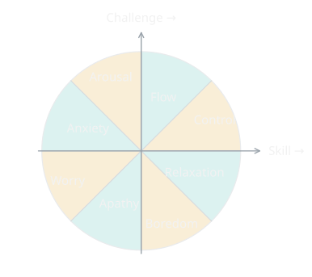
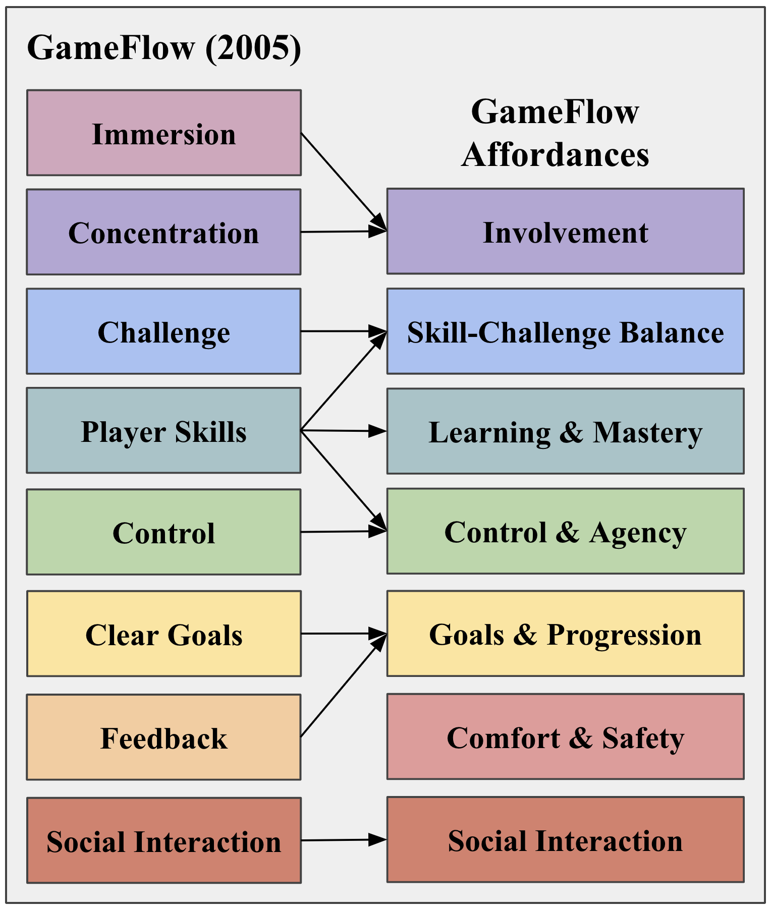
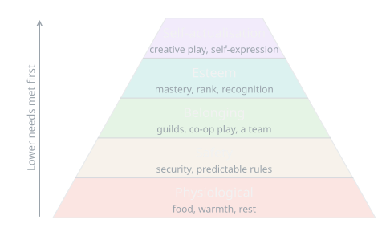

{/* Generated by scripts/convert-pptx-decks.py from the 2024 theory PowerPoints. Do not hand-edit: change the converter and re-run it. */}

{/* _class: title-slide */}

<header>

# Flow, Needs, and Motivation

COMP3540/6540 Game Development — Week 3 theory

Slides by Professor Penny Kyburz

</header>

---

## Theory: Flow, Needs, Motivation

- 01 — Flow and GameFlow
- 02 — Needs and Motivation
- 03 — Gamification and Gameful Design

Schell Ch. 10, 11, 18

---

## Flow

- Mihaly Csikszentmihalyi (psychologist) set out to identify the elements of enjoyment across different people/activities
- He found that enjoyment is described the same:
  - the world over, regardless of age, gender, social class, culture
  - across activities – playing music, chess, sports, painting
- Flow is an experience “so gratifying that people are willing to do it for its own sake, with little concern for what they will get out of it, even when it is difficult or dangerous”
  - The goal is an excuse for the process

<aside class="slide-aside">

- Mihaly Csikszentmihalyi. 1990. The Psychology of Optimal Experience.

</aside>

Flow and GameFlow

---

## Flow

- a task that can be completed
- the ability to concentrate on the task
- concentration is possible because the task has clear goals
- concentration is possible because the task provides immediate feedback
- the ability to exercise a sense of control over actions
- a deep but effortless involvement that removes awareness of the frustrations of everyday life
- concern for self disappears, but sense of self emerges stronger afterwards
- the sense of the duration of time is altered

<aside class="slide-aside">

- Mihaly Csikszentmihalyi. 1990. The Psychology of Optimal Experience.

</aside>

Flow and GameFlow

---

## Flow

- Skill-challenge balance is central
  - Too high challenge --\> frustration
  - Too low challenge --\> boredom
- Aiming to keep the player in the "flow channel"
  - Represents overall skill-challenge balance
  - Not moment-to-moment pacing

Flow and GameFlow

---

## Flow (cont.)

<figure class="deck-figure">

<figcaption>Redrawn after Massimini & Carli (1988)</figcaption>

</figure>

---

## Flow (cont.)

<figure class="deck-figure">

<figcaption>Redrawn after Csikszentmihalyi (1990); see Schell ch. 11</figcaption>

</figure>

---

## GameFlow

### A model of player enjoyment in video games

- 38 criteria, 8 elements
- Maps to Csikszentmihalyi’s concept of flow
- Criteria derived from games UX/PX literature
- Heuristics for design and evaluation
- Widely cited (\>3000) and used (\>200)
  - Games and game-like experiences

<aside class="slide-aside">

- Penny Sweetser and Peta Wyeth. 2005. GameFlow: a model for evaluating player enjoyment in games. Comput. Entertain. 3, 3 (July 2005), 24 pages. https://doi.org/10.1145/1077246.1077253

</aside>

| GAMEFLOW |
| --- |
| Concentration |
| Challenge |
| Player Skills |
| Control |
| Clear Goals |
| Feedback |
| Immersion |
| Social Interaction |

Flow and GameFlow

- [https://doi.org/10.1145/1077246.1077253](https://doi.org/10.1145/1077246.1077253)

---

## GameFlow Affordances

- Seven affordances (rather than elements) reflect that game designers do not directly create gameplay experiences. Rather, the experience exists between the player and the game.
- No specific or prescriptive criteria, only high-level affordances.

<aside class="slide-aside">

- Penny Sweetser and Anne Ozdowska. 2024. GameFlow Affordances: Towards a Tool for Designing Gameful Experiences. In Extended Abstracts of the 2024 CHI Conference on Human Factors in Computing Systems (CHI EA '24). ACM, New York, NY, USA, Article 174, 1–7. https://doi.org/10.1145/3613905.3650887

</aside>

Flow and GameFlow

- [https://doi.org/10.1145/3613905.3650887](https://doi.org/10.1145/3613905.3650887)

---

## GameFlow Affordances (cont.)

<figure class="deck-figure">

<figcaption>Figure from Sweetser & Ozdowska (2024), GameFlow Affordances, CHI EA '24, doi:10.1145/3613905.3650887 — reproduced by permission</figcaption>

</figure>

---

## GameFlow Affordances

- Involvement captures both Concentration and Immersion as engaging the player via attention-demanding aspects (i.e., tasks) and sensory stimulating aspects (i.e., stimuli).
- Skill-Challenge Balance maps to the central corresponding component of flow, while Learning & Mastery captures the integration of learning/play, and the need for mastery and reward.
- Control & Agency includes lower-level and direct control, as well as choice and meaningful impact in the game.
- Goals & Progression includes Clear Goals, as well as Feedback in terms of progression.
- Comfort & Safety relates to the player's connection to an external influence, their environment.

<aside class="slide-aside">

- Penny Sweetser and Anne Ozdowska. 2024. GameFlow Affordances: Towards a Tool for Designing Gameful Experiences. In Extended Abstracts of the 2024 CHI Conference on Human Factors in Computing Systems (CHI EA '24). ACM, New York, NY, USA, Article 174, 1–7. https://doi.org/10.1145/3613905.3650887

</aside>

Flow and GameFlow

- [https://doi.org/10.1145/3613905.3650887](https://doi.org/10.1145/3613905.3650887)

---

## GameFlow Affordances (cont.)

- Involvement — The game affords player involvement by engaging the player (cognitively, physically, emotionally) with satisfying tasks/stimuli (quality, quantity, variety).
- Skill-Challenge Balance — The game affords skill-challenge balance (for different players and throughout the game). Skill-challenge progression is bi-directional (increasing player skill drives challenge escalation and increasing challenge drives player skill development).
- Learning & Mastery — The game affords player learning and mastery with seamless integration of learning and play throughout the game. The player is given opportunities to demonstrate their skill development and mastery and is rewarded appropriately.
- Control & Agency — The game affords player control (over movement, interaction, interface, controls, play sessions) and agency (choice of actions/strategies, impact on game world). The player receives feedback on the success of their actions and strategies.
- Goals & Progression — The game affords player goal setting and progression. Goals (overarching, intermediate) are clearly presented to the player and/or the player can set their own goals. The player receives feedback on progress towards goals and current status in the game.
- Comfort & Safety — The game affords player comfort and safety (play space, body position, movements, wellness) while playing (for different players and throughout their play session).
- Social Interaction — The game affords social interaction through social play (competition, cooperation, and/or observation) and social connection (inside and/or outside the game).

GameFlow Affordances

---

## \#21 The Lens of Flow

- Does my game have clear goals? If not, how can I fix that?
- Are the goals of the player the same goals I intended?
- Are there parts of the game that distract players to the point they forget their goals? If so, can these distractions be reduced or tied into the game goals?
- Does my game provide a steady stream of not-too-easy, not-too-hard challenges, taking into account the fact that the player's skills maybe gradually improving?
- Are the player's skills improving at the rate I had hoped? If not, how can I change that?

Flow and GameFlow — Schell p.148

---

## Hierarchy of Human Needs

### Proposed by psychologist Abraham Maslow (1943)

- People are not motivated to pursue higher level needs until lower-level needs are satisfied
- Many game activities are about achievement and motivation (self-esteem)
- Multiplayer games fulfil more basic needs (belonging)
- Minecraft could be considered to cover the full triangle
  - Lower levels (fantasy) – gathering resources, building shelter
  - Higher levels – multiplayer game about mastery and creativity

Needs and Motivation — Schell p.154-155

---

## Hierarchy of Human Needs (cont.)

<figure class="deck-figure">

<figcaption>After Maslow (1943); the pyramid is a later convention, not his</figcaption>

</figure>

---

## Self-Determination Theory (SDT)

### Explains motivation based on innate psychological needs

- Competence – need for challenge and feelings of effectance
  - I need to feel good at something
- Autonomy – sense of volition or willingness
  - I need freedom to do things my own way
- Relatedness – sense of belonging and connectedness to others
  - I need to connect with other people

<aside class="slide-aside">

- Richard M. Ryan and Edward L. Deci. 2000. Intrinsic and Extrinsic Motivations: Classic Definitions and New Directions. Contemporary Educational Psychology 25, 1 (2000), 54–67. https://doi.org/10.1006/ceps.1999.1020

</aside>

- Satisfying the needs can enhance intrinsic motivation
- Intrinsic Motivation: doing something because it is inherently interesting or enjoyable
- Manifest in behaviours that people often do for no external rewards, such as play, exploration, and challenge seeking
- Extrinsic Motivation: doing something because it leads to a separable outcome

Needs and Motivation — Schell p.155-157

- [https://doi.org/10.1006/ceps.1999.1020](https://doi.org/10.1006/ceps.1999.1020)

---

## \#22 The Lens of Needs

- On which levels of Maslow's hierarchy is my game operating?
- Does it fill the needs of competence, autonomy, and relatedness?
- How can I make my game fill more basic needs than it already does?
- For the needs my game is already filling, how can it fill those needs even better?

### \#23 The Lens of Motivation

- What motivations do players have to play my game?
- Which motivations are most internal? Which are most external?
- Which are pleasure seeking? Which are pain avoiding?
- Which motivations support each other?
- Which motivations are in conflict?

Needs and Motivation — Schell p.156, 160

---

## \#79 The Lens of Freedom

- When do my players have freedom of action? Do they feel free at these times?
- When are they constrained? Do they feel constrained at these times?
- Are there any places I can let them feel freer than they do now?
- Are there any places where they are overwhelmed by too much freedom?

Needs and Motivation — Schell p.343-345

---

## Gamification and Gameful Design

- Design strategy of using game design elements in non-game contexts
- Selection and usage of the game design elements is key
  - Can play to intrinsic or extrinsic motivation
- Play is central to games, rules and goals alone do not make a game
- Meaningful gamification
- Using game design elements to help build intrinsic motivation and meaning in non-game settings
- Reward-based gamification
- Points, levels, leaderboards, achievements
- Rewards can undermine / damage intrinsic motivation
- Can be experienced to be more or less controlling
- Leaderboards can be experienced as goal setting
- Game platform achievements can be competence or ego boosts

<aside class="slide-aside">

- Penny Sweetser and Matthew Aitchison. 2020. Do Game Bots Dream of Electric Rewards? Conference on the Foundations of Digital Games (FDG 2020).

</aside>

Needs and Motivation

---

{/* _class: impact */}

## Questions?

See the [course website](/) for everything else: workshops, assessments and resources.