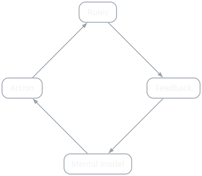

{/* Generated by scripts/convert-pptx-decks.py from the 2024 theory PowerPoints. Do not hand-edit: change the converter and re-run it. */}

{/* _class: title-slide */}

<header>

# Systems

COMP3540/6540 Game Development — Week 4 theory

Slides by Professor Penny Kyburz

</header>

---

## This lecture


- 01 — Systems and Dynamics
- 02 — Interacting with Systems
- 03 — Information Structure
- 04 — Control
- 05 — Feedback
- 06 — Interaction Loops

<div class="image-credit">Fullerton Ch. 4</div>

```comment
cut: only the heading changed; the converter's "Overview" is not what the agenda is
```


---

## Games as systems

- Formal elements that, set in motion, create a dynamic experience players engage with
- Simple or complex, predictable or unpredictable
- Systems exist throughout the natural and human-made world
  - Complex behaviour emerging from the interaction of discrete elements


<p class="deck-sr-only">Torn paper mountains standing up from a grey card base, counters marking positions in the valley between them.</p>

<div class="image-credit">Fullerton p.129-133 — COMP3540 workshop, 2024</div>

```comment
cut: the four basic elements, one long bullet each, become a slide apiece; "Basic elements of systems:" dropped as a lead-in and "e.g.," dropped from the examples; the sidebar (systems throughout the natural and human-made world, complex behaviour from discrete elements) is on the slide as bullets so the photograph can take the column
```


---

## Objects and properties

- Objects — the basic building blocks, physical or abstract
  - Game pieces or concepts, players, areas or terrain
  - Defined by their properties, behaviours and relationships with other objects
- Properties — qualities that define the physical or conceptual aspects of an object
  - Sets of values describing it: colour, location, health, strength, level, experience

<div class="image-credit">Fullerton p.129-133</div>


---

## Behaviours and relationships

- Behaviours — the potential actions an object might perform in a given state
  - Moving, fighting, using items
  - More behaviours = less predictable; more complex is not always better
- Relationships — between objects, and central to a system
  - Without relationships, objects are only a collection
  - Based on location, hierarchy, sequence, changes in the game, player choices
  - Determined by chance or by rule sets

<div class="image-credit">Fullerton p.129-133</div>


---

## System dynamics

- The whole is more than the sum of its parts — games can only be understood during play
- We cannot directly determine the player experience: we craft a possibility space and playtest it as rigorously as possible
- Each playthrough can be different


<p class="deck-sr-only">Hands moving a pipe-cleaner character across a paper prototype during a workshop.</p>

<div class="image-credit">Fullerton p.133, 146-148 — COMP3540 workshop, 2024</div>

```comment
cut: nothing cut; emergence gets its own slide, and the Sweetser reading moves out of the sidebar onto it so the possibility-space slide can carry the photograph
```


---

## Emergence

- Gameplay, like story, can have structure that varies from linear to emergent
  - Depends on how the objects, properties and behaviours are defined
  - Simple objects can give rise to a complex system if they are highly interconnected and interdependent
- Emergence — properties, behaviours and structure that occur at higher levels of a system, and are not present or predictable at lower levels
- Emergent gameplay in The Sims, SimCity, Black & White, Spore, GTA, Half-Life
- Further reading: Penny Sweetser. 2008. Emergence in Games

<div class="image-credit">Fullerton p.133, 146-148</div>


---

## Designing for interaction

- How much information do players have about the state of the system?
- What aspects of the system do players control?
- How is that control structured?
- What type of feedback does the system give the players?
- How does this affect the gameplay?

<div class="image-credit">Fullerton p.148-159</div>

```comment
cut: "Considerations:" dropped as a lead-in; the five questions are the source's, unfolded and unchanged
```


---

## Information structure

- Players need information on the state of game objects and their relationships to choose how to proceed
- Less information = less informed choices, less control over progress
  - Increased chance, and space for misinformation and deception
- Do players need to know the effect of every move they make? Of other players' moves? Is information always available?


<p class="deck-sr-only">Two people leaning over a brightly coloured board game, mid-turn, cards and money spread around it.</p>

<div class="image-credit">Fullerton p.148-159 — Photo by 2H Media on Unsplash</div>

```comment
cut: nothing cut; the four structures are a flat list on a slide of their own, "e.g.," dropped from poker and "some open / hidden info" written out
```


---

## Four information structures

- Open — classic games like Chess and Go give complete information
  - Emphasises player knowledge and calculation-based strategy
- Hidden — information about an opponent's state is hidden, as in poker
  - Play includes guessing, bluffing, deceiving and reading social cues
- Mixed — some information open, some hidden
- Dynamic — the information structure changes during play

<div class="image-credit">Fullerton p.148-159</div>


---

## Control

- Players control game systems by interacting with control systems
  - Keyboard, mouse, console controller, gesture, touch, speech
  - Must suit the game experience
- Players control the game system or state by direct control of movement, by selecting items and menu options, or indirectly — setting variables


<p class="deck-sr-only">Two hands holding a games console controller, thumbs resting on the sticks.</p>

<div class="image-credit">Fullerton p.148-159 — Photo by Kamil Switalski on Unsplash</div>

```comment
cut: the three ways players control the game state (direct movement, selection and menus, indirect variable-setting) are one bullet instead of a heading and three sub-bullets, so the photograph fits beside them
```


---

## Control and conflict

- Choice of controls forms the top-level player experience
  - A repetitive process performed throughout the game
  - If it is hard, unintuitive or not enjoyable, the player might quit
- Consider controls when designing and deciding on conflict
  - What can and can't the player control, and to what extent?
  - What happens if control is given, or taken away?
- More next week, on Game Interface Design

<div class="image-credit">Fullerton p.148-159</div>


---

## Feedback

- A direct relationship between the output of an interaction and a change to another system element
- Positive or negative, reinforcing or balancing
- Gain something when doing well = positive feedback loop
- Lose something when doing well = balancing effect
- Lose something when doing poorly = negative feedback loop
- Gain something when doing poorly = balancing effect
- Reinforcing loops make satisfying gameplay — escalating risk and reward based on player choices
- Balancing effects balance the game and the players: it is not fun if one player gets too far ahead

<div class="image-credit">Fullerton p.148-159</div>

```comment
cut: all four gain/lose lines kept, flattened out of their nesting; the two trailing sub-points folded onto the reinforcing and balancing bullets, so the whole of feedback is one slide instead of a twelve-line slide and a two-line orphan
```


---

## Interaction loops

- Interaction steps within a game:
  - The player starts with a mental model that prompts them to …
  - make a decision to …
  - apply an action in order to …
  - manipulate the game rules and in return …
  - receive feedback that …
  - updates their mental model — so they start to learn how the systems of the game work
- Players repeat the loop to practise a specific skill; mastery only arises after repeated passes, each one sampling the system and revealing more of how it behaves

<div class="image-credit">Fullerton p.148-159</div>

```comment
cut: the six steps are unchanged; "in other words" folded onto the last of them, and the three mastery lines compressed into one bullet, so the steps and the loop figure are not separated by a three-line orphan slide
```


---

## Interaction loops

<figure class="deck-figure">



<figcaption>Redrawn after Cook, 'Loops and Arcs' (Lostgarden, 2012)</figcaption>

</figure>


---

## Skill chains and pacing

- Skill chain: mastering simple interactions lets players complete compound interactions
- Interaction loops occur at different frequencies, or time scales — which helps in understanding pacing
- Thinking in interaction loops helps structure how a player builds their wisdom about a game
  - A holistic, intuitive understanding of a complex system

<div class="image-credit">Fullerton p.148-159</div>

```comment
cut: nothing cut; "Interaction Arcs" was stranded as the last bullet of the loops slide and is now the heading of its own
```


---

## Interaction arcs

- Used to deliver evocative content like a story
  - Similar structure to an interaction loop
  - The player starts with a mental model, applies an action to a system of rules and receives feedback
  - The mental model is updated with evocative stimuli
  - The goal is to convey ideas as efficiently and effectively as possible

<div class="image-credit">Fullerton p.148-159</div>


---

## Skill chains and pacing

<figure class="deck-figure">


<figcaption>Redrawn after Cook, 'Loops and Arcs' (Lostgarden, 2012)</figcaption>

</figure>


---

{/* _class: impact */}

## Questions?

See the [course website](/) for everything else: workshops, assessments and resources.