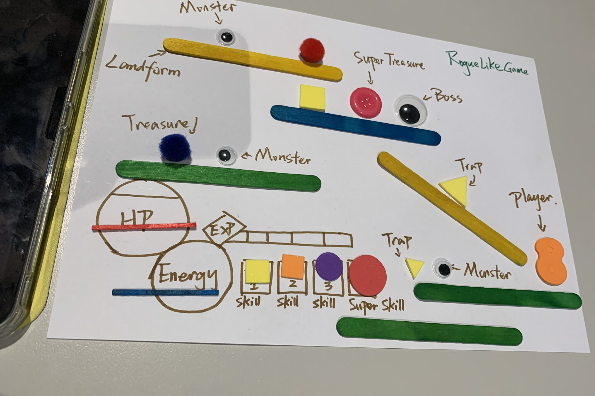
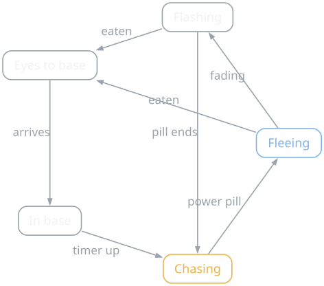
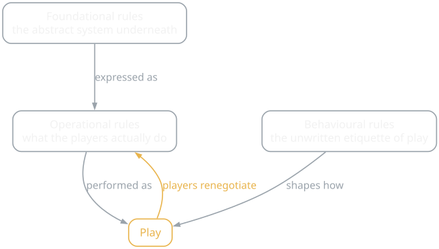
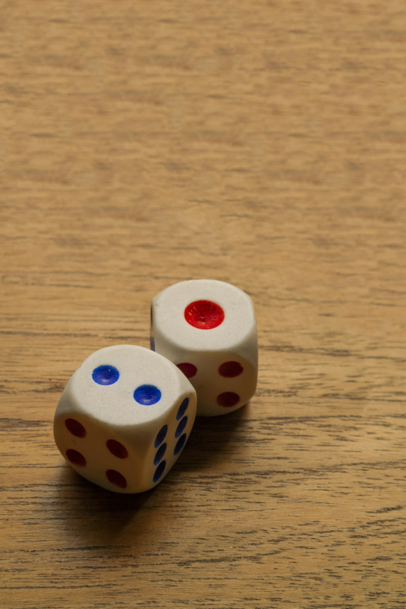

{/* Generated by scripts/convert-pptx-decks.py from the 2024 theory PowerPoints. Do not hand-edit: change the converter and re-run it. */}

{/* _class: title-slide */}

<header>

# Mechanics

COMP3540/6540 Game Development — Week 4 theory

Slides by Professor Penny Kyburz

</header>

---

## Seven kinds of mechanic


- 01 — Space
- 02 — Time
- 03 — Objects
- 04 — Actions
- 05 — Rules
- 06 — Skill
- 07 — Chance

<div class="image-credit">Schell Ch. 5, 12, 13</div>

```comment
cut: only the heading changed; the source slide had no title placeholder, so the converter used the 'Theory: Mechanics' title block
```


---

## What are mechanics?

- Procedures and rules of a game
- Describe the goal of the game, how players can and can't try to achieve it, and what happens when they try
- Mechanics make a game a game — not a movie
- Seven categories: space, time, objects, actions, rules, skill, chance

<div class="image-credit">Schell p.53, 166-210</div>

```comment
cut: the seven categories were a nested list repeating the agenda slide before it, so they are one bullet here
```


---

## Space

- Games take place in a space — the magic circle
- Defines the places that can exist and how they are related
- Tic-Tac-Toe: discrete 2D space, a 3x3 grid
- How about chess, Monopoly, pool, soccer?

<div class="image-credit">Schell p.166-210</div>

```comment
cut: the examples sidebar (Tic-Tac-Toe, chess, Monopoly, pool, soccer) is on the slide as bullets, because at eight lines it ran well past the four-line cap for an aside; 'as a mechanic, space is a mathematical construct' became the second slide's heading
```


---

## Space: a mathematical construct

- Discrete or continuous
- Number of dimensions
- Bounding areas, connected or not
- Nested spaces — a continuous outdoor area with locations leading to indoor spaces: RPGs, campaign maps
- Zero dimensions — no physical space at all: 20 questions
- Consider the space first, without the aesthetics: what is the abstract construction?

<div class="image-credit">Schell p.166-210</div>


---

## The Lens of Functional Space (lens 26)

- Is the space of this game discrete or continuous?
- How many dimensions does it have?
- What are the boundaries of the space?
- Are there subspaces? How are they connected?
- Is there more than one useful way to abstractly model the space of this game?

<div class="image-credit">Schell p.166-210</div>


---

## Time

- We travel forwards through time, with no control
- Playing with or controlling time is an interesting game proposition
- Discrete time: turns, with nothing between them
- Continuous time: sports, most videogames, real-time
- Some games mix time systems


<p class="deck-sr-only">An hourglass with the sand half run through, lit against a dark background.</p>

<div class="image-credit">Schell p.166-210 — Photo by Nathan Dumlao on Unsplash</div>

```comment
cut: 'Real world –' dropped as a lead-in; 'discrete and continuous time' split into the two bullets it labelled
```


---

## Time: clocks and races

- Clocks set absolute time limits for activities
- Boggle's sand timer, sports rounds; clocks can be nested — basketball
- Races — no fixed time limit, but time pressure: car and foot races, Space Invaders
- Controlling time — time-out, pause, speed up, rewind (retry/reload), Braid

<div class="image-credit">Schell p.166-210</div>


---

## The Lens of Time (lens 27)

- What is it that determines the length of my gameplay activities?
- Are my players frustrated because the game ends too early? How can I change that?
- Are my players bored because the game goes on too long? How can I change that?
- Would clocks or races make my gameplay more exciting?
- Time limits can irritate players. Would I be better off without time limits?
- Would a hierarchy of time structures help my game? That is, several short rounds that together comprise a larger round?

<div class="image-credit">Schell p.166-210</div>


---

## Objects

- Game spaces have objects in them: characters, props, tokens, scoreboards
- Objects have one or more attributes
- Attribute categories: position, speed
- Each attribute has a current state; attributes can be static or dynamic
- Objects are nouns, attributes are adjectives
- Some state changes must be shown to the player



<p class="deck-sr-only">A paper prototype of a roguelike: sticks as landforms, googly-eyed monsters, buttons as treasure, and drawn HP, energy and skill meters.</p>

<div class="image-credit">Schell p.166-210 — COMP3540 workshop, 2024</div>

```comment
cut: the 'Ghost movement in PacMan' sidebar is dropped because the state-machine figure that follows carries it in its caption; 'categories of information about objects' shortened to 'attribute categories'
```


---

## Objects: state and secrets

- Objects that behave the same should look the same, and the reverse
- A state diagram can help
- Secrets — what information is public, what is private?
- Is the game about trying to guess or gather unknown information?
- Or using complete information to devise strategies?
- What does the game "know", and how does it use that information?

<div class="image-credit">Schell p.166-210</div>


---

## Objects

<figure class="deck-figure">



<figcaption>After the observable behaviour of Pac-Man (Namco, 1980)</figcaption>

</figure>


---

## The Lens of the State Machine (lens 28)

- What are the objects in my game?
- What are the attributes of the objects?
- What are the possible states for each attribute?
- What triggers the state changes for each attribute?

<aside class="slide-aside">

- Gameplay is decision-making. Decisions are made based on information.

</aside>

<div class="image-credit">Schell p.166-210</div>

```comment
cut: the two lenses the source stacked on one slide get a slide each; every question word for word
```

```comment
Secrets – cut or move to previous slide?
```


---

## The Lens of Secrets (lens 29)

- What is known by the game only?
- What is known by all players?
- What is known by some or only one player?
- Would changing who knows what information improve my game in some way?

<div class="image-credit">Schell p.166-210</div>


---

{/* _class: impact */}

## Actions are the verbs

- What can players do in the game?

<div class="image-credit">Schell p.166-210</div>

```comment
cut: 'Actions are the verbs of game mechanics' becomes the heading so the question the source asks stands on its own slide; the two examples per action type move onto their bullet
```


---

## Basic and strategic actions

- Two types: basic action, strategic action
- Basic — the base actions a player can take: move a checker forward, jump an opponent
- The building blocks of gameplay
- Strategic — use basic actions to achieve a goal: protect a checker, sacrifice a checker
- Meaningful in the larger picture of the game

<div class="image-credit">Schell p.166-210</div>


---

## Emergent gameplay

- Strategic actions that are not part of the rules, emerging from play
- Create the playground, nurture the emergent play

<div class="image-credit">Schell p.166-210</div>


---

## Cultivating emergent gameplay

- Add more verbs (basic actions): more potential for combinations and interactions
- Too many verbs can bloat and confuse gameplay
- Verbs that can act on many objects: more interconnections and interactions
- Goals that can be achieved in more than one way
- Incentivise players to look for interesting strategies; different strategies need to be balanced

<div class="image-credit">Schell p.166-210</div>

```comment
cut: 'Cultivating emergent gameplay' becomes the heading; twenty source lines over two slides, each sub-point folded onto its parent bullet
```


---

## Emergence: subjects and side effects

- Many subjects (instances) — multiple checkers versus just one
- Strategic actions scale with (subjects x verbs x objects)
- Side effects that change constraints
- Multiple aspects of the game change with each basic action

<div class="image-credit">Schell p.166-210</div>


---

## The Lens of Emergence (lens 30)

- How many verbs do my players have?
- How many objects can each verb act on?
- How many ways can players achieve their goals?
- How many subjects do the players control?
- How do side effects change constraints?

<div class="image-credit">Schell p.166-210</div>

```comment
cut: the two lenses the source stacked on one slide get a slide each; every question word for word
```


---

## The Lens of Action (lens 31)

- What are the basic actions in my game?
- What are the strategic actions?
- What strategic actions would I like to see? How can I change my game in order to make those possible?
- Am I happy with the ratio of strategic to basic actions?
- What actions do players wish they could do in my game that they cannot? Can I enable these, as basic or strategic actions?

<div class="image-credit">Schell p.166-210</div>


---

## Rules

- Rules define the space, timing, objects, actions, consequences, constraints and goals
- Parlett's Rule Analysis — kinds of rule:
- Operational: what players do to play the game
- Foundational: the underlying formal structure — an abstract, mathematical representation of game state and how and when it changes
- Behavioural: implicit to gameplay, "good sportspersonship"
- Written: "rules that come with the game"

<div class="image-credit">Schell p.166-210</div>

```comment
cut: the eight kinds of rule are a flat list so they can break across two slides; all eight kept with Parlett's wording
```


---

## Rules: laws and house rules

- Laws: "tournament rules" for serious, competitive play
- Official: written rules merged with laws for serious play
- Advisory: "rules of strategy", tips to play better
- House: players tune the rules to their own tastes, or to fix perceived deficiencies, or to mix it up

<div class="image-credit">Schell p.166-210</div>


---

## Rules

<figure class="deck-figure">



<figcaption>Redrawn after Parlett, via Salen & Zimmerman (2004)</figcaption>

</figure>


---

## Rules: modes and enforcement

- Modes: different rules during different parts of play
- Players can get confused with too many modes; often one main mode and several sub-modes
- Enforcer: who enforces the rules?
- Traditional games — the players enforce them
- Computer games — the computer does, so rules can be more complex, and become constraints
- Players still need to be able to comprehend the rules

<div class="image-credit">Schell p.166-210</div>

```comment
cut: sixteen source lines over two slides; the two mode sub-points folded onto one bullet
```


---

## Rules: cheating and the goal

- Cheatability: perceived and actual cheating, and the ability to cheat
- Devalues the game and its endogenous value
- Object of the game: the most important rule, it must be:
- Concrete: players understand and can clearly state the goal
- Achievable: players think they have a chance to achieve it
- Rewarding: challenging, rewards, anticipation of rewards

<div class="image-credit">Schell p.166-210</div>


---

## The Lens of Goals (lens 32)

- What is the ultimate goal of my game?
- Is that goal clear to players?
- If there a series of goals, do the players understand that?
- Are the different goals related to each other in a meaningful way?
- Are my goals concrete, achievable, and rewarding?
- Do I have a good balance of short- and long-term goals?
- Do players have a chance to decide on their own goals?

<div class="image-credit">Schell p.166-210</div>

```comment
cut: lens 33 sat in loose text boxes beside lens 32 and now has its own slide; every question word for word
```


---

## The Lens of Rules (lens 33)

- What are the foundational rules of my game? How do these differ from the operational rules?
- Are there "laws" or "house rules" that are forming as the game develops? Should these be incorporated into my game directly?
- Are there different modes in my game? Do these modes make things simpler, or more complex? Would the game be better with fewer modes? More modes?
- Who enforces the rules?
- Are the rules easy to understand, or is there confusion about them? If there is confusion, should I fix it by changing the rules or by explaining them more clearly?

<div class="image-credit">Schell p.166-210</div>


---

## Skill

- Matching skill to challenge is core for enjoyment (Week 3 Theory)
- Most games blend different skills
- Physical: strength, dexterity, coordination, endurance
- Mental: memory, observation, puzzle solving, decisions
- Social: reading or fooling an opponent, teamwork, intimidation


<p class="deck-sr-only">Two hands working the sticks and buttons of a games controller, lit from the screen.</p>

<div class="image-credit">Schell p.166-210 — Photo by Reet Talreja on Unsplash</div>

```comment
cut: 'sports, game controllers, physical controllers' dropped from the physical bullet (the photograph beside it makes the point); 'communication' folded into 'teamwork'
```


---

## Skill: real and virtual

- Real skills the player has, versus virtual skills the player is pretending to have
- Enumerating skills — make a list of the skills required, general or very specific
- Is your game testing the skills you want it to? Quick reactions, or memorising patterns?

<div class="image-credit">Schell p.166-210</div>


---

## The Lens of Skill (lens 34)

- What skills does my game require from the player?
- Are there categories of skill that this game is missing?
- Which skills are dominant?
- Are these skills creating the experience I want?
- Are some players much better at these skills than others? Does this make the game feel unfair?
- Can players improve their skills with practice, leading to a feeling of mastery?
- Does this game demand the right level of skill?

<div class="image-credit">Schell p.166-210, 212-250</div>

```comment
cut: lens 42 sat in loose text boxes beside lens 34 and now has its own slide; every question word for word
```


---

## The Lens of Head and Hands (lens 42)

- Are my players looking for mindless action or an intellectual challenge?
- Would adding more places that involve puzzle solving in my game make it more interesting?
- Are there places where the player can relax their brain and just play the game without thinking?
- Can I give the player a choice – succeed either by exercising a high level of dexterity or by finding a clever strategy that works with a minimum of physical skill?
- If "1" means all physical and "10" means all mental, what number would my game get?

<div class="image-credit">Schell p.166-210, 212-250</div>


---

## Chance

- Chance means uncertainty — surprises, fun!
- Humans seek pleasure and avoid pain
- People pay to eliminate the chance of regret — insurance
- Risk versus reward mechanics
- Manipulative monetisation mechanics
- Skill and chance are entangled



<p class="deck-sr-only">Two dice resting on a wooden table after a roll.</p>

<div class="image-credit">Schell p.166-210 — Photo by Muhammad Irfan on Unsplash</div>

```comment
cut: 'losing something' folded into 'regret'; lens 41 gets its own slide instead of an h3 inside this one
```


---

## The Lens of Skill vs Chance (lens 41)

- Are my players here to be judged (skill) or to take risks (chance)?
- Skill tends to be more serious than chance: is my game serious or casual?

<div class="image-credit">Schell p.166-210</div>


---

{/* _class: impact */}

## Questions?

See the [course website](/) for everything else: workshops, assessments and resources.