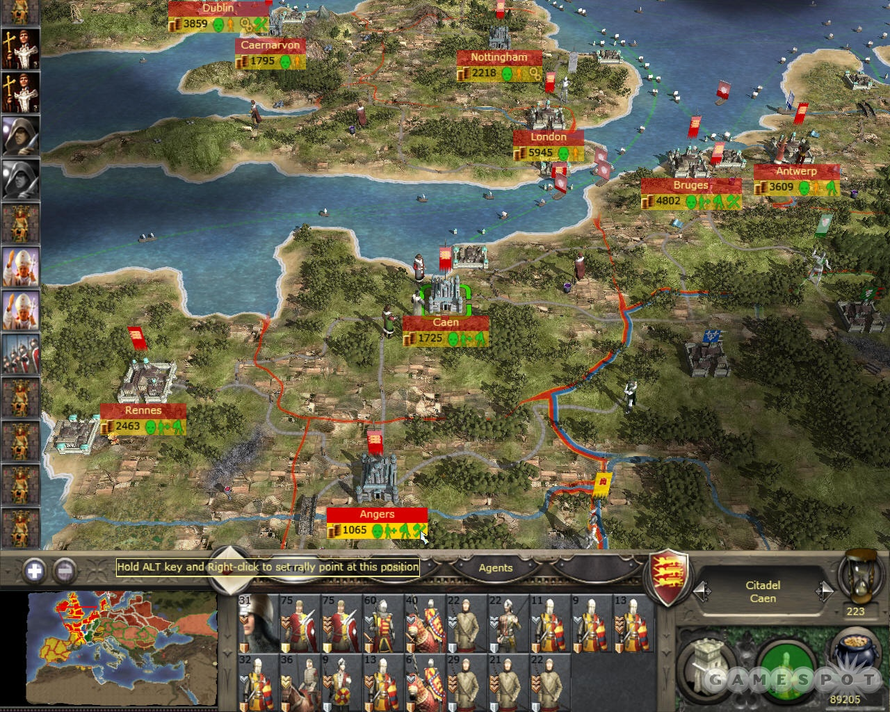
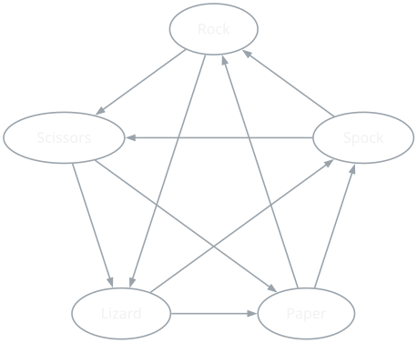

{/* Generated by scripts/convert-pptx-decks.py from the 2024 theory PowerPoints. Do not hand-edit: change the converter and re-run it. */}

{/* _class: title-slide */}

<header>

# Balance

COMP3540/6540 Game Development — Week 4 theory

Slides by Professor Penny Kyburz

</header>

---

## Theory: Balance


- 01 — Balancing Game Systems
- 02 — Variables and Dynamics
- 03 — Dominant Objects and Strategies
- 04 — Symmetry and Asymmetry
- 05 — Rewards and Punishment
- 06 — Balancing for Skill
- 07 — Balancing Methodologies

<div class="image-credit">Fullerton Ch. 4 — Schell Ch.</div>


---

## Balancing Game Systems

- Process of making sure the game meets player experience goals
  - System is of the scope and complexity envisioned
  - Elements of the system are working together without undesired results
- Multiplayer games: starting positions and play are fair (no player has an inherent advantage), no single strategy dominates all others
- Single player: skill level is properly adjusted to the target audience

<aside class="slide-aside">

- Fairness: gives all players an equal opportunity to achieve game goals
- Balance: availability of dominant strategies or overpowered objects

</aside>

- Key balancing areas: Variables, Dynamics, Starting Conditions, Skill
- Key balancing issues: Reinforcing Relationships, Dominant Objects or Strategies, Rewards vs Punishment, Symmetrical vs Asymmetrical games

<div class="image-credit">Balance — Fullerton p.321-342</div>


---

## Balancing Game Systems

- Variables: numbers that define the properties of game objects
  - Number of players, size of playing area, amount of resources
  - Changing the values can drastically change the nature of the game and how it plays out
- Dynamics: forces at work when game is in action
  - Unexpected things can happen when a system is set in motion
  - Combinations of rules, objects, actions can create imbalance
  - Need to fix/remove the problems or add new rules to mitigate

<div class="image-credit">Balance — Fullerton p.321-342</div>


---

## Balancing Game Systems

- Reinforcing relationships: a change in one part of the system causes another change in the same direction
  - Rewards stronger players over time, game ends prematurely
  - Change reinforcing relationship into a balancing relationship
  - Keep strong players from accumulating too much power
    - Pay a price for a gain, add randomness, ganging up
  - Keep the scales balanced, without stagnating
  - At the end, the scale should tip dramatically
    - After the climax, wrap it up quickly
    - "mopping up" in strategy games (e.g., Total War)

<div class="slide-media">



</div>

<div class="image-credit">Balance — Fullerton p.321-342 — Medieval II: Total War (Creative Assembly, 2006)</div>


---

## Balancing Game Systems

- Dominant objects: similar objects should be proportional in terms of strength
  - Fighting game – no single unit should be significantly more powerful than others
  - Provide choices by using strengths and weaknesses
    - Rock, Paper, Scissors (also in strategy games)
    - Racing – good at hills, poor on corners
    - Fighting – killer move, Archilles' heel
    - Economic – durable, cost more
  - Asymmetric, but balanced, is difficult to do right

<div class="image-credit">Balance — Fullerton p.321-342</div>


---

## Balancing Game Systems (cont.)

<figure class="deck-figure">



<figcaption>After Kass & Bryla's five-way rock-paper-scissors; see Fullerton ch. 10</figcaption>

</figure>


---

## Balancing Game Systems

- Dominant strategies: a strategy is strictly better than others
  - Player should have interesting/meaningful option/choices
  - Makes game dull if always using/choosing the same
  - Tic-Tac-Toe has a dominant strategy (boring once you know it)
  - Not the same as a "favourite" strategy
  - Multiplayer communities often develop and evolve favourite strategies over time (e.g., StarCraft)

### \#39 The Lens of Meaningful Choices

- What choices am I asking the player to make?
- Are they meaningful? How?
- Am I giving the player the right number of choices? Would more make them feel more powerful? Would less make the game clearer?

<div class="image-credit">Balance — Fullerton p.321-342 — Schell Ch. 13 p.212-250</div>


---

## Balancing Game Systems

- Balancing starting positions: players start on an equal footing with an equal opportunity to win
  - Does not mean giving all players the same resources/setup
- Symmetrical games: players have same starting setup, access to same resources and information
  - Many boardgames, except play order needs to be balanced
    - Little strategic advantage to going first, first player also receives a penalty, randomness in order / game
- Asymmetrical games: players have different abilities, resources, rules, or objectives, still needs to be fair
  - Makes for interesting, varied, and more realistic games

<div class="image-credit">Balance — Fullerton p.321-342</div>


---

## Balancing Game Systems

- Reasons for using asymmetry: players have different goals
  - Simulating real-world situations (e.g., WWII)
  - Giving players different ways to play/explore the game
  - Giving players choice/options that suit their skills/preferences
  - Levelling the playing field between different players
  - To create more interesting play/choices/situations

### \#37 The Lens of Fairness

- Should my game be symmetrical? Why?
- Should my game be asymmetrical? Why?
- Which is more important: that my game is a reliable measure of who has the most skill or that it provide an interesting challenge to all players?
- If I want players of different skill levels to play together, what means will I use to make the game interesting and challenging for everyone?

<div class="image-credit">Balance — Schell Ch. 13 p.212-250</div>


---

## Balancing Game Systems

- Asymmetrical objectives: players have different goals
  - Ticking clock: weak defender fends off strong attacker
    - Defender: hold out for a set amount of time
    - Attacker: beat defender before time runs out
    - Common in mission-based games
  - Protection: trying to protect versus capture something
  - Combination: ticking clock and capture/protect
    - Reach the HQ, steal the code, blow up the bridge
  - Individual objectives: specific, unique to each player
- Complete asymmetry: each player or team has different objectives and sets of rules they follow to achieve them

<div class="image-credit">Balance — Fullerton p.321-342</div>


---

## Balancing Game Systems

- Rewards: players want to be rewarded for doing well
- Types of rewards in games:
  - Praise: telling the player they did well (statement, sound)
  - Points: measure of player success
  - Prolonged play: more time to achieve their goal
  - Gateway: unlocking / moving to a new area
  - Spectacle: music, animation, cutscene
  - Expression: special clothes, decorations, emotes
  - Powers: gaining power, helps to reach goals
  - Resources: use to reach goals or unlock other rewards
  - Status: leaderboard ranking, achievement
  - Completion: completing all the goals

<div class="image-credit">Balance — Schell Ch. 13 p.212-250</div>


---

## Balancing Game Systems

- Punishment: can increase enjoyment
  - Endogenous value: fear of losing something of value
  - Risk-taking: exciting, risk vs reward, chance of failure makes success more rewarding
  - Challenge: failure means a punishing setback
- Types of punishment:
  - Shaming: opposite of praise (message, sound, music)
  - Loss of points: painful, use sparingly
  - Shortened play: timer, lives
  - Terminated play: game over
  - Setback: back to checkpoint or start of level
  - Removal of powers: tread carefully, players treasure their powers, could remove temporarily
  - Resource depletion: loss of money, goods, ammunition, shields, hit points, common type of punishment

<div class="image-credit">Balance — Schell Ch. 13 p.212-250</div>


---

## The Lens of Reward (lens 46)

- What rewards is my game giving out now? Can it give out others as well?
- Are players excited when they get rewards in my game, or are they bored by them? Why?
- Getting a reward you don’t understand is like getting no reward at all. Do my players understand the rewards they are getting?
- Are the rewards my game gives out too regular? Can they be given out in a more variable way?
- How are my rewards related to one another? Is there a way that they could be better connected?
- How are my rewards building? Too fast, to slow, or just right?

### \#47 The Lens of Punishment

- What are the punishments in my game?
- Why am I punishing the players? What do I hope to achieve by it?
- Do my punishments seem fair to the players? Why or why not?
- Is there a way to turn these punishments into rewards and get the same or a better effect?
- Are my strong punishments balanced against commensurately strong rewards?

<div class="image-credit">Balance — Schell Ch. 13 p.212-250</div>


---

## Balancing for Skill

- Matching game challenge level to player skill level (Week 8)
  - Every player has a different skill level
  - Offer different difficulty levels, player chooses
    - Modifies some variables in the game (e.g., hitpoints)
  - Otherwise, can attempt to balance against "median" skill
- Balancing for median skill: between high and low skill
  - Requires extensive playtesting with players of different skill
    - Find the high and low skill points, then fix between
  - Increase difficulty over course of the game (e.g., missions)
- Balancing dynamically: adjusting difficulty to level of player skill as they play, increasing as they get better
  - Tetris – increase block speed as score increases
  - Racing - "rubber band" to players
  - Usually want this to be invisible to the player

<div class="image-credit">Balance — Fullerton p.321-342</div>

```comment
Balancing for skill – are these slides repetitive? Hold some for Week 8?
```


---

## Balancing for Skill

- Some techniques for balancing for skill level
  - Increase difficulty with every success
  - Allow skilled players to get through easy parts fast
  - Create “layers of challenge” – give players a score or rating that they can try to beat next time
  - Let players choose the difficulty level (e.g., easy, medium, hard)
  - Playtest with a variety of players
  - Give the losers a break / helping hand (e.g., extra powerups)

<div class="image-credit">Balance — Schell Ch. 13 p.212-250</div>


---

## The Lens of Challenge (lens 38)

- What are the challenges in my game?
- Are they too easy, too hard, or just right?
- Can my challenges accommodate a wide variety of skill levels?
- How does the level of challenge increase as the player succeeds?
- Is there enough variety in the challenges?
- What is the maximum level of challenge in my game?

### \#43 The Lens of Competition

- Does my game give a fair measurement of player skill?
- Do people want to win my game? Why?
- Is winning this game something people can be proud of? Why?
- Can novices meaningfully compete at my game?
- Can experts meaningfully compete at my game?
- Can experts generally be sure they will defeat novices?

<div class="image-credit">Balance — Schell Ch. 13 p.212-250</div>


---

## Techniques for Balancing

- Think modular: most games are a set of interrelated sub-systems, break down into functional units
  - The more interconnected, the harder to balance
  - Isolate subsystems and abstract them from one another
    - When you make a change, you can see its effects
- Purity of purpose: every component of your game has a single, clearly defined mission
  - Nothing exists without reason or with more than 1 function
  - Break mechanics down into building blocks with a flowchart
- One change at a time: then test, cause of effects are known
- Spreadsheets: track everything in a spreadsheet
  - Makes it easier to balance, see everything at once, model changes and effects

<div class="image-credit">Balance — Fullerton p.321-342</div>


---

## Game Balancing Methodologies

- Use the lens of the problem statement: define the balance problem before trying to solve it
- Doubling and halving: start with large changes to test the limits and save time
- Train your intuition by guessing exactly: make a best guess and test it, you’ll develop intuition over time
- Document your model: develop a framework for your balancing – what is the relationship between variables/elements?
- Tune your model as you tune your game: develop and refine your model/framework as you tune
- Plan to balance: put systems in place that will make it easy to change the values of things that will need balancing
- Let the players do it: to a limited extent, e.g., choosing difficulty level

<div class="image-credit">Balance — Schell Ch. 13 p.212-250</div>


---

{/* _class: impact */}

## Questions?

See the [course website](/) for everything else: workshops, assessments and resources.