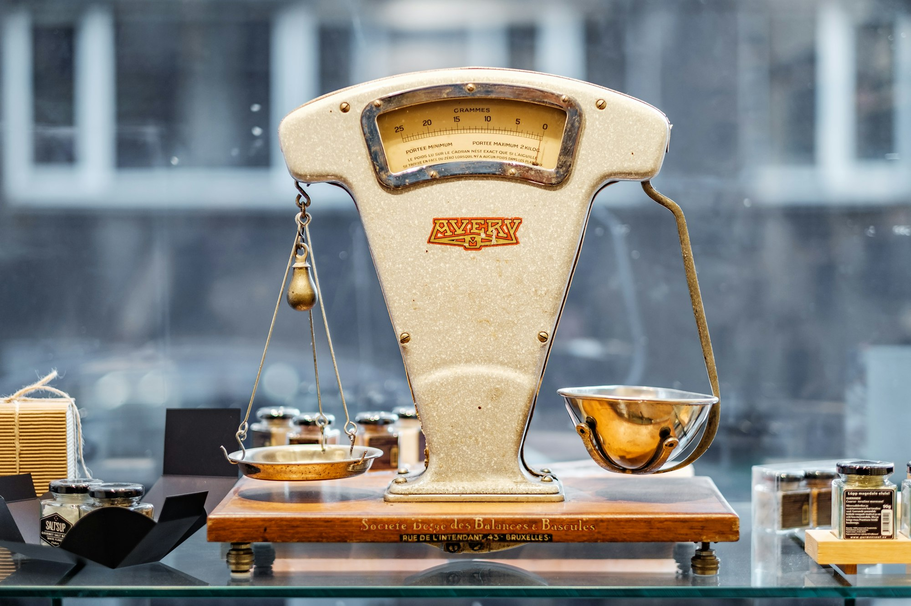

{/* Generated by scripts/convert-pptx-decks.py from the 2024 theory PowerPoints. Do not hand-edit: change the converter and re-run it. */}

{/* _class: title-slide */}

<header>

# Balance

COMP3540/6540 Game Development — Week 4 theory

Slides by Professor Penny Kyburz

</header>

---

## This lecture


- 01 — Balancing Game Systems
- 02 — Variables and Dynamics
- 03 — Dominant Objects and Strategies
- 04 — Symmetry and Asymmetry
- 05 — Rewards and Punishment
- 06 — Balancing for Skill
- 07 — Balancing Methodologies

<div class="image-credit">Fullerton Ch. 4 — Schell Ch.</div>

```comment
cut: only the heading changed; the `Theory: Balance …` title block is the deck title and its readings, not a heading
```


---

## What balance means

- Making sure the game meets the player experience goals
  - System is of the scope and complexity envisioned
  - Elements work together without undesired results
- Fairness: gives all players an equal opportunity to achieve game goals
- Balance: availability of dominant strategies or overpowered objects



<p class="deck-sr-only">A two-pan balance scale on a workbench, the pans hanging level.</p>

<div class="image-credit">Fullerton p.321-342 — Photo by Piret Ilver on Unsplash</div>

```comment
cut: the sidebar definitions of fairness and balance are bullets here, and the two loose text boxes (the key areas and the key issues, labels off a dropped diagram) are the second slide, which is what they were on the source slide; the one-bullet '(cont.)' slide the converter made of 'Single player …' is gone
```


---

## What needs balancing

- Multiplayer: starting positions and play are fair — no inherent advantage, no single dominant strategy
- Single player: skill level properly adjusted to the target audience
- Key balancing areas: variables, dynamics, starting conditions, skill
- Key balancing issues: reinforcing relationships, dominant objects or strategies, rewards versus punishment, symmetrical versus asymmetrical games

<div class="image-credit">Fullerton p.321-342</div>


---

## Variables and dynamics

- Variables: numbers that define the properties of game objects
  - Number of players, size of playing area, amount of resources
  - Changing the values can drastically change the nature of the game and how it plays out
- Dynamics: forces at work when game is in action
  - Unexpected things can happen when a system is set in motion
  - Combinations of rules, objects, actions can create imbalance
  - Need to fix/remove the problems or add new rules to mitigate

<div class="image-credit">Fullerton p.321-342</div>

```comment
cut: only the heading changed: the source repeated 'Balancing Game Systems' as the title of every slide, and this one is about variables and dynamics
```


---

## Reinforcing relationships

- A change in one part of the system causes another change in the same direction
- Rewards stronger players over time; the game ends prematurely
- Change a reinforcing relationship into a balancing relationship
- Keep strong players from accumulating too much power
  - Pay a price for a gain, add randomness, ganging up

<div class="slide-media">


</div>

<div class="image-credit">Fullerton p.321-342 — Medieval II: Total War (Creative Assembly, 2006)</div>

```comment
cut: 'Reinforcing relationships:' drops off the definition because it is the heading; the source's third level of nesting is folded up one level; nothing else cut
```


---

## Tipping the scales

- Keep the scales balanced, without stagnating
- At the end, the scale should tip dramatically
  - After the climax, wrap it up quickly
  - "Mopping up" in strategy games — Total War

<div class="image-credit">Fullerton p.321-342</div>


---

## Dominant objects

- Similar objects should be proportional in terms of strength
- Fighting game — no single unit significantly more powerful than others
- Provide choices by using strengths and weaknesses:
  - Rock, Paper, Scissors — also in strategy games
  - Racing — good at hills, poor on corners
  - Fighting — killer move, Achilles' heel
  - Economic — durable, cost more
- Asymmetric, but balanced, is difficult to do right

<div class="image-credit">Fullerton p.321-342</div>

```comment
cut: 'Dominant objects:' drops off the definition because it is the heading; the source's third level of nesting is folded up one level; the source's 'Archilles'' is spelled Achilles'
```


---

## Dominant objects

<figure class="deck-figure">


<figcaption>After Kass & Bryla's five-way rock-paper-scissors; see Fullerton ch. 10</figcaption>

</figure>


---

## Dominant strategies

- A strategy that is strictly better than the others
- Players should have interesting, meaningful choices
- Makes a game dull if you always choose the same one
- Tic-Tac-Toe has a dominant strategy — boring once you know it
- Not the same as a "favourite" strategy
- Multiplayer communities develop and evolve favourite strategies over time — StarCraft

<div class="image-credit">Fullerton p.321-342 — Schell Ch. 13 p.212-250</div>

```comment
cut: 'Dominant strategies:' drops off the definition because it is the heading; lens 39 was stranded on a '(cont.)' slide as an h3 and now has a slide of its own, every question word for word
```


---

## The Lens of Meaningful Choices (lens 39)

- What choices am I asking the player to make?
- Are they meaningful? How?
- Am I giving the player the right number of choices? Would more make them feel more powerful? Would less make the game clearer?

<div class="image-credit">Fullerton p.321-342 — Schell Ch. 13 p.212-250</div>


---

## Balancing starting positions

- Players start on an equal footing, with an equal opportunity to win
- Not the same as giving everyone identical resources
- Symmetrical games: the same setup, resources and information


<p class="deck-sr-only">Runners in lanes on a track, starting level with one another.</p>

<div class="image-credit">Fullerton p.321-342 — Photo by Nicholas Wilson on Unsplash</div>

```comment
cut: 'Balancing starting positions:' drops off the definition because it is the heading; 'setup' dropped from 'the same resources/setup'; the play-order line is flattened up one level from the source's third level
```


---

## Symmetry and asymmetry

- Many board games — but play order needs balancing
- Little strategic advantage to going first, a penalty for the first player, or randomness in the order
- Asymmetrical games: different abilities, resources, rules or objectives — and still fair
- Makes for interesting, varied, and more realistic games

<div class="image-credit">Fullerton p.321-342</div>


---

{/* _class: impact */}

## Why make a game asymmetrical?

- Players have different goals

<div class="image-credit">Schell Ch. 13 p.212-250</div>

```comment
cut: the source's 'Reasons for using asymmetry: players have different goals' becomes the deck's impact question and its answer, with the five reasons on the next slide; lens 37 was stranded on a '(cont.)' slide as an h3 and now has a slide of its own, every question word for word
```


---

## Reasons for using asymmetry

- Simulating real-world situations — WWII
- Giving players different ways to play and explore the game
- Choices that suit players' skills and preferences
- Levelling the playing field between different players
- Creating more interesting play, choices and situations

<div class="image-credit">Schell Ch. 13 p.212-250</div>


---

## The Lens of Fairness (lens 37)

- Should my game be symmetrical? Why?
- Should my game be asymmetrical? Why?
- Which is more important: that my game is a reliable measure of who has the most skill or that it provide an interesting challenge to all players?
- If I want players of different skill levels to play together, what means will I use to make the game interesting and challenging for everyone?

<div class="image-credit">Schell Ch. 13 p.212-250</div>


---

## Asymmetrical objectives

- Players have different goals
- Ticking clock: a weak defender fends off a strong attacker
  - Defender: hold out for a set amount of time
  - Attacker: beat the defender before time runs out
  - Common in mission-based games

<div class="image-credit">Fullerton p.321-342</div>

```comment
cut: 'Asymmetrical objectives:' drops off the definition because it is the heading; the source's third level of nesting is folded up one level; the one-bullet '(cont.)' slide the converter made of 'Complete asymmetry …' is gone
```


---

## Objectives: protect and capture

- Protection: trying to protect versus capture something
- Combination: ticking clock and capture or protect
  - Reach the HQ, steal the code, blow up the bridge
- Individual objectives: specific, unique to each player
- Complete asymmetry: each player or team has different objectives and different rules to achieve them

<div class="image-credit">Fullerton p.321-342</div>


---

## Rewards

- Players want to be rewarded for doing well
- Praise: telling the player they did well — a statement, a sound
- Points: a measure of player success
- Prolonged play: more time to achieve their goal
- Gateway: unlocking or moving to a new area


<p class="deck-sr-only">A heap of gold coins, a goblet and bars of bullion: treasure as the reward.</p>

<div class="image-credit">Schell Ch. 13 p.212-250 — Photo by Andrej Sachov on Unsplash</div>

```comment
cut: the label 'Types of rewards in games:' is dropped, since the ten named kinds follow it and the continuation heading says so; Schell's ten kinds of reward are otherwise unchanged
```


---

## Rewards: spectacle to completion

- Spectacle: music, animation, cutscene
- Expression: special clothes, decorations, emotes
- Powers: gaining power, helps to reach goals
- Resources: use to reach goals or unlock other rewards
- Status: leaderboard ranking, achievement
- Completion: completing all the goals

<div class="image-credit">Schell Ch. 13 p.212-250</div>


---

## Punishment

- Punishment can increase enjoyment
- Endogenous value: fear of losing something of value
- Risk-taking: exciting — risk versus reward, and the chance of failure makes success more rewarding
- Challenge: failure means a punishing setback

<div class="image-credit">Schell Ch. 13 p.212-250</div>

```comment
cut: the label 'Types of punishment:' is dropped, since the continuation heading says it; 'loss of' dropped from the resource-depletion list; Schell's seven kinds otherwise unchanged
```


---

## Seven kinds of punishment

- Shaming: the opposite of praise — message, sound, music
- Loss of points: painful, use sparingly
- Shortened play: timer, lives
- Terminated play: game over
- Setback: back to a checkpoint or the start of the level
- Removal of powers: tread carefully, players treasure their powers — could remove temporarily
- Resource depletion: money, goods, ammunition, shields, hit points — a common punishment

<div class="image-credit">Schell Ch. 13 p.212-250</div>


---

## The Lens of Reward (lens 46)

- What rewards is my game giving out now? Can it give out others as well?
- Are players excited when they get rewards in my game, or are they bored by them? Why?
- Getting a reward you don’t understand is like getting no reward at all. Do my players understand the rewards they are getting?
- Are the rewards my game gives out too regular? Can they be given out in a more variable way?
- How are my rewards related to one another? Is there a way that they could be better connected?
- How are my rewards building? Too fast, to slow, or just right?

<div class="image-credit">Schell Ch. 13 p.212-250</div>

```comment
cut: the two lenses the source stacked on one slide get a slide each, instead of lens 47 sitting as an h3 on a '(cont.)' slide; every question word for word, including Schell's 'to slow'
```


---

## The Lens of Punishment (lens 47)

- What are the punishments in my game?
- Why am I punishing the players? What do I hope to achieve by it?
- Do my punishments seem fair to the players? Why or why not?
- Is there a way to turn these punishments into rewards and get the same or a better effect?
- Are my strong punishments balanced against commensurately strong rewards?

<div class="image-credit">Schell Ch. 13 p.212-250</div>


---

## Balancing for skill

- Matching challenge level to player skill level (Week 8)
- Every player has a different skill level
- Offer difficulty levels, player chooses
  - Modifies some variables — hitpoints
- Otherwise, balance against "median" skill


<p class="deck-sr-only">A climber on an indoor wall of coloured holds, on a route chosen to match their skill.</p>

<div class="image-credit">Fullerton p.321-342 — Photo by Stacie Ong on Unsplash</div>

```comment
cut: 'Matching game challenge level' shortened to 'Matching challenge level' and '(e.g., hitpoints)' to a dash clause, so the first bullets fit the column beside the photograph; three slides instead of a slide and a '(cont.)', each with the sub-points folded up from the source's third level
```

```comment
Balancing for skill – are these slides repetitive? Hold some for Week 8?
```


---

## Balancing for median skill

- Balancing for median skill: between high and low skill
- Requires extensive playtesting with players of different skill
  - Find the high and low skill points, then fix between
- Increase difficulty over the course of the game — missions

<div class="image-credit">Fullerton p.321-342</div>


---

## Balancing dynamically

- Balancing dynamically: adjusting difficulty to the player's skill as they play, increasing as they get better
- Tetris — increase block speed as the score increases
- Racing — "rubber band" to players
- Usually want this to be invisible to the player

<div class="image-credit">Fullerton p.321-342</div>


---

## Techniques for balancing skill

- Increase difficulty with every success
- Allow skilled players to get through easy parts fast
- Create “layers of challenge” — a score or rating to beat next time
- Let players choose the difficulty level — easy, medium, hard
- Playtest with a variety of players
- Give the losers a break or a helping hand — extra powerups

<div class="image-credit">Schell Ch. 13 p.212-250</div>

```comment
cut: the lead-in 'Some techniques for balancing for skill level' becomes the heading; '(e.g., …)' parentheticals become dash clauses; all six of Schell's techniques kept
```


---

## The Lens of Challenge (lens 38)

- What are the challenges in my game?
- Are they too easy, too hard, or just right?
- Can my challenges accommodate a wide variety of skill levels?
- How does the level of challenge increase as the player succeeds?
- Is there enough variety in the challenges?
- What is the maximum level of challenge in my game?

<div class="image-credit">Schell Ch. 13 p.212-250</div>

```comment
cut: the two lenses the source stacked on one slide get a slide each, instead of lens 43 sitting as an h3 on a '(cont.)' slide; every question word for word
```


---

## The Lens of Competition (lens 43)

- Does my game give a fair measurement of player skill?
- Do people want to win my game? Why?
- Is winning this game something people can be proud of? Why?
- Can novices meaningfully compete at my game?
- Can experts meaningfully compete at my game?
- Can experts generally be sure they will defeat novices?

<div class="image-credit">Schell Ch. 13 p.212-250</div>


---

## Techniques for balancing

- Think modular: most games are a set of interrelated sub-systems, broken into functional units
  - The more interconnected, the harder to balance
  - Isolate subsystems and abstract them from one another — then a change shows its effects

<div class="image-credit">Fullerton p.321-342</div>

```comment
cut: 'every component of your game' shortened to 'every component'; 'makes it easier to balance' dropped from the spreadsheets bullet as a restatement of the slide; the one-bullet '(cont.)' slide the converter made of the spreadsheets line is gone
```


---

## Purity of purpose

- Purity of purpose: every component has a single, clearly defined mission
  - Nothing exists without reason or with more than one function
  - Break mechanics down into building blocks with a flowchart
- One change at a time: then test, so the cause of an effect is known
- Spreadsheets: track everything in a spreadsheet — see it all at once, and model changes and their effects

<div class="image-credit">Fullerton p.321-342</div>


---

## Game balancing methodologies

- Use the lens of the problem statement: define the balance problem before trying to solve it
- Doubling and halving: start with large changes to test the limits and save time
- Train your intuition by guessing exactly: make a best guess, then test it
- Document your model: a framework for your balancing — how do the variables and elements relate?

<div class="image-credit">Schell Ch. 13 p.212-250</div>

```comment
cut: 'you’ll develop intuition over time' dropped as a restatement of 'train your intuition'; all seven of Schell's methodologies kept with their names; the one-bullet '(cont.)' slide the converter made of the last two is gone
```


---

## Methodologies: plan to balance

- Tune your model as you tune your game: develop and refine the framework as you tune
- Plan to balance: put systems in place that make it easy to change the values that need balancing
- Let the players do it — to a limited extent, such as choosing the difficulty level

<div class="image-credit">Schell Ch. 13 p.212-250</div>


---

{/* _class: impact */}

## Questions?

See the [course website](/) for everything else: workshops, assessments and resources.