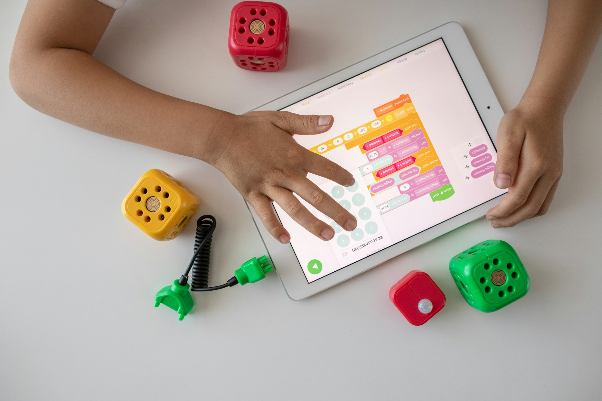

{/* Generated by scripts/convert-pptx-decks.py from the 2024 theory PowerPoints. Do not hand-edit: change the converter and re-run it. */}

{/* _class: title-slide */}

<header>

# Interface Design

COMP3540/6540 Game Development — Week 5 theory

Slides by Professor Penny Kyburz

</header>

---

## Interface Design


- 01 — Game Interface Design
- 02 — Control Schemes
- 03 — Viewpoints
- 04 — Interface Design
- 05 — Channels of Information
- 06 — Effective Interface Design

<div class="image-credit">Fullerton Ch. 8 — Schell Ch. 15</div>


---

## Game Interface

- Where the player and game come together
  - Thin membrane that separates player and game
  - When the interface fails, the experience ends abruptly
  - Should be as robust, powerful and invisible as possible
  - Goal is to make players feel in control of the experience


<p class="deck-sr-only">An adult and a child at an arcade machine, hands on its controls: where the player and the game come together.</p>

<div class="image-credit">Schell Ch.15, p.268-295 — Photo by Brittani Burns on Unsplash</div>

```comment
cut: nothing cut; the four lens 59 questions move to a slide of their own
```


---

## The Lens of Control (lens 59)

- When players use the interface, does it do what is expected? If not, why not?
- Intuitive interfaces give a feeling of control. Is your interface easy to master or hard to master?
- Do your players feel they have a strong influence over the outcome of the game? If not, how can you change that?
- Feeling powerful = feeling in control. Do your players feel powerful? Can you make them feel more powerful somehow?

<div class="image-credit">Schell Ch.15, p.268-295</div>


---

## Player, interface, game world

- Game interface: controller, display device, a system of manipulating a virtual character, how the game communicates info to the player
- Physical input: the player touches something to change the game world
- Physical output: how the player sees what is going on in the world
- Virtual interface: a conceptual layer between physical input/output and the game world
  - Input elements — a virtual menu for selections
  - Output elements — a score display
  - Can be very thin or very dense

<div class="image-credit">Schell Ch.15, p.268-295</div>

```comment
cut: the seven diagram labels are the content of this slide, so they become the body; the 'breaking it down' lead-in and 'can mean many things' are dropped
```


---

## Player, interface, game world

<figure class="deck-figure">


<figcaption>Redrawn after Schell ch. 15</figcaption>

</figure>


---

## The Lens of Physical Interface (lens 60)

- What does the player pick up and touch? Can this be made more pleasing?
- How does this map to the actions in the game world? Can the mapping be more direct?
- If you can't create a custom physical interface, what metaphor are you using when you map the inputs to the game world?
- How does the physical interface look under the Lens of the Toy?
- How does the player see, hear, and touch the world of the game? Is there a way to include a physical output device that will make the world become more real in the player's imagination?

<div class="image-credit">Schell Ch.15, p.268-295</div>

```comment
cut: the repeated slide title and the lens number move into the heading; the five questions are unchanged
```


---

## The Lens of Virtual Interface (lens 61)

- What information does a player need to receive that isn't obvious just by looking at the game world?
- When does the player need this information? All the time? Only occasionally? Only at the end of a level?
- How can this information be delivered to the player in a way that won't interfere with the player's interactions with the game world?

<div class="image-credit">Schell Ch.15, p.268-295</div>

```comment
cut: the repeated slide title and the lens number move into the heading; the five questions are unchanged
```


---

## Virtual interface: pop-up menus

- Are there elements of the game world that are easier to interact with using a virtual interface (like a pop-up menu, for instance) than they are to interact with directly?
- What kind of virtual interface is best suited to my physical interface? Pop-up menus, for example, are a poor match for a gamepad controller.

<div class="image-credit">Schell Ch.15, p.268-295</div>


---

## The Lens of Transparency (lens 62)

- What are the player's desires? Does the interface let the players do what they want?
- Is the interface simple enough that with practice, players will be able to use it without thinking?
- Do new players find the interface intuitive? If not, can it be made more intuitive, somehow? Would allowing players to customise the controls help or hurt?
- Does the interface work well in all other situations, or are there cases (near a corner, going very fast, etc.) when it behaves in ways that will confuse the player?

<div class="image-credit">Schell Ch.15, p.268-295</div>

```comment
cut: the repeated slide title and the lens number move into the heading; the seven questions are unchanged, across two slides
```


---

## Transparency under pressure

- Can players continue to use the interface well in stressful situations, or do they start fumbling with the controls or missing crucial information? If so, how can this be improved?
- Does anything confuse players about the interface? On which of the six interface arrows is it happening?
- Do players feel a sense of immersion when using the interface?

<div class="image-credit">Schell Ch.15, p.268-295</div>


---

## Input and output

- Input: devices and control schemes
- Output: camera viewpoint of the game environment
- Output: visual display of game status and the controls to interact with it
- Controls, viewpoint and interface work together to:
  - Create the game experience
  - Allow the player to understand and have agency within the system


<p class="deck-sr-only">Two hands gripping a games controller, thumbs on the sticks: the physical interface a player picks up and touches.</p>

<div class="image-credit">Fullerton p.254-266 — Photo by Reet Talreja on Unsplash</div>

```comment
cut: the 'the interface between the player and the game includes' lead-in is dropped and the third level of nesting flattened
```


---

## Control Schemes

- Controls allow player inputs to a digital game
- Advances in control systems have attracted new audiences to games
  - Active immersive play of VR headsets
  - Simple, intuitive play of smartphones and tablets

<aside class="slide-aside">

- Input devices:
- Keyboard, mouse, joystick, steering wheels, plastic guns, guitars, bongo drums, multitouch screens, motion sensors, data gloves, VR headsets, voice recognition, and more

</aside>

<div class="image-credit">Fullerton p.254-266</div>

```comment
cut: the five stranded text boxes are Fullerton's advice, so they become the second slide; nothing dropped
```


---

## Designing for the controller

- Understand the capabilities of the controller for the platform you are designing for
- Think about how your game can best use the controller, alongside the interface design
- Start with your list of procedures: translate them into a set of digital controls
- Create a kinaesthetic prototype and test the controls until they are integrated with your gameplay
- Highly detailed controls may need grouping under a menu system, reached with a set of controls

<div class="image-credit">Fullerton p.254-266</div>


---

## Control tables

- After you decide how controls will work, create a control table
  - List the controls, and next to each the game procedure attached
- For very complex games or controls
  - Several tables, each a specific game state — a new state exists each time controls change
  - Drive a car, fly a plane, ride a bike: 3 game states, but keep controls similar between states

<div class="image-credit">Fullerton p.254-266</div>

```comment
cut: sub-bullets merged where the second restated the first; the source's sub-heading supplies each slide heading
```


---

## Effortless controls

- Designing controls, like designing games, is an iterative process
  - You only know if they work well by testing them
- Goal is to make controls as effortless as possible
  - Players do not want to think about the controls; they should feel intuitive
  - Adding too many controls will frustrate the average player
  - Expert players might want detailed or custom controls, but not at the expense of alienating less experienced players

<div class="image-credit">Fullerton p.254-266</div>


---

## Selecting Viewpoints

- Overhead view: looking directly down on the game world
  - Affords a clear view of terrain, useful for strategy and tactics
- Side view: looking side-on at the game world
  - Side-scroller, platformer, arcade
  - Player only controls units in 2 planes, focus on puzzles

<div class="slide-media">


</div>

<div class="image-credit">Fullerton p.254-266 — credit to be set when the replacement is sourced</div>

```comment
cut: all five viewpoints kept, two slides instead of three; wording unchanged apart from contractions
```


---

## Isometric, first and third person

- Isometric view: angled top-down or off-axis 3D view
  - Allows a "god's eye" view — strategy, construction, RPG games
- First-person view: through the eyes of a game character
  - Immediacy and connection with the character, limits knowledge of the game state
- Third-person view: follows a character, but not inside their view
  - Detailed view of the character's action — adventure, sport

<div class="image-credit">Fullerton p.254-266</div>


---

{/* _class: impact */}

## What is the purpose of the interface?

- What is the state of the game, and how much information should the player know about it?

<div class="image-credit">Fullerton p.254-266</div>

```comment
cut: the slide's own opening question becomes the impact slide; the three design questions are unchanged
```


---

## Choosing a viewpoint

- Consider prototyping with different viewpoints
- Different viewpoints provide:
  - Different degrees of access to the state of the world
  - Varying relationships to the character and game objects

<div class="image-credit">Fullerton p.254-266</div>


---

## Viewpoint as a design element

- Choice of viewpoint = formal and dramatic design element
- Should the player feel extremely close to the game character, sharing their sense of movement in addition to their lack of knowledge at times?
- Should the player remain close, but somewhat outside of the character, and be able to see more of the environment, picking up clues or tools not in direct vision of the character?
- Is there no character in your game? Or no world? What view makes the most sense with your design?

<div class="image-credit">Fullerton p.254-266</div>


---

## Communicating the game state

- How info about the game state and options reaches the player
  - Points/progress, status of units, communication with other players, perpetual choices, special opportunities for action
  - How will you incorporate this info in and around your main view?
- Goal is to make the interface as easy to understand as possible
  - Ideally fresh and innovative, but familiar and intuitive
- Form follows function: the design of an object must come from its purpose — architect Louis Henri Sullivan, 1896
  - Formal elements inform interface and control design
  - Do not design the interface first, it comes from the gameplay

<div class="image-credit">Fullerton p.254-266</div>

```comment
cut: 'communicated to the player' shortened to 'reaches the player'; nothing else dropped
```

```comment
figure omitted pending copyright review (see Fullerton p.254-266)
```


---

## Channels of Information

- List and prioritise information
  - Lots of info, but not all info is equally important
- List channels — ways of communicating a stream of data
  - Top-centre of screen, avatar, sound effects, music, border of screen, on enemies, word balloons over heads
  - List all the possible channels you think you might use

<aside class="slide-aside">

- Interfaces need to communicate info
- Determining how to communicate necessary info to players in your game requires thoughtful design

</aside>

<div class="image-credit">Schell Ch.15, p.268-295</div>

```comment
cut: the source's own sub-heading names the second slide; 'e.g.' dropped, nothing else
```


---

## Mapping information to channels

- Map information to channels
  - By instinct, experience, trial and error
  - Playtest, remap, repeat
- Review use of dimensions
  - A channel can have multiple dimensions — colour, size, font
  - Using dimensions to reinforce the same info helps make it clear
  - Using dimensions for different info can be elegant

<div class="image-credit">Schell Ch.15, p.268-295</div>


---

## Channels and Dimensions (lens 66)

- What data need to travel to and from the player?
- Which data are most important?
- What channels do I have available to transmit these data?
- Which channels are most appropriate for which data? Why?
- Which dimensions are available on the different channels?
- How should I use those dimensions?

<div class="image-credit">Schell Ch.15, p.268-295</div>

```comment
cut: the heading shortens 'The Lens of Channels and Dimensions' to fit 40 characters; the six questions are unchanged
```


---

## Metaphors

- Visual interfaces are metaphorical: graphical symbols that help us contextualise the experience
- The desktop metaphor — files, folders, inbox, trash
- Many games use physical metaphors linked to their theme: objects carried in an RPG in a backpack

<div class="slide-media">


</div>

<div class="image-credit">Fullerton p.254-266 — Schell Ch.15, p.268-295 — Diablo II (Blizzard North, 2000)</div>

```comment
cut: the stranded lens 67.5 box becomes its own slide, questions unchanged; 'etc' dropped from the metaphor question
```


---

## Mental models

- What visual metaphor would best communicate all the possible procedures, rules and boundaries in your game?
- Take the dry, statistical facts in the computer's memory and display them in a way that fits the experience
- Keep in mind the "mental model" players bring to the game
  - Range of ideas and concepts associated with a given context
  - Can help players understand or cause them to misunderstand

<div class="image-credit">Fullerton p.254-266 — Schell Ch.15, p.268-295</div>


---

## The Lens of the Metaphor (67.5)

- Is my interface already a metaphor for something?
- If it is a metaphor, am I making the most of that metaphor? Or is the metaphor getting in the way?
- If it isn't a metaphor, would it be more intuitive if it were?

<div class="image-credit">Fullerton p.254-266 — Schell Ch.15, p.268-295</div>


---

## Visualisation

- Visualisation: players process many types of quantitative info very quickly
  - Visualise info so they get their status at a glance
- Cultural expectations cue meaning = natural mapping
  - An arc, like a petrol gauge: left...right = empty...full
  - A rising bar, like a temperature: up...down = rising...falling


<p class="deck-sr-only">A car tachometer: a needle sweeping an arc of numbers, the natural mapping a game interface borrows.</p>

<div class="image-credit">Fullerton p.254-266 — Photo by Chris Liverani on Unsplash</div>

```comment
cut: the third list level under 'natural mapping' is flattened and 'e.g.' dropped; all four principles kept
```

```comment
figure omitted pending copyright review (see Fullerton p.254-266)
figure omitted pending copyright review (see Fullerton p.254-266)
```


---

## Grouping, consistency, feedback

- Grouping features: group similar features together visually
  - Player always knows where to look for them
  - Grouping combat features, health info, communications
- Consistency: keep features in the same location between screens
  - Follow standards and expectations from similar games
- Feedback: letting players know their action was accepted
  - Provide feedback on each player action — did it register, did it work?
  - Aural feedback is effective for creating a responsive interface

<div class="image-credit">Fullerton p.254-266</div>


---

## Juiciness

- Juiciness: second-order motion that is derived from the action of the player
- Juicy system: shows a lot of second-order motion that a player can easily control and that gives them a lot of power and rewards
  - An interaction gives you a continuous flow of delicious rewards
- Juicy Game Design (video)

<div class="image-credit">Schell Ch.15, p.268-295</div>

- [youtube.com](https://www.youtube.com/watch?v=tkYtc59vytI)

```comment
cut: the two stranded lens boxes become their own slides, questions unchanged; the bare video URL is the link under the first slide
```


---

## The Lens of Feedback (lens 63)

- What do players need/want to know at this moment?
- What do you want players to feel at this moment? How can you give feedback that creates that feeling?
- What do players want to feel at this moment? Is there an opportunity for them to create a situation where they will feel that?
- What is the player's goal at this moment? What feedback will help them toward that goal?

<div class="image-credit">Schell Ch.15, p.268-295</div>


---

## The Lens of Juiciness (lens 64)

- Is my interface giving the player continuous feedback for their actions? If not, why not?
- Is second-order motion created by the actions of the player? Is this motion powerful and interesting?
- Juicy systems reward the player many ways at once. When I give the player a reward, how many ways am I simultaneously rewarding them? Can I find more ways?

<div class="image-credit">Schell Ch.15, p.268-295</div>


---

## Primality

- Primality: touch interfaces tend to be associated with juicy fun
  - Have changed gaming in a short period of time
  - Young children take to touch interfaces with ease
- Why are touch interfaces intuitive / easy to understand?



<p class="deck-sr-only">A child's hands on a tablet screen, dragging coloured blocks: touch interfaces need no instructions.</p>

<div class="image-credit">Schell Ch.15, p.268-295 — Photo by Robo Wunderkind on Unsplash</div>

```comment
cut: nothing dropped; the lens 65 questions get their own slide
```


---

## Before touch: tools

- Before touch, interfaces were tools: a physical object gave a remote response
  - Humans are good at using tools, but they are not primal
  - 3 million years of tools versus 300+ million of touching things

<div class="image-credit">Schell Ch.15, p.268-295</div>


---

## The Lens of Primality (lens 65)

- What parts of my game are so primal an animal could play? Why?
- What parts of my game could be more primal?

<div class="image-credit">Schell Ch.15, p.268-295</div>


---

## Interface modes

- Interface modes: a change in gameplay that needs an interface change
- Use as few modes as possible — less chance of confusion
- Avoid overlapping modes
  - They give rise to complicated and unintended situations and side-effects
- Make different modes look as different as possible
  - Player needs to know what mode they are in
  - Make modes distinct by changing something large on screen, the avatar's action, the on-screen data, or the camera perspective

<div class="image-credit">Schell Ch.15, p.268-295</div>

```comment
cut: 'use modes sparingly' repeats the bullet above it; the four ways to make modes distinct are folded into one bullet (they were a third list level); the lens 67 aside becomes its own slide, unchanged
```


---

## The Lens of Modes (lens 67)

- What modes do I need in my game? Why?
- Can any modes be collapsed or combined?
- Are any of the modes overlapping? If so, can I put them on different input channels?
- When the game changes modes, how does the player know that? Can the game communicate the mode change in more than one way?

<div class="image-credit">Schell Ch.15, p.268-295</div>


---

## Steal or customise

- Steal (top-down): begin with the interface of a similar successful game and change it to suit your game
- Customise (bottom-up): begin from scratch — list info, channels, dimensions
  - Good for novel games or for finding better solutions
- Design around your physical interface: form follows function, fit it to your target interface

<div class="image-credit">Schell Ch.15, p.268-295</div>

```comment
cut: each approach's two sub-bullets merged into its own line; all five approaches kept
```


---

## Theme and sound

- Theme your interface: tie it together with your game world and gameplay
- Sound maps to touch: sounds can make up for lack of touch feedback
  - What do you want your interface to feel like? What sounds create that feeling?

<div class="image-credit">Schell Ch.15, p.268-295</div>


---

## Layers and metaphors

- Balance options and simplicity with layers
  - As many options as possible versus as simple an interface as possible
  - Create layers with modes and sub-modes — an inventory
- Use metaphors: make it resemble something the player has seen before
- If it looks different, it should act different; if it looks the same, it should act the same

<div class="image-credit">Schell Ch.15, p.268-295</div>

```comment
cut: 'e.g.' dropped and the look/act pair joined into one bullet; nothing else
```


---

## Test and question the rules

- Test, test, test! Test early and often, use paper prototypes
- Break the rules to help your player
  - Rules of thumb: lots of games copy other interfaces
  - Don't follow the 'standards' without thinking and questioning

<div class="image-credit">Schell Ch.15, p.268-295</div>


---

{/* _class: impact */}

## Questions?

See the [course website](/) for everything else: workshops, assessments and resources.