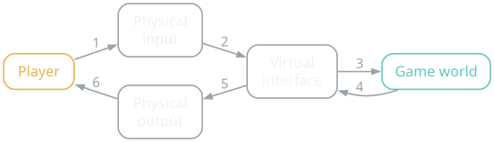
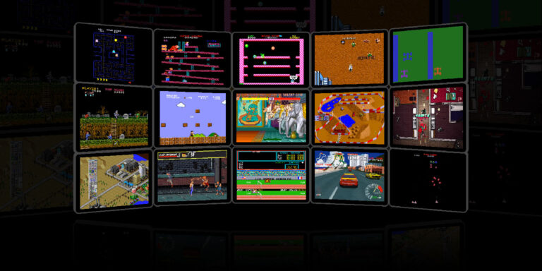
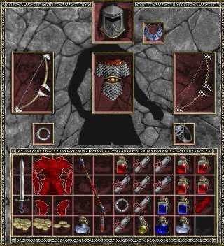

{/* Generated by scripts/convert-pptx-decks.py from the 2024 theory PowerPoints. Do not hand-edit: change the converter and re-run it. */}

{/* _class: title-slide */}

<header>

# Interface Design

COMP3540/6540 Game Development — Week 5 theory

Slides by Professor Penny Kyburz

</header>

---

## Theory: Interface Design


- 01 — Game Interface Design
- 02 — Control Schemes
- 03 — Viewpoints
- 04 — Interface Design
- 05 — Channels of Information
- 06 — Effective Interface Design

<div class="image-credit">Fullerton Ch. 8 — Schell Ch. 15</div>


---

## Game Interface

- Where the player and game come together
  - Thin membrane that separates player and game
  - When the interface fails, the experience ends abruptly
  - Should be as robust, powerful, invisible as possible
  - Goal is to make players feel in control of the experience
  - \#59 The Lens of Control
- When players use the interface, does it do what is expected? If not, why not?
- Intuitive interfaces give a feeling of control. Is your interface easy to master or hard to master?
- Do your players feel they have a strong influence over the outcome of the game? If not, how can you change that?
- Feeling powerful = feeling in control. Do your players feel powerful? Can you make them feel more powerful somehow?

<div class="image-credit">Interface Design — Schell Ch.15, p.268-295</div>


---

## Game Interface Design

- Game interface: can mean many things
  - Controller, display device, a system of manipulating a virtual character, how the game communicates info to the player

- Breaking it down: we have a player and a game world
- Physical input: player touches something to make changes in the game world
- Physical output: some way the player can see what is going on in the game world
- Virtual interface: conceptual layer that exist between the physical input/output and the game world
- Has input elements (e.g., virtual menu for selections)
- Has output elements (e.g., score display)
- Can be very thin or very dense

<div class="image-credit">Interface Design — Schell Ch.15, p.268-295</div>


---

## Game Interface Design (cont.)

<figure class="deck-figure">



<figcaption>Redrawn after Schell ch. 15</figcaption>

</figure>


---

## Game Interface Design (cont.)

- Game Interface Design
- \#60 The Lens of Physical Interface
- What does the player pick up and touch? Can this be made more pleasing?
- How does this map to the actions in the game world? Can the mapping be more direct?
- If you can't create a custom physical interface, what metaphor are you using when you map the inputs to the game world?
- How does the physical interface look under the Lens of the Toy?
- How does the player see, hear, and touch the world of the game? Is there a way to include a physical output device that will make the world become more real in the player's imagination?

<div class="image-credit">Interface Design — Schell Ch.15, p.268-295</div>


---

## Game Interface Design (cont.)

- Game Interface Design
- \#61 The Lens of Virtual Interface
- What information does a player need to receive that isn't obvious just by looking at the game world?
- When does the player need this information? All the time? Only occasionally? Only at the end of a level?
- How can this information be delivered to the player in a way that won't interfere with the player's interactions with the game world?
- Are there elements of the game world that are easier to interact with using a virtual interface (like a pop-up menu, for instance) than they are to interact with directly?
- What kind of virtual interface is best suited to my physical interface? Pop-up menus, for example, are a poor match for a gamepad controller.

<div class="image-credit">Interface Design — Schell Ch.15, p.268-295</div>


---

## Game Interface Design (cont.)

- Game Interface Design
- \#62 The Lens of Transparency
- What are the player's desires? Does the interface let the players do what they want?
- Is the interface simple enough that with practice, players will be able to use it without thinking?
- Do new players find the interface intuitive? If not, can it be made more intuitive, somehow? Would allowing players to customise the controls help or hurt?
- Does the interface work well in all other situations, or are there cases (near a corner, going very fast, etc.) when it behaves in ways that will confuse the player?
- Can players continue to use the interface well in stressful situations, or do they start fumbling with the controls or missing crucial information? If so, how can this be improved?
- Does anything confuse players about the interface? On which of the six interface arrows is it happening?
- Do players feel a sense of immersion when using the interface?

<div class="image-credit">Interface Design — Schell Ch.15, p.268-295</div>


---

## Game Interface

- The interface between the player and the game includes:
  - Input
    - Devices and control schemes
  - Output
    - Camera viewpoint of the game environment
    - Visual display of the game status and controls that allow the player to interact with the system
  - Controls, viewpoint, and interface work together to:
    - Create the game experience
    - Allow the player to understand and have agency within the system

<div class="image-credit">Interface Design — Fullerton p.254-266</div>


---

## Control Schemes

- Controls allow player inputs to a digital game
- Advances in control systems have attracted new audiences to games
  - Active immersive play of VR headsets
  - Simple, intuitive play of smartphones and tablets

<aside class="slide-aside">

- Input devices:
- Keyboard, mouse, joystick, steering wheels, plastic guns, guitars, bongo drums, multitouch screens, motion sensors, data gloves, VR headsets, voice recognition, and more

</aside>

- Need to understand the capabilities of the controller for the platform you are designing for
- Create a kinaesthetic prototype and test the controls until they are integrated with your gameplay
- Need to think about how your game can best utilise the controller – in conjunction with interface design
- Start with your list of procedures – need to be translated into a set of digital controls
- Highly detailed controls – might need to group under a menu system of other visual device – access using set of controls

<div class="image-credit">Interface Design — Fullerton p.254-266</div>


---

## Control Schemes

- After you decide how controls will work – create a control table
  - List the controls, next to each list the attached game procedure
- For very complex games / controls
  - Might need several tables, each representing a specific game state (a new state exists each time controls are changed)
  - E.g., a game where you drive a car, fly a plane, ride a bike – 3 games states, but try to keep controls similar between states
- Designing controls (like games) is an iterative process
  - Only know if they work well by testing them
- Goal is to make controls as effortless as possible
  - Players do not want to think about the controls
  - Controls should feel intuitive
  - Adding too many controls will frustrate the average player
  - Expert players – might want detailed or custom controls
    - But not at the expense of alienating less experienced players

<div class="image-credit">Interface Design — Fullerton p.254-266</div>


---

## Selecting Viewpoints

- Overhead view: looking directly down on game world
  - Affords a clear view of terrain, useful for strategy/tactics
- Side view: looking side-on at the game world
  - Side-scroller, platformer, arcade
  - Player only controls units in 2 planes, focus on puzzles
- Isometric view: angled top-down or off-axis 3D view
  - Allows "god's eye" view, strategy, construction, RPG games
- First-person view: through the eyes of a game character
  - Creates immediacy and connection with character, limits overall knowledge of the game state
- Third-person view: follows a character, but not inside their view
  - Detailed view of character's action, adventure, sport

<div class="slide-media">



</div>

<div class="image-credit">Interface Design — Fullerton p.254-266 — credit to be set when the replacement is sourced</div>


---

## Selecting Viewpoints

- What is the purpose of the interface? What is the state of the game, and how much information should the player know about it?
- Consider prototyping with different viewpoints
- Different viewpoints provide:
  - Different degrees of access to the state of the world
  - Varying relationships to the character and game objects
- Choice of viewpoint = formal and dramatic design element
  - Should the player feel extremely close to the game character, sharing their sense of movement in addition to their lack of knowledge at times?
  - Should the player remain close, but somewhat outside of the character, and be able to see more of the environment, picking up clues or tools not in direct vision of the character?
  - Is there no character in your game? Or no world? What view makes the most sense with your design?

<div class="image-credit">Interface Design — Fullerton p.254-266</div>


---

## Interface Design

- How info about the game state and options are communicated to the player
  - Points/progress, status of units, communication with other players, perpetual choices, special opportunities for action
  - How will you incorporate this info in/around your main view?
- Goal is to make the interface as easy to understand as possible
  - Ideally fresh and innovative, but familiar and intuitive
- Form follows function: design of an object must come from its purpose (architect Louis Henri Sullivan, 1896)
  - Formal elements inform interface/control design
  - Do not design the interface first, it comes from the gameplay

<div class="image-credit">Interface Design — Fullerton p.254-266</div>

```comment
figure omitted pending copyright review (see Fullerton p.254-266)
```


---

## Interface Design (cont.)

- Channels of Information
- List and prioritise information
  - Lots of info, but not all info is equally important
- List channels (ways of communicating a stream of data)
  - e.g., top-centre of screen, avatar, sound effects, music, border of screen, on enemies, word balloons over heads
  - List all the possible channels you think you might use
- Map information to channels
  - By instinct, experience, trial and error
  - Playtest, remap, repeat
- Review use of dimensions
  - A channel can have multiple dimensions (e.g., colour, size, font)
  - Can use dimensions to reinforce same info or for different info
    - Using dimensions for reinforcing helps make info clear
    - Using dimensions for different info can be elegant

<aside class="slide-aside">

- Interfaces need to communicate info
- Determining how to communicate necessary info to players in your game requires thoughtful design

</aside>

<div class="image-credit">Interface Design — Schell Ch.15, p.268-295</div>


---

## Interface Design (cont.)

- Channels of Information
  - \#66 The Lens of Channels and Dimensions
- What data need to travel to and from the player?
- Which data are most important?
- What channels do I have available to transmit these data?
- Which channels are most appropriate for which data? Why?
- Which dimensions are available on the different channels?
- How should I use those dimensions?

<div class="image-credit">Interface Design — Schell Ch.15, p.268-295</div>


---

## Effective Interface Design

- Metaphors: visual interfaces are metaphorical, graphical symbols that help us to contextualise the experience
  - Desktop metaphor (files, folders, inbox, trash)
  - What visual metaphor would best communicate all the possible procedures, rules, boundaries etc in your game?
  - Many games use physical metaphors linked to their overall theme – objects carried in an RPG in a backpack
  - Take the dry, statistical facts linked in the computer's memory and display them in a way that fits the experience
  - Keep in mind the "mental model" players bring to the game
    - Range of ideas and concepts associated with a given context
    - Can help players understand or cause them to misunderstand

- \#67.5 The Lens of the Metaphor
- Is my interface already a metaphor for something?
- If it is a metaphor, am I making the most of that metaphor? Or is the metaphor getting in the way?
- If it isn't a metaphor, would it be more intuitive if it were?

<div class="slide-media">



</div>

<div class="image-credit">Interface Design — Fullerton p.254-266 — Schell Ch.15, p.268-295 — Diablo II (Blizzard North, 2000)</div>


---

## Effective Interface Design

- Visualisation: players often need to process many types of quantitative info very quickly during a game
  - Visualise info so they can get their status at a glance
  - Cultural expectations to cue meaning = natural mapping
    - Arc (e.g., petrol gauge) left...right = empty...full
    - Rising bar (e.g., temperature) up....down = rising...falling
- Grouping features: group similar features together visually
  - Player always knows where to look for them
  - e.g., grouping combat features, health info, communications
- Consistency: keep features in same location between screens
  - Follow standards / expectations from similar games
- Feedback: letting players know their action was accepted
  - Provide feedback on each player action (did it register/work?)
  - Aural feedback is effective for creating a responsive interface

<div class="image-credit">Interface Design — Fullerton p.254-266</div>

```comment
figure omitted pending copyright review (see Fullerton p.254-266)
figure omitted pending copyright review (see Fullerton p.254-266)
```


---

## Effective Interface Design (cont.)

- Effective Interface Design
- Juiciness: second-order motion that is derived from the action of the player
- Juicy system: shows a lot of second-order motion that a player can easily control and that gives them a lot of power and rewards
  - An interaction gives you a continuous flow of delicious rewards
  - Juicy Game Design: https://www.youtube.com/watch?v=tkYtc59vytI

- \#63 The Lens of Feedback
- What do players need/want to know at this moment?
- What do you want players to feel at this moment? How can you give feedback that creates that feeling?
- What do players want to feel at this moment? Is there an opportunity for them to create a situation where they will feel that?
- What is the player's goal at this moment? What feedback will help them toward that goal?
- \#64 The Lens of Juiciness
- Is my interface giving the player continuous feedback for their actions? If not, why not?
- Is second-order motion created by the actions of the player? Is this motion powerful and interesting?
- Juicy systems reward the player many ways at once. When I give the player a reward, how many ways am I simultaneously rewarding them? Can I find more ways?

<div class="image-credit">Interface Design — Schell Ch.15, p.268-295</div>

- [https://www.youtube.com/watch?v=tkYtc59vytI](https://www.youtube.com/watch?v=tkYtc59vytI)


---

## Effective Interface Design (cont.)

- Effective Interface Design
- Primality: touch interfaces tend to be associated with juicy fun
  - Have changed gaming in a short period of time
  - Young children take to touch interfaces with ease
  - Why are touch interfaces intuitive / easy to understand?
- Before touch: interfaces were tools
  - Interaction with physical object --\> remote response
  - Humans are good at using tools, but they are not primal
  - 3 million years of tools versus 300+ million of touching things
  - \#65 The Lens of Primality
- What parts of my game are so primal an animal could play? Why?
- What parts of my game could be more primal?

<div class="image-credit">Interface Design — Schell Ch.15, p.268-295</div>


---

## Effective Interface Design (cont.)

- Effective Interface Design
- Interface Modes: change in gameplay that necessitates interface change. Tips for modes:
  - Use as few modes as possible
    - Less chance of confusion, use modes sparingly
  - Avoid overlapping modes
    - Can give rise to complicated and unintended situations and side-effects
  - Make different modes look as different as possible
    - Player needs to know what mode they are in
    - Make modes distinct by changing:
    - Something large and visible on screen
    - The action your avatar is taking
    - The on-screen data
    - The camera perspective

<aside class="slide-aside">

- \#67 The Lens of Modes
- What modes do I need in my game? Why?
- Can any modes be collapsed or combined?
- Are any of the modes overlapping? If so, can I put them on different input channels?
- When the game changes modes, how does the player know that? Can the game communicate the mode change in more than one way?

</aside>

<div class="image-credit">Interface Design — Schell Ch.15, p.268-295</div>


---

## Effective Interface Design (cont.)

- Effective Interface Design
- Steal (top-down approach)
  - Begin with the interface of a similar successful game
  - Change it to suit your game / needs
- Customise (bottom-up approach)
  - Begin from scratch – list info, channels, dimensions
  - Good for novel games or finding better solutions
- Design around your physical interface
  - Form follows function – fit to your target interface
- Theme your interface
  - Tie it together with your game world / gameplay
- Sound maps to touch
  - Sounds can make up for lack of touch feedback
  - What do you want your interface to feel like? What sounds create that feeling?

<div class="image-credit">Interface Design — Schell Ch.15, p.268-295</div>


---

## Effective Interface Design (cont.)

- Effective Interface Design
- Balance options and simplicity with layers
  - Giving players as many options as possible versus making your interface as simple as possible
  - Create layers with modes/sub-modes (e.g., inventory)
- Use metaphors
  - Make it resemble something the player has seen before
- If it looks different, it should act different
  - If it looks the same, it should act the same
- Test, Test, Test!
  - Test early and often, use paper prototypes
- Break the rules to help your player
  - Rules of thumb – lots of games copy other interfaces
  - Don't follow the 'standards' without thinking/questioning

<div class="image-credit">Interface Design — Schell Ch.15, p.268-295</div>


---

{/* _class: impact */}

## Questions?

See the [course website](/) for everything else: workshops, assessments and resources.