{/* Generated by scripts/convert-pptx-decks.py from the 2024 theory PowerPoints. Do not hand-edit: change the converter and re-run it. */}

{/* _class: title-slide */}

<header>

# Level Design

COMP3540/6540 Game Development — Week 5 theory

Slides by Professor Penny Kyburz

</header>

---

## In this lecture


- 01 — What is a level?
- 02 — Level Separation
- 03 — Level Order
- 04 — Components of a Level
- 05 — Level Flow
- 06 — Good Level Design
- 07 — Process of Level Design

<div class="image-credit">Rudolf Kremers. (2009) Level Design: Concept, Theory, and Practice. — Richard Rouse III (2005) Game Design: Theory & Practice, 2nd Ed. Ch. 23.</div>

```comment
cut: the title block was the deck title plus its two readings; the readings are in the credit line
```


---

## What is a level?

- Levels are distinct areas in a game: separated by geographical area, content or gameplay
- Many older games had one level: a variation in gameplay (Space Invaders, Centipede) or of one level (Pac-Man)

<div class="slide-media">

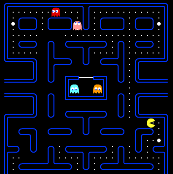
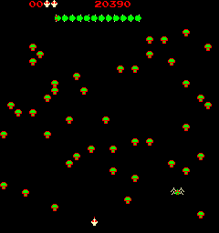
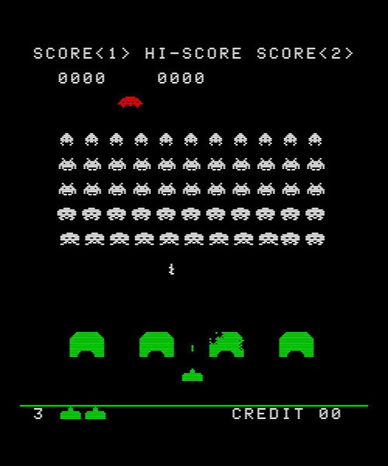
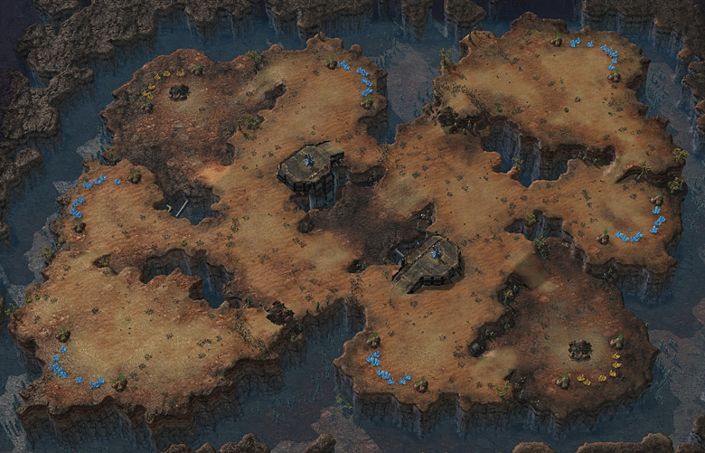
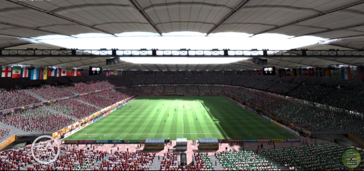

</div>

<div class="image-credit">Pac-Man (Namco, 1980) — Centipede (Atari, 1981) — Space Invaders (Taito, 1978) — StarCraft (Blizzard, 1998) — credit to be set when the replacement is sourced</div>

```comment
cut: dropped “constrained/” and the “e.g.,” hedges; the four genres move to their own slide
```


---

## Levels by genre

- Real-time strategy – a map and a set of objectives
- Racing – a track
- Sports – stadium, other team, aesthetic
- Simulation – no levels: the player constructs play, the whole game is one level


---

## Level separation

- How gameplay is broken into levels has a big impact on the flow of a game
  - Players play one level at a time – “just until I finish this level”
  - Save points can be limited to after a level
  - Player feels accomplishment after a level
- A level is like a chapter or act: tension/release on a dramatic curve

<div class="slide-media">

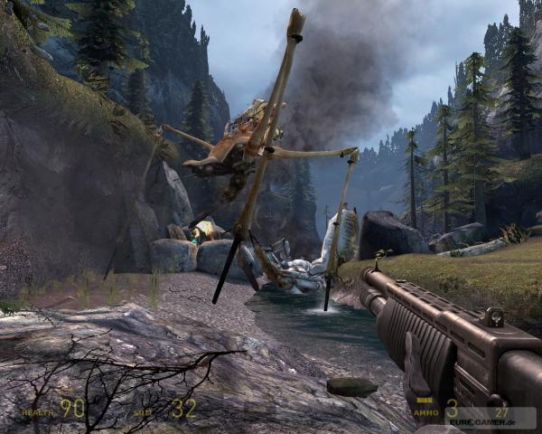

</div>

<div class="image-credit">Half-Life 2 (Valve, 2004)</div>

```comment
cut: the Level Order text box was a second, unheaded list on the source slide; it becomes the second slide here. Dropped “or put off stopping” and “book … in play”
```


---

## Level order

- Level order matters to the flow and pacing of the game – the order of level types, bosses
- Story-centric games (BioShock) need lots of planning: levels must support story events, environment, enemies
- No story constraints in some games (Doom) – earlier levels easier, restricted creatures


---

## Components of a level

- Design of levels is core to gameplay: “where the rubber hits the road”
- The goal of each level – an engaging gameplay experience
- What is the game trying to accomplish?
- How important are the different aspects of the game?
- What will the level do to support the game’s type of gameplay?
- How is the level different from others?
- Is this a “thinking” level after an action one?
- Is it about exploration and discovery, or building up the player’s character?

```comment
cut: the whole slide was loose text boxes; dropped the lead-in “Keep in mind the focus of the game”, since the six questions are the slide
```


---

## Components of a level: puzzles

- Progressing through a level may involve more than finding a path while fighting
- Figuring out how to open a door or clear an obstacle – “switch flipping”, or placing explosives in FPS games

<div class="slide-media">

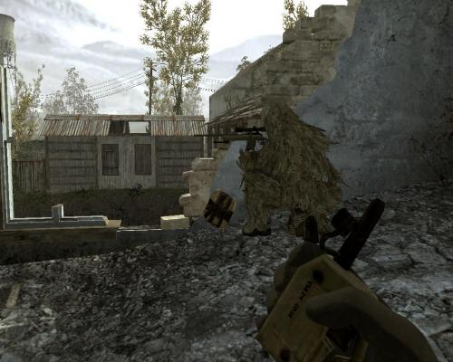

</div>

<div class="image-credit">Half-Life 2 (Valve, 2004)</div>

```comment
cut: loose text restored as the second slide; dropped “Player must figure something out to progress” (repeats the bullet above) and “Important to determine emphasis on puzzles” (the heading and question say it)
```


---

## Puzzles: how much emphasis?

- More sophisticated variants: understanding game physics to solve a physics puzzle
- Not just finding it, but finding it and figuring it out
- Puzzles must enhance the experience, not delay gameplay or pad out the game
- What is the role and importance of puzzles in this game?


---

## Components of a level: exploration

- Important in adventure, open-world and RPGs (Fallout, Grand Theft Auto)
- Not just a bridge between action – the thrill of exploring a new world
- Not just architecture: finding new things is the reward for exploring

<div class="slide-media">

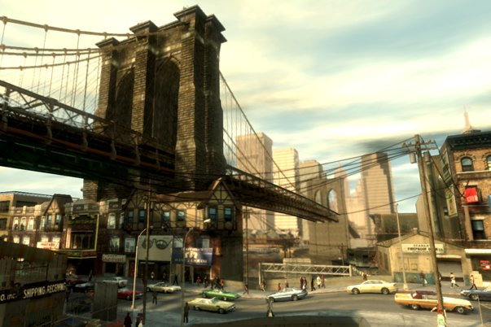
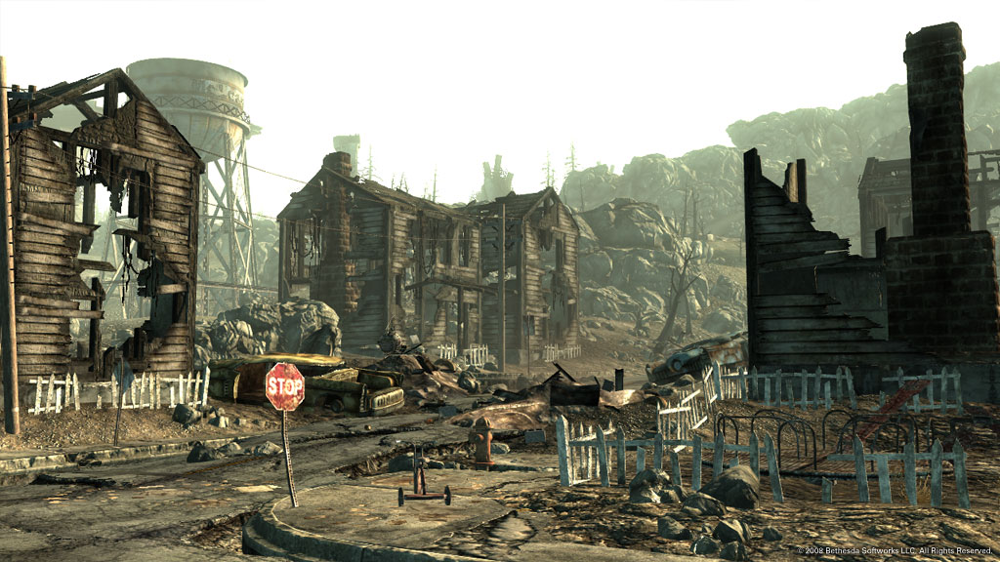

</div>

<div class="image-credit">credit to be set when the replacement is sourced — Fallout 3 (Bethesda Game Studios, 2008)</div>

```comment
cut: loose text restored as the second slide; dropped “Think about how the player will explore the level” as a lead-in
```


---

## Exploration: the player’s route

- What cool piece of art will they see around the next corner?
- How excited will players be to find new areas? Playtest with fresh eyes
- Flow of the level is central to exploration:
  - One way to proceed, or several paths to explore?
  - Obvious, or does the player have to find it?
  - Action games lead players to the next conflict; exploration games make paths less obvious


---

## Components of a level: aesthetics

- Appearance is crucial to overall success, but the level must be fun to play
- Balance the level so it looks good, plays well, renders quickly and meets story needs

<div class="slide-media">

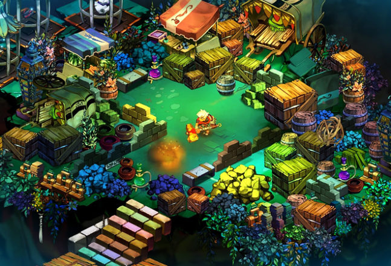

</div>

<div class="image-credit">Bastion (Supergiant Games, 2011)</div>

- [youtube.com](https://www.youtube.com/watch?v=O_fvjzdFCNs)

```comment
cut: the bare URL becomes a named link; nothing else
```


---

## Aesthetics and gameplay

- Visual appearance can also affect gameplay
  - Textures for visual cues, lighting for concealing – where the player can and can’t go
- Aesthetics might be done by artists, but the designer must know the effect on gameplay
- [Video: graphically stunning video game levels](https://www.youtube.com/watch?v=O_fvjzdFCNs)


---

## Components of a level: story

- Levels are vital for setting and storytelling
- Levels need to support the story: appearance of characters and story goals
- In story-driven games, level goals tie directly to the progression of the story

<div class="slide-media">

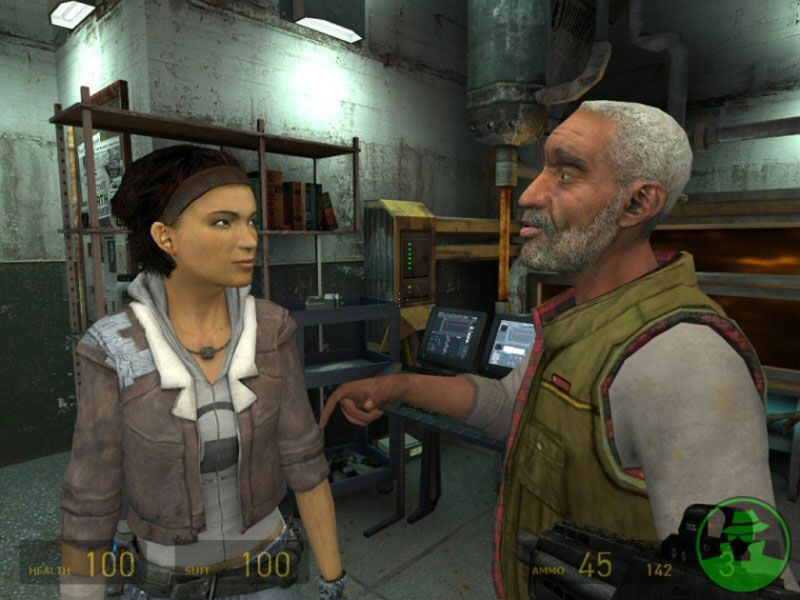
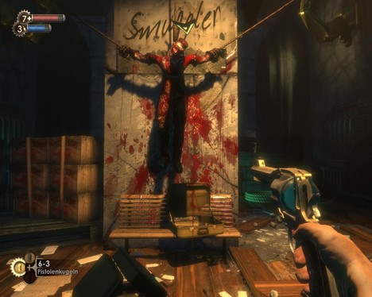

</div>

<div class="image-credit">Half-Life 2 (Valve, 2004) — Left 4 Dead (Valve, 2008)</div>

```comment
cut: loose text restored as the second slide; “story shouldn’t be overly restrictive” folded into the bullet above it
```


---

## Story and gameplay

- Story goals must be known before the level is built; settings chosen to support the story
- The story must stay loose enough for the level designer to be creative
- Gameplay: balance strategy, action, puzzles and exploration
- You cannot balance before the level exists – the story may need to change for it


---

{/* _class: impact */}

## How much action, at what pace?

- Most games contain action – fighting, running, driving, jumping

<div class="slide-media">

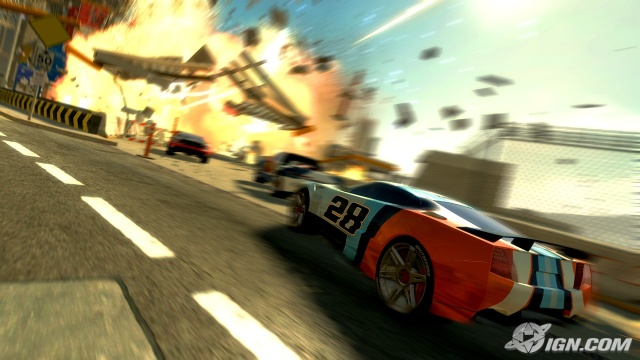
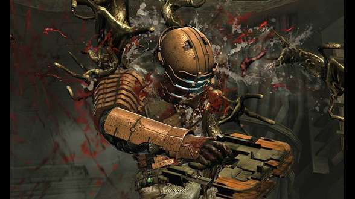

</div>

<div class="image-credit">Burnout (Criterion Games, 2001) — Dead Space (EA Redwood Shores, 2008)</div>

```comment
cut: the slide’s own first question heads it as the deck’s impact slide; loose text restored as the last three questions, with “Designer needs to consider” dropped as a lead-in
```


---

## Components of a level: action

- How much of the level should be action-filled?
- How many battles will the player fight? Is the action fast and furious?
- Are there breaks between conflicts, or a constant fear of death?
- How does the enemy AI function, and how does the map support conflicts?
- What geometry gives players cover to duck behind while dodging enemy fire?
- How can the level let players work out their own strategy for winning?


---

## Level flow: action/adventure

- Player plays a level from a distinct beginning to end
- Exploring the space is central – much less fun to play more than once
- Encounters with characters and adversaries are predetermined and set up
- Gameplay is identical each time: linear, with a few choices of A to B

<div class="slide-media">

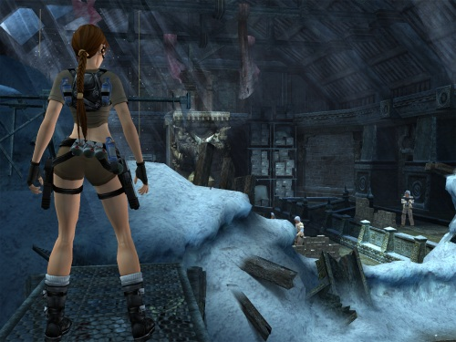
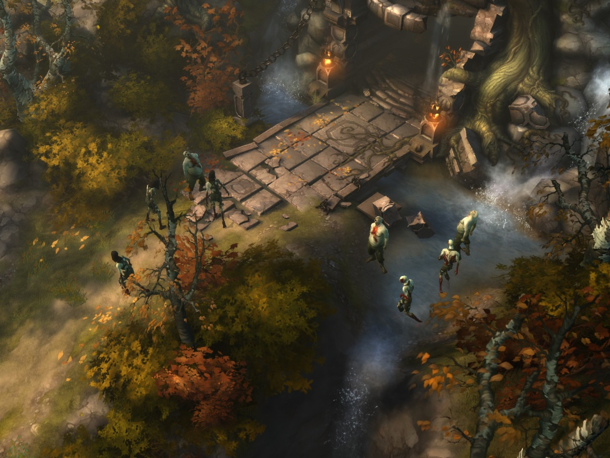

</div>

<div class="image-credit">Tomb Raider (Core Design / Crystal Dynamics) — Pillars of Eternity (Obsidian Entertainment, 2015)</div>

```comment
cut: the role-playing text box was loose and becomes the second slide; “significantly” and “carefully” dropped
```


---

## Level flow: role-playing games

- Role-playing games: similar to action, with a bit less linearity
- The designer intends a particular route, but players choose the order of actions
- “Hub” gameplay branches off different adventures from a central location – a town – where players pick challenges to hone their skills


---

## Level flow: strategy

- Action is less “canned”: battles can take place anywhere
- Different locations give strategic advantages; a battle can move from one to another
- Exploration is not central – map sections can go unexplored
- Gameplay is less predictable, flow less defined

<div class="slide-media">

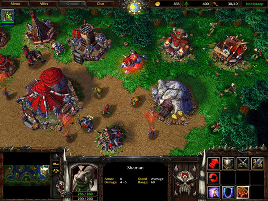
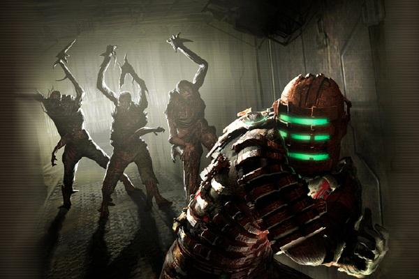

</div>

<div class="image-credit">Warcraft III (Blizzard, 2002) — Dead Space (EA Redwood Shores, 2008)</div>

```comment
cut: the deathmatch text box was loose and becomes the second slide; dropped “and unexploited”
```


---

## Level flow: FPS deathmatch

- Deathmatch is close to strategy flow: exploration matters less, combat anywhere
- Players stick to one map for a while – you must know it thoroughly to win
- Exploration and memorisation are integral to the meta-game: a means to an end, not an end in itself


---

## Level flow: open world

- Combines elements of RPG, strategy and FPS level flow
- Players go to different locations to get missions (RPG)
- Action and combat can flow all over the map (strategy)
- Players only excel once they have memorised the streets and can get around quickly (deathmatch)

<div class="slide-media">

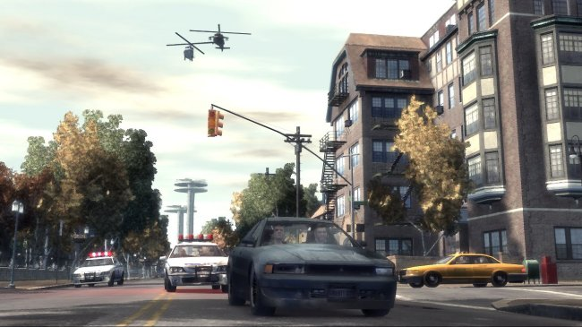

</div>

<div class="image-credit">Grand Theft Auto IV (Rockstar North, 2008)</div>

```comment
cut: nothing dropped; the screenshot moves out of the 40% panel, which cropped it
```


---

## Level flow: sports

- Non-linear flow, like deathmatch and strategy levels
- Action takes place all over the court
- Movement flows back and forth over the same ground, unpredictably
- No exploration: the whole court is always visible

<div class="slide-media">

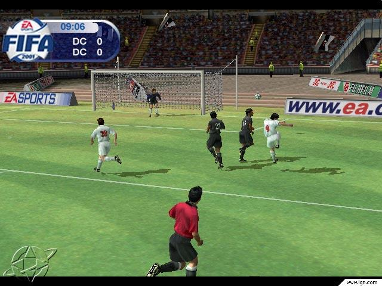

</div>

<div class="image-credit">FIFA (EA Sports)</div>

```comment
cut: the racing text box was loose and becomes the second slide; “in unique and unpredictable ways” compressed
```


---

## Level flow: racing

- Distinct start and end like exploration-led action games, but the same place – a loop
- The race path is repeated, non-linear in how players race opponents
- Modern racing games borrow exploration: visually stunning, varied levels
- Alternate paths and shortcuts for varied gameplay (SSX)


---

## Good level design: progression

- Players cannot get stuck – progression blockers: a blocked path, a trap, a vital character killed, or simply too hard
- Good planning and lots of playtesting; multiple ways to progress
- Success the first time? Too easy if most players win first time, but the possibility should exist and the player should feel they have a fair chance

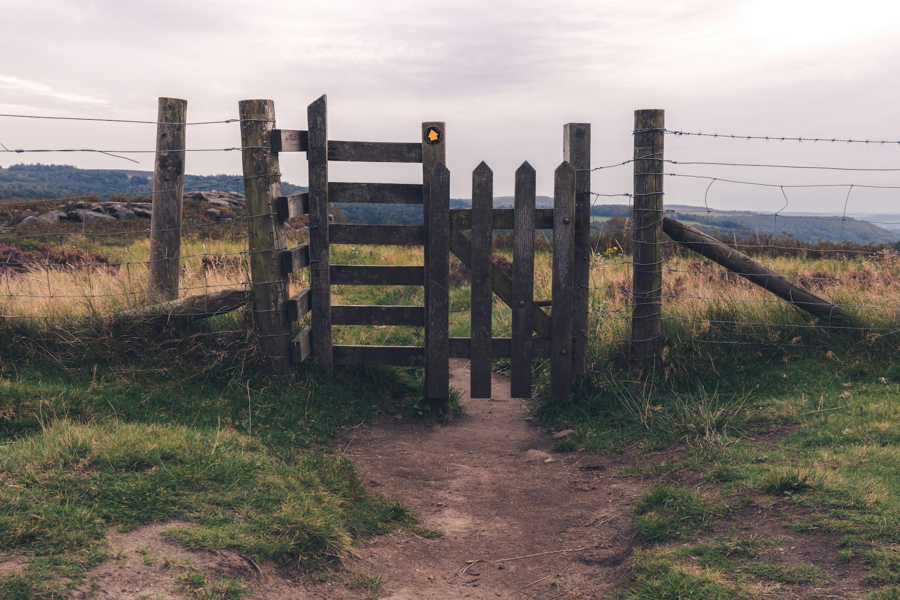

<p class="deck-sr-only">A gate closed across a worn footpath through a field: the progression blocker a level must never have.</p>

<div class="image-credit">Photo by Ben Griffiths on Unsplash</div>

```comment
cut: the navigating text box was loose and becomes the second slide; nothing dropped
```


---

## Good level design: navigating

- Landmarks: memorable landmarks ease exploration – an ornate room, a large statue, a pool of lava
- Limited backtracking: don’t make players backtrack large sections; branching paths lead back
- Navigable areas clearly marked: lighting, textures and obstacles show where you can and can’t go


---

## Good level design: goals

- Critical path: the primary goal of the level – head north, kill the creature – gives a sense of direction
- Sub-goals: tasks contributing to the final goal, with feedback and rewards for getting closer to victory

```comment
cut: the choices text box was loose and becomes the second slide; the two “not” cases are one bullet
```


---

## Good level design: choices

- Choice in how to accomplish the goals
  - FPS – bonus items, ways to kill the enemies
  - Strategy – places to battle, rally, gather resources
  - Adventure – multiple solutions to puzzles, different characters
- Real choices: not both options leading to the same outcome, and not one clearly superior


---

## Process of level design

- 1. Preliminary
- 2. Conceptual and sketched outline
- 3. Base architecture / block out
- 4. Refine architecture (until fun)
- 5. Base gameplay
- 6. Refine gameplay (until fun) – repeat 5, may return to 3
- 7. Refine aesthetics
- 8. Playtesting

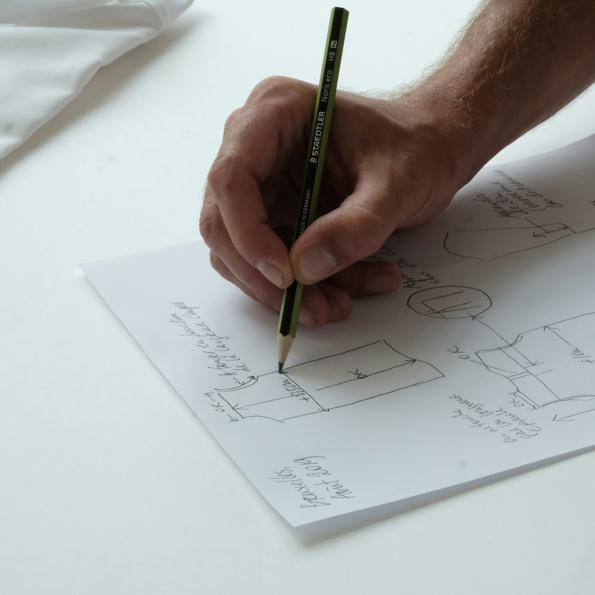

<p class="deck-sr-only">A hand sketching a plan in pencil on paper — step 2 of the process, before anything is built.</p>

<div class="image-credit">Photo by Studio Crevettes on Unsplash</div>

```comment
cut: the eight steps were a sidebar repeated on five consecutive slides; they become this slide and are dropped from the steps that follow
```


---

## 1. Preliminary

- Which gameplay and mechanics are close to final, and which are incomplete?
  - How much will the game change, and how will that impact your level?
  - Levels and gameplay are designed in tandem – both evolve over development


---

## 2. Conceptual and sketched outline

- What does the level need to do from a gameplay and story perspective?
  - Challenges, environments, pace, rewards, story elements?
  - Sketch the layout once you know what the level must accomplish
  - Changes to a sketch are easier than to a built level – use it for feedback


---

## 3. Base architecture

- When you are happy with the sketch, begin construction
  - Create the base layout so players can navigate it and reach every location
  - Get a sense of whether the layout feels right

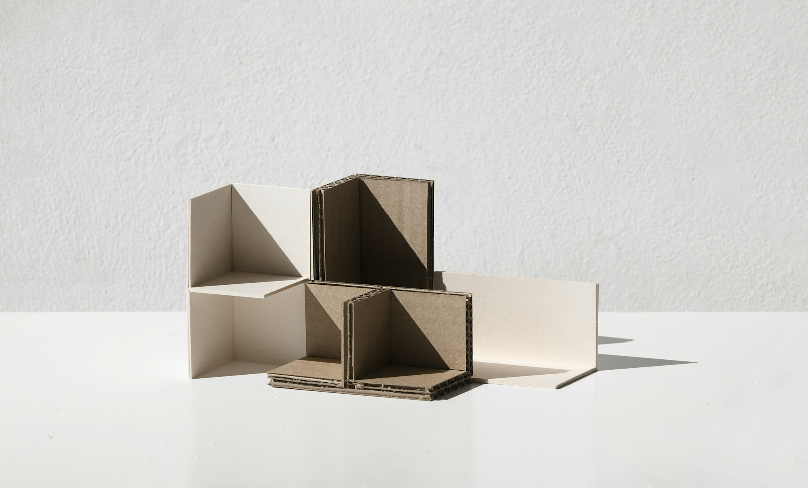

<p class="deck-sr-only">A card model of plain building volumes: architecture blocked out before any detail, as step 3 asks.</p>

<div class="image-credit">Photo by Fernando Andrade on Unsplash</div>

```comment
cut: step 4 was a loose text box and becomes the second slide; the step numbers move into the headings
```


---

## 4. Refine architecture

- Does the level as a whole make sense and flow as you hoped?
  - Navigating it as a player is how you tell whether it is working
  - Repeat steps 3-4 until the level feels right and moving through it is fun


---

## 5. Base gameplay

- When navigation feels right, start implementing gameplay
  - You planned it thoroughly before you started; now see if it works
  - Experience gives you the ability to predict whether an abstract idea will be fun
  - A level’s gameplay is the actions the player can make in that level
  - FPS – place monsters and items; RPG – plus puzzles, characters, quests; RTS – unit placement, quantities, reinforcements
- 6. Refine gameplay until it is fun: repeat step 5
  - You may need to go back to step 3 and refine the architecture

```comment
cut: step 6 and the three genre examples were loose text boxes and are restored here; “you had the gameplay in mind through all steps” compressed
```


---

## 7. Refine aesthetics

- Now it is playing well, make it look good: textures, lighting, decorations
  - May be given to artists
  - Put aesthetics off until gameplay is finished, or time is wasted on art that gets scrapped
  - Don’t break gameplay when putting the aesthetics in
- 8. Playtesting: show it to other people, let them play, get feedback
  - Give it to someone and ask what they think, or be there and observe
  - Do they get stuck or lost? Is it challenging enough? Is it fun?

```comment
cut: step 8 was a loose text box and is restored here; “flesh out visually” dropped as a repeat
```


---

{/* _class: impact */}

## Questions?

See the [course website](/) for everything else: workshops, assessments and resources.