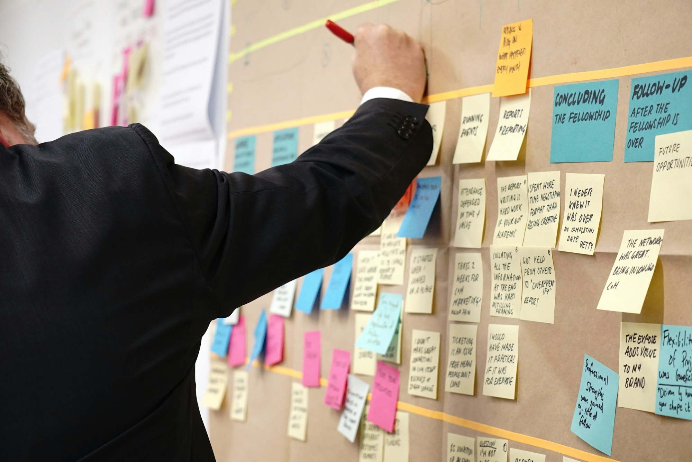
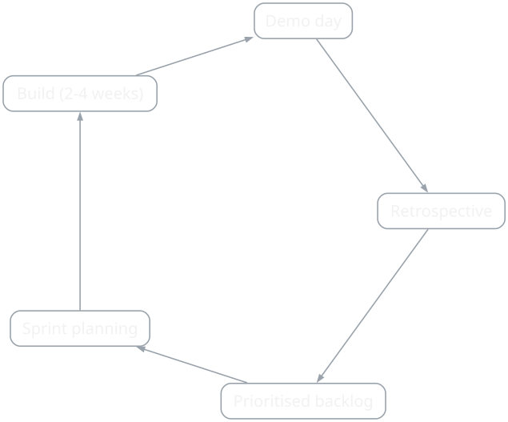
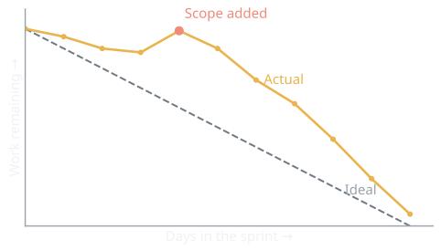

{/* Generated by scripts/convert-pptx-decks.py from the 2024 theory PowerPoints. Do not hand-edit: change the converter and re-run it. */}

{/* _class: title-slide */}

<header>

# Agile Game Development

COMP3540/6540 Game Development — Week 7 theory

Slides by Professor Penny Kyburz

</header>

---

## Overview


- 01 — Agile Manifesto
- 02 — Agile Game Development
- 03 — Agile Project Planning


---

## The Agile Manifesto


The twelve principles in short, in full at
[agilemanifesto.org](https://agilemanifesto.org/principles.html).

| What you ship | How the team works |
| --- | --- |
| Deliver working software early and often | Business people and developers work together daily |
| Welcome changing requirements, even late | Build around motivated people, and trust them |
| Ship on a scale of weeks, not months | Talk face to face |
| Working software is the measure of progress | Keep a pace the team can sustain indefinitely |
| Attend to technical excellence and good design | The best designs come from self-organising teams |
| Maximise the work *not* done | Reflect regularly, then adjust |

<div class="image-credit">Schell p.103-105 — Paraphrased from the twelve principles, agilemanifesto.org</div>

- [techtarget.com](https://www.techtarget.com/searchcio/definition/Agile-Manifesto)

```comment
cut: the four values move to the slide the source builds them up on (slide 6); this slide carries the twelve principles on their own
```


---

{/* _class: hero */}



<p class="deck-sr-only">A person adding a sticky note to a wall plan already dense with notes under handwritten headings.</p>

<div class="photo-caption">
The backlog is a list sorted by priority. Things are added, removed and reordered every sprint.
<span class="photo-credit">Photo by Jo Szczepanska on Unsplash</span>
</div>


---

## Agile Game Development

<figure class="deck-figure">



<figcaption>Drawn for COMP3540 from Schell pp. 103-105 and Fullerton pp. 431-440</figcaption>

</figure>


---

## Four values

- Individuals and interactions over processes and tools
- Working software over comprehensive documentation
- Customer collaboration over contract negotiation
- Responding to change over following a plan


<p class="deck-sr-only">Two people at a whiteboard covered in sticky notes, mid-conversation.</p>

<div class="image-credit">Fullerton p.431-440 — Photo by Sable Flow on Unsplash</div>

```comment
cut: the source reveals one value per slide; the four are one idea and read as one slide. The techtarget link stays in the credit line.
```


---

## Four values

<figure class="deck-figure">



<figcaption>Drawn for COMP3540 from Fullerton pp. 431-440</figcaption>

</figure>


---

{/* _class: impact */}

## Questions?

See the [course website](/) for everything else: workshops, assessments and resources.