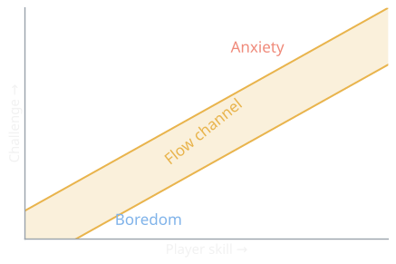
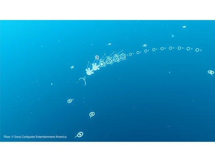

{/* Generated by scripts/convert-pptx-decks.py from the 2024 theory PowerPoints. Do not hand-edit: change the converter and re-run it. */}

{/* _class: title-slide */}

<header>

# Challenge, Difficulty, Pacing

COMP3540/6540 Game Development — Week 8 theory

Slides by Professor Penny Kyburz

</header>

---

## Theory: Challenge, Difficulty, Pacing Rudolf Kremers. (2009) Level Design: Concept, Theory, and Practice.

- 01 — Challenge
- 02 — Difficulty
- 03 — Dynamic Difficulty Adjustment
- 04 — Pacing

---

## Challenge

- Need challenge in life in order to measure our strength of character or to test our skills at a certain activity
  - Positive challenges and negative challenges
  - Feel a sense of empowerment and reward for meeting a challenge successfully
- Challenges are a great way to test player skills, enjoyment comes from:
  - Learning how to use the gameplay mechanics
  - Being confronted with new and enjoyable ways to test your ability

<aside class="slide-aside">

- Kremers – Ch. 12, 16

</aside>

Difficulty

---

## Challenge

- Challenge is not a desirable goal in itself
  - Just inserting extra challenges does not increase the value of the experience
- If no reason for the challenge:
  - Player suffers from desensitisation and boredom
  - Lose motivation and build up resentment
  - Stop taking it seriously
  - Stop feeling an emotional connection
- Without context, challenge is just hardship
  - Challenge needs to serve a higher goal (why am I doing this?)
  - Allow to reach a positive outcome (what will I get/achieve?)

<aside class="slide-aside">

- Kremers – Ch. 12, 16

</aside>

Difficulty

---

## Difficulty

- Challenge is a formal invitation or demand on the player to overcome adversity
- Difficulty describes how well the player is equipped to overcome the challenge
  - Level of challenge in relation to player skill
- The same challenge can pose different difficulty to different players
  - Human beings have wildly different abilities and skill levels
  - One danger of game design is to create an experience that is suitable to one player, but creates an insurmountable obstacle to another

<aside class="slide-aside">

- Kremers – Ch. 12, 16

</aside>

Difficulty

---

## Difficulty

- Misjudging the abilities of the player:
  - Can cause a level to be too easy or hard
  - Can lead to boredom or frustration
  - Can severely damage a player’s enjoyment of a game
- Frustration can lead players to quit the game
- Avoiding boredom is not just a matter of increasing difficulty
  - If an activity doesn’t require the use of new skills or refine the use of current skill sets, the activity will become less interesting and less rewarding

<aside class="slide-aside">

- Kremers – Ch. 12, 16

</aside>

Difficulty

---

## Difficulty

- Two major aspects of challenges in game design
  - Skill needs to balance with challenge
  - Balance is subject to considerations of challenge context

<aside class="slide-aside">

- Kremers – Ch. 12, 16

</aside>

- Challenge context
- Challenge can be used to test players, affect pacing, or allow players to measure their own strength
- The final boss is different than an idle puzzle along the way
- Players might choose a certain difficulty level (e.g., ridiculously hard)
- Some games aim to be particularly hard or easy

Difficulty

---

## Difficulty (cont.)

<figure class="deck-figure">

<figcaption>Redrawn after Csikszentmihalyi (1990); see Schell ch. 11</figcaption>

</figure>

---

## Dynamic Difficulty Adjustment

- Allowing the game to react to the apparent skill level of the player and adjust the difficulty accordingly
- Game experience is tailored to varying skill levels and play styles of its players
- Example – adjust AI based on player deaths
  - If player dies too many times in a conflict area – adjust the difficulty downwards (e.g., make AI shooting less accurate)
- Many ways to implement
  - Can yield good results if it’s not overly obvious to the player

<aside class="slide-aside">

- Kremers – Ch. 12, 16

</aside>

Difficulty

---

## Dynamic Difficulty Adjustment

- Must evaluate the need to adjust the difficulty
  - Need to gather and interpret performance data before any changes can be made (e.g., accuracy, health after encounters)
- Provides limited info on which to base important decisions
  - What if the player enjoys a playing style that results in being very close to death most of the time?
  - What if the player enjoys shooting the scenery as well as shooting enemies?
- We cannot gather data that objectively tells us the player’s real emotions and experiences directly
  - (Although there is active research on this topic)
  - Reactive/passive difficulty adjustment will always be based on subjective guesses
  - Interpretation of the data can yield incorrect conclusions, resulting in inappropriate adjustments

<aside class="slide-aside">

- Kremers – Ch. 12, 16

</aside>

Difficulty

---

## Player-Controlled Difficulty Adjustment

### Example – flOw

- Core game mechanics based on player-controlled difficulty adjustment
- Proactive difficulty adjustment controlled by the players themselves
- Puts difficulty adjustment choices in the player’s hands, rather than designing a self-regulating system that tries to interpret player actions
- Primitive marine organism that has to find food to evolve
- Can dive to more dangerous depths to find more food
- Player can find a gameplay space they are comfortable with
- Video: https://www.youtube.com/watch?v=9pRBptP3i1Q

<aside class="slide-aside">

- Kremers – Ch. 12, 16

</aside>

Difficulty — flOw (thatgamecompany, 2006)

- [https://www.youtube.com/watch?v=9pRBptP3i1Q](https://www.youtube.com/watch?v=9pRBptP3i1Q)

---

## Difficulty Tips

- Challenge is a tool for achieving something specific (not a goal in its own right)
- Arbitrary difficulty
  - Provides pointless challenge
  - Takes an existing game mechanic and makes it awkward without any good reason
- Prohibitive difficulty
  - Some games are too hard for most people to enjoy
  - Designers spend so much time playing a game that they reach an atypical skill level and are trying to entertain themselves
  - Need to entertain your audience and not yourself
- Unfair challenges
  - Some designers think of the player as their enemy and try to kill them as harshly as possible

<aside class="slide-aside">

- Kremers – Ch. 12, 16

</aside>

Difficulty

---

## Difficulty Tips

- Gameplay situations can test a player’s skills, but should not challenge players to do tasks or overcome obstacles presented in an unfair way, such as:
  - Instant death (unannounced)
  - Requiring players to do something extremely hard without training them first
  - Obscure nonsensical puzzles
  - Extended memory-based gameplay
  - Overly harsh restrictions (impossibly short time trials)
  - Lack of save points
  - One-way doors that close behind the player without warning

<aside class="slide-aside">

- Kremers – Ch. 12, 16

</aside>

Difficulty

---

## Pacing

- We want to exert control over the timing and intensity of the gameplay experience
- Pacing should keep players in "the zone" (flow channel)
  - The perfect state where immersion and enjoyment keep players in a state of gaming bliss
  - As a level/game progresses, designer needs to ensure the right balance is maintained between challenge and ability, along a learning curve that develops over time
- Designing for game pacing
  - Need to maintain a sensible learning curve
  - Under-challenge – player becomes bored, but can still try to entertain themselves
  - Over-challenge – make the player frustrated, may stop playing

<aside class="slide-aside">

- Kremers – Ch. 12, 16

</aside>

Pacing

---

## Pacing (cont.)

<figure class="deck-figure">

<figcaption>Redrawn after Csikszentmihalyi (1990); see Schell ch. 11</figcaption>

</figure>

---

## Pacing Methods

- Linear progression (a straight path from A to B)
  - Has clear advantages and if not overused can be a very effective method of controlling pacing in a level/game
    - Gives the player a great sense of clarity as progression is along one path
    - This kind of direct challenge can be enjoyable, especially if it is clear to players that they must finish an obstacle course of gameplay to progress
    - Pacing is controlled by the gameplay along the way
    - Easy to create and test such a formal environment
- Loops (player ends up at the starting point)
  - All linear advantages apply
    - Can also show the player their goal from the start – can greatly enhance sense of context in which players perform actions

<aside class="slide-aside">

- Kremers – Ch. 12, 16

</aside>

Pacing

---

## Pacing Methods

- Sandbox
  - Players come up with their own solutions, or there is at least the illusion that they can
    - Player feels that the world isn’t too prescribed
    - Provides the raw building material to create the player’s own mark on the world, can bend it to their will
  - Isn’t always easy to influence pacing in such an environment
    - But much can be done by placing certain conditional events in the world and by creating natural-looking bottlenecks
    - Player must be of a particular strength to access an area, a certain type of monster is only released once the player has a certain weapon

<aside class="slide-aside">

- Kremers – Ch. 12, 16

</aside>

Pacing

---

## Pacing Methods

- Stickiness
  - Slow the player down by creating areas that are sticky
  - Provide positive reasons for staying in an area
    - A safe area in which the player can engage in some fun activity
    - RPG selling/crafting/buying example
    - Creating a tempting discrete challenge that may yield a great reward
  - If instances of stickiness are optional, player will never feel resentful about this kind of manipulation
  - Half-Life 2 – many optional areas, filled with opportunities for almost carefree play

<aside class="slide-aside">

- Kremers – Ch. 12, 16

</aside>

Pacing

---

## Pacing Methods

- Push and pull
  - Elements in the environment that seek to influence the player’s progression, forcibly or by necessity
  - Push – players need to go down a lift, when they get to the bottom the lift breaks and makes backtracking impossible
  - Pull – player is being chased by a strong enemy, somewhere in front of them they can see a health pack
  - Games/levels are full of opportunities of pacing adjustments by pushing and pulling – can come across as natural if done well

<aside class="slide-aside">

- Kremers – Ch. 12, 16

</aside>

Pacing

---

## Pacing Methods

- Space
  - Pacing is as much determined by what you leave out as what you put in
  - There is need in game design for spaces where nothing happens
  - Spaces between gameplay events are incredibly important, part of the gameplay experience as a whole
  - Sometimes leaving empty space is a game design event in its own right
  - The full picture has to incorporate room for the player to breathe, reflect, think, observe, contemplate, and strategise
  - As vital to the action in the game as the action-packed moments

<aside class="slide-aside">

- Kremers – Ch. 12, 16

</aside>

Pacing

---

## Pacing Methods

- Puzzles as pacing devices
  - Determine the likely duration of a puzzle sequence, gives some control over pacing
- Other methods
  - Fear – scare players into adjusting their pace of progression
  - Hurry – create a necessity to rush
  - Time – affect the progression of time to create pacing changes
  - Physics – use the properties of the environment determine progress
  - AI – let the player depend on the progression of an NPC

<aside class="slide-aside">

- Kremers – Ch. 12, 16

</aside>

Pacing

---

{/* _class: impact */}

## Questions?

See the [course website](/) for everything else: workshops, assessments and resources.