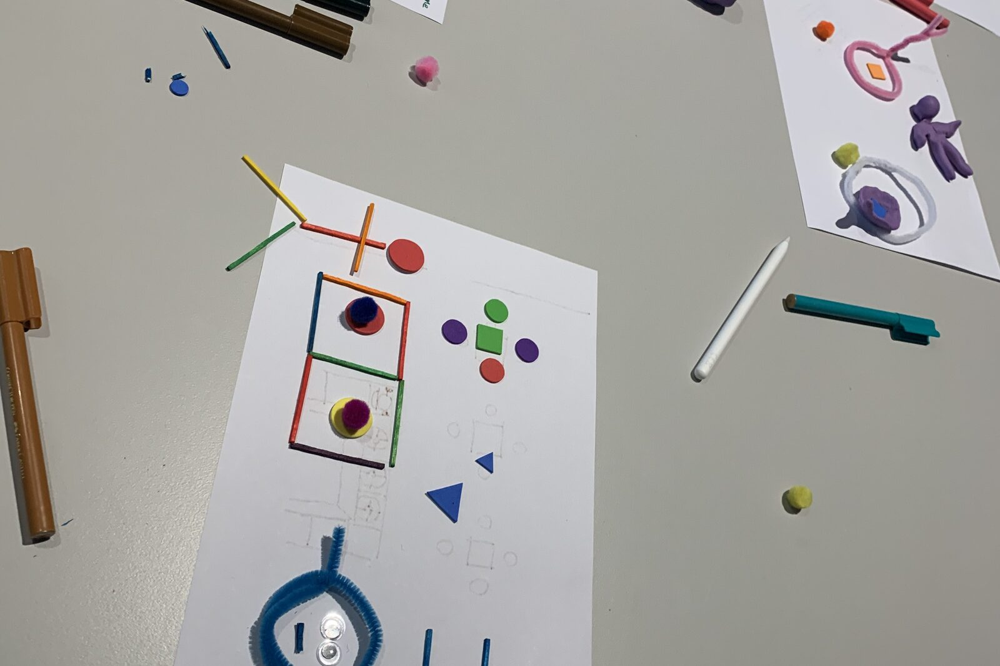
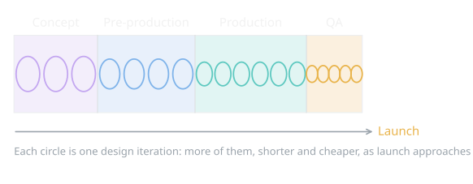
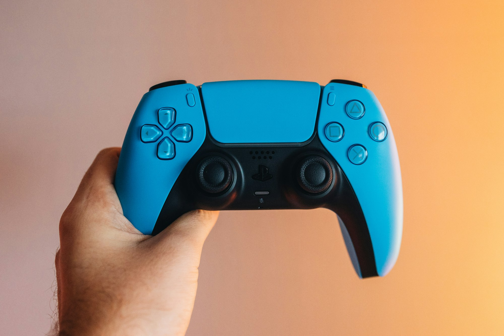
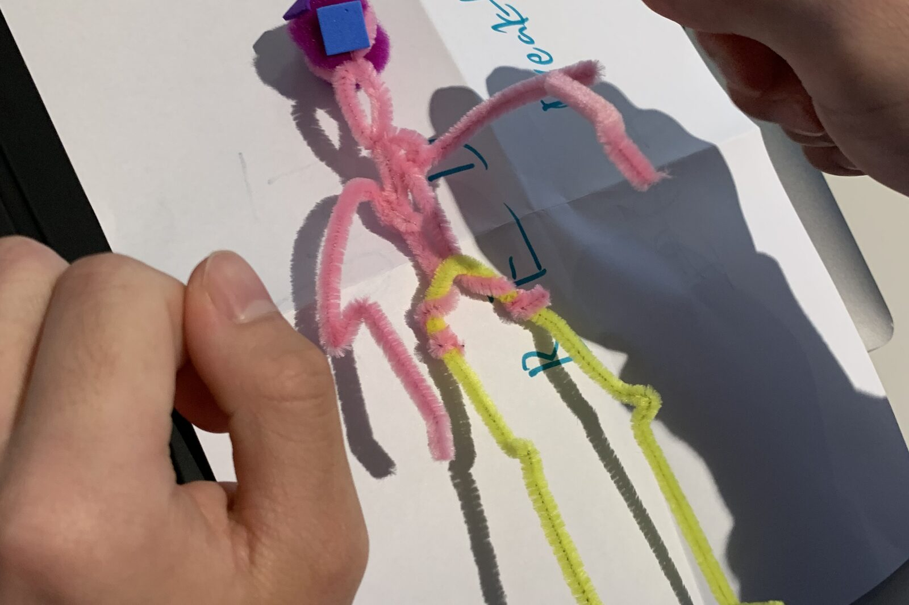
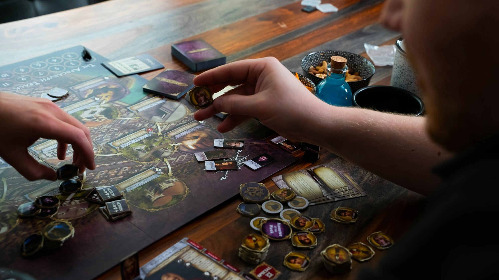
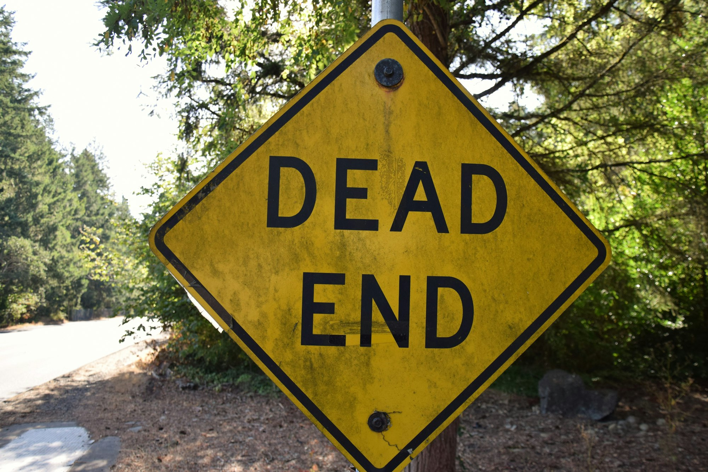

{/* Generated by scripts/convert-pptx-decks.py from the 2024 theory PowerPoints. Do not hand-edit: change the converter and re-run it. */}

{/* _class: title-slide */}

<header>

# Playtesting Process

COMP3540/6540 Game Development — Week 9 theory

Slides by Professor Penny Kyburz

</header>

---

## In this lecture


- 01 — Introduction to Playtesting
- 02 — Playtesting & Iterative Design
- 03 — Types of Playtesters
- 04 — Playtesting Prototype Phases

```comment
cut: the title block was the deck title; nothing dropped
```


---

## Introduction to playtesting

- The single most important activity a designer engages in
  - Often the least understood, and left to last
- Misconception: playtesting is just playing the game and giving feedback
- Reality: a full process – selection, recruiting, preparation, controls, analysis

<aside class="slide-aside">

- What is playtesting?
- Something the designer performs throughout the entire design process to gain insight into how players experience the game

</aside>

<div class="image-credit">Fullerton Ch.9 p.277-310</div>

```comment
cut: the four other kinds of testing become their own slide; dropped “etc” from usability testing and “marketing questions” as a restatement
```


---

## Often confused with playtesting

- Internal design review – developers play the game and discuss the features
- Quality assurance – testing and searching for flaws and bugs
- Focus group testing – marketing bring people in to play and ask about price and selling points
- Usability testing – recording mouse movements, eye movements and navigation patterns

<div class="image-credit">Fullerton Ch.9 p.277-310</div>


---

## Ways to playtest

- Informal and qualitative – 10 friends in your garage
- Structured and quantitative – hundreds in a professional lab
- Goal: useful feedback from players to improve your game
- Make sure your game is:
  - Functioning as intended
  - Internally complete
  - Balanced and fun to play



<p class="deck-sr-only">A workshop desk with a small paper prototype set up mid-game beside pens and spare pieces.</p>

<div class="image-credit">Fullerton Ch.9 p.277-310 — COMP3540 workshop, 2024</div>

```comment
cut: dropped the lead-in “numerous ways to conduct playtesting” — the heading says it — and the “e.g.,” hedges
```


---

## Playtesting and iterative design

- The designer is the player’s advocate throughout development
- A continual iterative process
  - Cycles get tighter as production moves forward
  - Smaller and smaller issues to solve and changes to make
  - No fundamental or dramatic changes towards the end
- Playtesting in beta – a fully functional game – is too late
  - No fundamental changes: you are stuck with the core gameplay
- Playtest and iterate from the start

<div class="image-credit">Fullerton Ch.9 p.277-310</div>

```comment
cut: nothing dropped; the nesting is one level and the sub-points sit under the claim they qualify
```


---

## Playtesting and iterative design

<figure class="deck-figure">



<figcaption>After Fullerton ch. 1; redesigned as a timeline</figcaption>

</figure>


---

## Self-testing (you!)

- You, individually or as a team – and throughout the project
- Early stages: experiment with concepts and core mechanics
- Fix obvious problems
- Try playing with a “fresh” mind
- You will rely on others more as you go



<p class="deck-sr-only">Two hands holding a games controller: self-testing is playing your own game, over and over.</p>

<div class="image-credit">Fullerton Ch.9 p.277-310 — Photo by Kamil Switalski on Unsplash</div>

```comment
cut: the aside’s two sentences fold into the first and last self-testing bullets, so the slide can carry a photograph; confidants become their own slide
```

```comment
self-testing – early stage of development when you’re experimenting with fundamental concepts, individually or as a group, come up with core mechanics, fix obvious problems with play experience – goal is to make the game work (rough approximation of final product), self-test throughout project
playtesting with confidants – after foundation stage and prototype is playable, test with people you know well (outside design team), might need to be present/explain things (incomplete prototype), aim to have a prototype that can be played without intervention (complete interface, maybe some written rules), do not rely on these people (not objective)
```


---

## Playtesting with confidants

- Confidants – people you know well, outside the design team
  - Fresh eyes, but they are not objective
- An incomplete prototype – you might need to explain things
- Aim for a prototype they can play without much intervention
  - Physical prototype – write down the full set of rules
  - Digital prototype – interface in place, some written rules
- Wean yourself off confidants once the prototype is playable – for balanced feedback

<div class="image-credit">Fullerton Ch.9 p.277-310</div>


---

## People you don’t know

- Strangers: difficult to let them play your incomplete game

Who you play with changes as the prototype matures.

| Prototyping stage | Playtest on your own | Playtest with confidants | Playtest with target audience |
| --- | --- | --- | --- |
| 1) Foundations | yes | | |
| 2) Structure | yes | yes | |
| 3) Formal details | | | yes |
| 4) Refinement | | | yes |

<div class="image-credit">Fullerton Ch.9 p.277-310 — After Fullerton, fig. 8.2</div>

```comment
cut: the first bullet is alone on the slide the Fullerton fig. 8.2 table lands on; the two groups of outsiders share the second slide. “vocal about it” and “within target audience” compressed
```

```comment
playtesting with people you don’t know – difficult to let strangers play incomplete game, need their fresh perspective (nothing to lose/gain by telling you how they honestly feel), no knowledge of the game
playtesting with target audience – ideal tester is someone who represents your target audience, testers who actually go out and spend their money to buy games like yours – far more relevant feedback as have a gut instinct for what works, compare your game with others to provide additional market research, will know what they like/dislike and tell you in excessive detail, target audience will provide insight no one else can; more diverse a group the better (broad range of people within target audience), want people who play your games but not too narrow a selection of target audience
post notices on gaming websites, might need to have participants sign a non-disclosure agreement (NDA) (person promises not to tell anyone about your product until it is released)
playtesters typically paid in cash or free games, don’t be paranoid about people stealing your ideas, provide snacks/drinks
```


---

## Strangers and the target audience

- You need their fresh perspective
  - Nothing to lose or gain by telling you how they feel
  - No knowledge of the game
- People who represent your target audience
  - They spend money on games like yours – more relevant feedback
  - They compare your game to others, and know what they like and dislike
  - Insight no one else can give; the more diverse the group the better

<div class="image-credit">Fullerton Ch.9 p.277-310</div>


---

{/* _class: impact */}

## Who should be there?

- It depends on why you are testing

<div class="image-credit">Schell p.482-495</div>

```comment
cut: the slide’s own question heads it as the deck’s impact slide; nothing dropped
```


---

## Who to invite, and why

- Developers – convenient and know the game, but too close to it and biased
- Friends – available and comfortable, but biased and not honest
- Expert players in your genre – detailed feedback and comparison with similar games, but not representative of most players
- New players – fresh eyes on usability and initial appeal, but you also want to test long-term play

<div class="image-credit">Schell p.482-495</div>


---

## Finding ideal playtesters

- Advertise for testers – recruit from a range of sources
- Screen applicants
  - Articulate enough to convey opinions
  - Can they hold a conversation on the phone?
  - Basic demographics: hobbies, why they applied
  - How often do they buy these games?


<p class="deck-sr-only">Two people talking across a table, one listening: screening an applicant is a conversation.</p>

<div class="image-credit">Fullerton Ch.9 p.277-310 — Photo by LinkedIn Sales Solutions on Unsplash</div>

```comment
cut: the screening questions become sub-bullets short enough for the narrow column; nothing dropped
```

```comment
finding the ideal playtesters – tap into community (recruit from high school, college, sports club, social organisations etc), post online or put ad in the paper (more sources give better candidate pool) – then screen and turn down applicants (once you have enough applicants), look for tests articulate enough to convey opinions (e.g. can hold a decent conversation on the phone), ask questions for basic demographics – hobbies, why did you apply, how often do you buy this type of game (if not a consumer of this type of game then feedback is less useful)
```


---

## Playtesters for your project

- Recruiting like this is not relevant for your projects
  - You can make use of other students in your workshop
  - Students in other workshops will peer assess your game – do not get them to playtest it

<div class="image-credit">Fullerton Ch.9 p.277-310</div>


---

## Playtesting in phases

- Discrete phases, each focused on part of the design

What you test for changes too: fun comes first and last.

| Prototyping stage | Functional? | Internally complete? | Balanced? | Fun? | Accessible? |
| --- | --- | --- | --- | --- | --- |
| 1) Foundations | | | | yes | |
| 2) Structure | yes | | | yes | |
| 3) Formal details | yes | yes | yes | | |
| 4) Refinement | | | | yes | yes |

<div class="image-credit">Fullerton Ch.10 p.311-320 — After Fullerton, fig. 9.1</div>

```comment
cut: the two loose text boxes (“break playtesting into discrete phases”, “each focuses on specific aspects of design”) become the first bullet, cut to one line because it shares the slide with the Fullerton fig. 9.1 table; the “Playtesting” label and the loose “Fullerton Ch.10 p.311-320” pointer are dropped, and that reading is in the credit line from Phase 3 on
```

```comment
break playtesting process into several discreet phases, each focusing on specific aspects of the design, perfecting these aspects and then moving on to the next phase
foundation – main concern is that basic idea for the game is fun, might only be a core mechanic, probably only playing the game on your own
```


---

## Phase 1: Foundation

- The basic idea is fun and engaging, with the potential to reach your design goals
- Might be the core mechanic and nothing else
- Will likely just be self-testing

<div class="image-credit">Fullerton Ch.10 p.311-320</div>


---

## Phase 2: Structure

- Playable by people without a full vision of the end – confidants
- Does the foundation hold up under real players?



<p class="deck-sr-only">Hands moving a pipe-cleaner character across a paper prototype during a workshop.</p>

<div class="image-credit">Fullerton Ch.10 p.311-320 — COMP3540 workshop, 2024</div>

```comment
cut: the nine questions were loose text boxes off a dropped diagram; they are what the Structure phase tests for, so they are restored as the second slide. “Rigours of” and the loose “Functionality and fun” label are dropped — the questions below ask both
```


---

## Structure: the questions to ask

- Are the formal elements working together in this basic state?
- Is your experience goal starting to take shape?
- Is there a beginning, middle and end to the experience?
- Can players reach the objective? Are they engaging in the conflict you designed?
- Are they enjoying that challenge? Is there a spark to your game?
- Should you continue with this idea, or start again?

<div class="image-credit">Fullerton Ch.10 p.311-320</div>


---

## Phase 3: Formal details

- Build a fully functional version of the game system
- Focus on making your game functional, internally complete and balanced
- Fun is difficult at this stage, but look for the promise of fun

<div class="image-credit">Fullerton Ch.10 p.311-320</div>

```comment
cut: Refinement becomes its own slide; the aside repeats the “discrete phases” text that is now a bullet on the phases slide
```

```comment
Formal details – build out a fully functional version of the game system – what do you do with feedback from playtesters? Focus on making the game (1) functional, (2) internally complete, (3) balanced
Refinement – game should be functional, complete and balanced – focus on making sure the game is fun and accessible
```


---

## Phase 4: Refinement

- The game should be functional, complete and balanced
- Is it fun? Is it accessible?

<div class="image-credit">Fullerton Ch.10 p.311-320</div>


---

## Testing for functionality

- Someone who knows nothing can sit down and play it
- The system’s components interact properly
- A resolution can be achieved
- Paper – players follow the rules and never reach an impasse
- Software – the controls and core loop let players progress



<p class="deck-sr-only">Two players reaching across a table strewn with tokens and cards, mid-game.</p>

<div class="image-credit">Fullerton Ch.10 p.311-320 — Photo by 2H Media on Unsplash</div>

```comment
cut: “the system is established to the point where” dropped as a lead-in; “procedures” folded into “the rules”
```

```comment
The system is established to the point where someone who knows nothing about the game can sit down and play it, components of the system interact properly and a resolution can be achieved
Paper prototype – players can play the game following the rules and procedures properly and not reach an impasse
Software prototype – players can use the control and make the game progress
```


---

## Testing for completeness

- An internally complete game: players can operate it without the gameplay or functionality being compromised
- You can say your game is complete at any stage – and no game is ever complete
- Gaps in the rules result in an exploit, a dead end or a complete breakdown
  - “the rules don’t say either way”, “I’m completely stuck”, “you can’t do that”
- Go back to the rules and look for holes

<div class="image-credit">Fullerton Ch.10 p.311-320</div>

```comment
cut: nothing dropped; the definition is kept whole
```

```comment
Completeness – an internally complete game is one in which the players can operate the game without reaching any point at which either the gameplay or the functionality is compromised
Need to test every permutation under all conditions
Gaps in the rules – result in loophole, dead-end or complete breakdown
“the rules don’t say either way”, “I’m completely stuck”, “you can’t do that”
After identifying incomplete section, go back to rules and look for holes, plug holes/complete rules so they make sense – can affect other parts of the game
```


---

## Completeness: loopholes

- A loophole is a flaw users can exploit to gain an unfair or unintended advantage
  - Ruins the experience for all players
- Players ferret them out – it can take over the main gameplay
- Loopholes vs. features – do they improve the experience, or ruin it for some players?

<div class="image-credit">Fullerton Ch.10 p.311-320</div>

```comment
cut: how to find them becomes the second slide; nothing dropped
```

```comment
Loopholes – a flaw in the system which users can exploit to gain an unfair or unintended advantage – in videogames so many possibilities difficult to test them all, some players make a point of ferreting them out
Loopholes versus features – system issues can be loopholes or benefits
Usually won’t find all loopholes before release, some developers use a public beta test – can dampen sales of the game but can be a valuable tool
When discover a loophole, need to tweak system and perform another playtest – iterative process and each loophole can take days/weeks to solve
To find and remove loopholes:
Use control situations to test aspects of the system in isolation, do a series of playtests where you instruct testers to attempt to disrupt the system – challenge them to see who can come up with the most creative way to get ahead, find testers who enjoy figuring out alternative or subversive solutions
```


---

## Loopholes: finding them

- You won’t find them all in a complex game – too many possibilities
  - A public beta test
  - Use control situations to test aspects in isolation
  - Find people who enjoy this, and instruct players to disrupt the system

<div class="image-credit">Fullerton Ch.10 p.311-320</div>


---

## Completeness: dead ends

- The player gets stuck
  - Cannot continue towards the objective, whatever they do
- Adventure games are susceptible – objects collected to use later
- Strategy – the player runs out of resources
- FPS – a space the player stumbles into and cannot get out of



<p class="deck-sr-only">A yellow DEAD END sign beside a road running into trees.</p>

<div class="image-credit">Fullerton Ch.10 p.311-320 — Photo by fr0ggy5 on Unsplash</div>

```comment
cut: dropped the “e.g.,” hedge on the adventure-game example; nothing else
```

```comment
Dead-ends – occurs when a player gets stranded in the game and cannot continue towards the game objective no matter what they do (adventure games susceptible to this – if need to collect objects and use them to solve a puzzle; strategy games where the player cannot win as they run out of resources; FPS - space player stumbles into and cannot get out of)
```


---

## Balance and fun

- Balance (Week 4 theory) – the game meets the goals you set for the player experience
  - The system is of the scope and complexity you envisioned
  - The elements work together without undesired results
- Fun (Week 3 theory) – is your game fun?
- Is your game accessible to new players? Can someone pick up and play?
- Test people who are part of the target audience, objective (not friends), and have never played the game

<div class="image-credit">Fullerton Ch.10 p.321, Ch.11 p.349, 376-377</div>

```comment
cut: the two phases fit one slide, so the source’s “(cont.)” slide is gone; nothing dropped
```

```comment
Balance - Process of making sure the game meets the goals you’ve set for the player experience: that the system is of the scope and complexity you envisioned and that the elements of the system are working together without undesired results
Is your game accessible?
Need to test people who are: part of the target market, objective (not friends), have never played the game
Need to test a fair few – three to five for each segment of he market
```


---

{/* _class: impact */}

## Questions?

See the [course website](/) for everything else: workshops, assessments and resources.