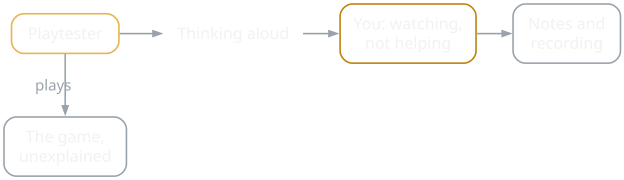
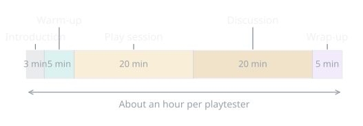
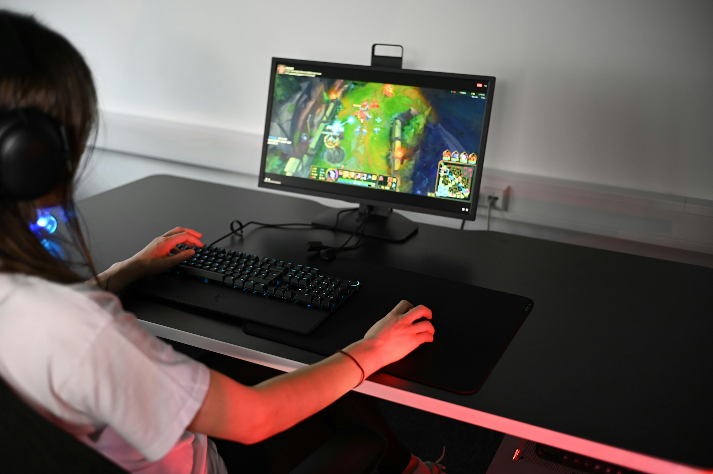
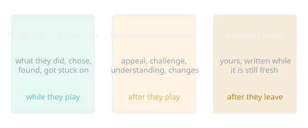
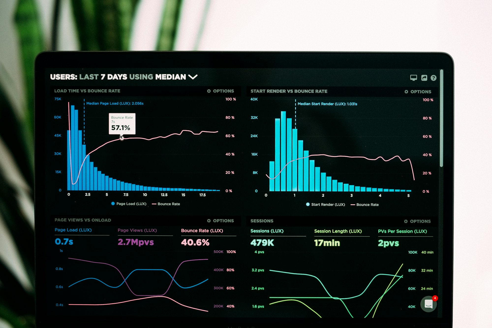

{/* Generated by scripts/convert-pptx-decks.py from the 2024 theory PowerPoints. Do not hand-edit: change the converter and re-run it. */}

{/* _class: title-slide */}

<header>

# Conducting Playtesting

COMP3540/6540 Game Development — Week 9 theory

Slides by Professor Penny Kyburz

</header>

---

## This lecture


- 01 — Conducting Playtesting
- 02 — Methods of Playtesting
- 03 — A Primer for Playtesting
- 04 — Taking Notes
- 05 — Usability Techniques
- 06 — Data Gathering
- 07 — Control Situations

```comment
cut: the `Theory: ...` title block is the deck title, not a heading
```


---

## Your role: observer

- Your role is investigator and observer, not designer
- Give playtesters access, lead a useful playtest, record what they do and say, then analyse their responses
- Don't tell them what to think, or explain how it works
- Let them play with minimal explanation, make mistakes, and see how each person approaches it
- Ideally an objective person runs the test while you watch from a distance — behind glass or via video
- Create a test script to keep you on track as observer

<div class="image-credit">Fullerton Ch.9 p.277-310</div>

```comment
cut: seven sentences become six fragments; "minimal explanation", "make mistakes" and "see how each person approaches it" are one bullet now
```


---

## Your role: observer

<figure class="deck-figure">



<figcaption>Drawn for COMP3540 from Fullerton ch. 9, pp. 277-310</figcaption>

</figure>


---

## The test script

- Introduction (2-3 mins)
- Warm-up discussion (5 mins)
- Play session (15-20 mins)
- Discussion of game experience (15-20 mins)
- Wrap-up

<div class="image-credit">Fullerton Ch.9 p.277-310</div>

```comment
cut: the test-script sidebar, held on screen across five source slides, becomes this slide's own list; the introduction and warm-up details follow
```


---

## Introduction (2-3 mins)

- Welcome the playtesters and thank them for taking part
- Introduce yourself, and anyone else present
- Brief explanation of the playtesting process
- Say if you are recording video or audio — for your reference, not for sharing

<div class="image-credit">Fullerton Ch.9 p.277-310</div>


---

## Warm-up: get them talking

- Write some questions to get them talking, such as:
- What are some of the games you play?
- What do you like about these games?
- What was the last game you purchased?

<div class="image-credit">Fullerton Ch.9 p.277-310</div>


---

## The test script

<figure class="deck-figure">



<figcaption>Drawn for COMP3540 from Fullerton ch. 9, pp. 277-310</figcaption>

</figure>


---

## Play session (15-20 mins)

- Explain the game is still in development and you want their feedback — you are testing the game, not their skill
- Any issues they hit will help improve the game
- Then leave them alone and watch remotely, or watch quietly from behind
- Either way, ask them to think aloud — what are they thinking, choosing, confused about?
- You learn far more than by watching; they forget, so remind them and ask what they are trying to do now
- It can feel weird — encourage them, let them practise

<div class="image-credit">Fullerton Ch.9 p.277-310</div>

```comment
cut: the think-aloud text boxes the converter had stranded in a comment are now the second half of the slide; the repeated test-script sidebar is gone
```


---

{/* _class: hero */}



<p class="deck-sr-only">A player at a desktop computer seen from behind over their shoulder, the game on screen.</p>

<div class="photo-caption">
Watch from behind, or watch remotely. Either way, ask them to think aloud — and keep reminding them.
<span class="photo-credit">Photo by ELLA DON on Unsplash</span>
</div>


---

## Discussion (15-20 mins)

- One-on-one discussion after the play session
- Probe for appeal, interest, challenge, understanding — for example:
- Overall, what were your thoughts about the game?
- What were your thoughts about the game play?
- Were you able to learn quickly how to play?
- What is the objective of the game?

<div class="image-credit">Fullerton Ch.9 p.277-310</div>

```comment
cut: all eight of Penny's example questions kept, word for word, across two slides; "Example questions" folded into the bullet above them
```


---

## Discussion: more questions

- How would you describe the game to someone else?
- Is there anything you wish you knew before starting to play?
- Is there anything you didn't like about the game?
- Was there anything you found confusing?
- You will have specific questions, based on your goals
- Focus on the most important questions at this stage

<div class="image-credit">Fullerton Ch.9 p.277-310</div>


---

{/* _class: hero */}


<p class="deck-sr-only">Two people sitting across a table in conversation, one listening with hands folded.</p>

<div class="photo-caption">
The discussion afterwards is half the session. Probe for appeal, challenge and understanding — and do not defend the game.
<span class="photo-credit">Photo by LinkedIn Sales Solutions on Unsplash</span>
</div>


---

## What data will I collect?

- FFWWDD — after the play session:
  - What was the most frustrating moment or aspect?
  - What was your favourite moment or aspect?
  - Was there anything you wanted to do that you couldn't?
  - If you had a magic wand to change, add, remove anything, what would it be?
  - What were you doing in the experience?
  - How would you describe this game to your friends and family?

<div class="image-credit">Schell p.482-495</div>

```comment
cut: three levels of nesting flattened to two; Schell's six questions unchanged
```


---

## Wrap-up and tips

- Thank the playtesters; a token gift is a nice touch
- Listen to their feedback without responding or defending; write criticisms down
- You are looking for things to improve, not praise — and criticism of your own creation is hard to hear
- Do not lead your playtesters to say what you want to hear
- Better to hear the bad news now than after you release
- In groups, people sway each other (group think) and some dominate (group dynamics)

<div class="image-credit">Fullerton Ch.9 p.277-310</div>

```comment
cut: "Tips" as a sub-list flattened into the slide's bullets; the test-script sidebar appears once, earlier
```


---

## Methods of playtesting

- Individual vs. group: good for ideas, bad for evaluation
- One-on-one: watch, take notes, ask questions
- Group testing: they play together while you observe and ask
- Feedback forms: a standard list after playing
- Compare results — quantitative, shows how often a problem hits


<p class="deck-sr-only">Two players seen from behind, side by side, watching a split-screen game on a television.</p>

<div class="image-credit">Fullerton Ch.9 p.277-310 — Photo by Emily Wade on Unsplash</div>

```comment
cut: each method keeps its name and its point in six words; the full-bleed photograph moves into the column beside them
```

```comment
Usability testing takes place individually, group dynamics are good for generating ideas but bad for evaluating
One-on-one testing – sit down with individuals and watch over their shoulders as they play, take notes and ask them questions along the way
Group testing – get a group of people and allow them to play the game together, observe the group and ask questions as they play
```


---

## Methods: interviews and metrics

- Interview: face-to-face, in depth, after playing
- Open discussion: individual or group, open or structured
- Metrics: collected in-game or by other tools
- What are players using, or not using? For tuning
- Combine approaches: game, space, time, money
- Not testing is not an option!

<div class="image-credit">Fullerton Ch.9 p.277-310</div>


---

## A primer for playtesting

- Playtest before you think you are ready
- Strategise for early playtesting
- Know why you are playtesting — what question are you answering?
- Prepare variations
- Be grateful to your playtesters (say thanks)
- Design the learning experience (and playtest it)

<aside class="slide-aside">

- "Rules" by Zimmerman and Pozzie

</aside>

<div class="image-credit">Fullerton Ch.9 p.277-310</div>

```comment
cut: Zimmerman and Pozzie's twelve rules, unchanged, six to a slide
```


---

## Primer: know your testers

- Blame yourself, not your playtesters
- Know your testers — hardcore gamer or new player
- Don't explain — explain as little as possible
- Take notes — it shows you care; prepare a notes sheet
- Be selfish — you are there to learn, not for testers to have fun
- Encourage your playtesters to talk aloud (and remind them)

<div class="image-credit">Fullerton Ch.9 p.277-310</div>


---

{/* _class: hero */}


<p class="deck-sr-only">Hands moving a pipe-cleaner character across a paper prototype during a workshop.</p>

<div class="photo-caption">
Playtest before you think you are ready. The first one always finds something the tenth would not.
<span class="photo-credit">COMP3540 workshop, 2024</span>
</div>


---

## Primer: notice everything

- Notice everything — what they did, chose, how long it took
- Shut up — don't interfere, explain, or tell them what to do
- See the big picture — what are the human reactions?
- Don't be afraid of data — the right data will help you
- Answer a question with a question — how do you think it works?

<div class="image-credit">Fullerton Ch.9 p.277-310</div>

```comment
cut: the remaining thirteen rules, unchanged, across three slides
```


---

## Primer: hunger for failure

- Hunger for failure — look for what is not working
- Discuss what happened — focus on the most important aspects
- Put feedback into context — players identify issues, not fixes
- Collaborate with your playtesters — gather their fresh ideas

<div class="image-credit">Fullerton Ch.9 p.277-310</div>


---

## Primer: break these rules

- The cruelly honest playtest — the truth hurts
- Embrace the unexpected — it might be better than the plan
- The playtest's the thing — get the process right
- Break these rules

<div class="image-credit">Fullerton Ch.9 p.277-310</div>


---

## Taking notes

- You cannot remember every comment
- You remember what you hoped to hear
- Write down the date, their feedback, your own observations


<p class="deck-sr-only">A hand writing on a clipboard, lit against a dark background.</p>

<div class="image-credit">Fullerton Ch.9 p.277-310 — Photo by Vladislav Igumnov on Unsplash</div>

```comment
cut: "example on next slide" dropped (the redrawn form follows); the photograph moves into the column
```

```comment
Imperative to take notes, can’t remember all the comments/feedback from players
Write down date, feedback from testers, your own observations
form to capture observations and comments
Tailor form to specific needs, many questions will be unique to the game, start by identifying key areas of the game that need input and create questions geared to get feedback on those areas
(1) in-game observations (thoughts you write down while testers are playing the game), (2) post-game questions (questions designed to help elicit opinions about the key aspects of a game system – general questions, formal elements, dramatic elements, procedures/rules/interface/controls, end of session, (3) revision ideas (space for you to articulate ideas for making the game better)
```


---

## The note-taking form

- Use a form to capture observations and comments
- In-game observations as they play
- Post-game questions on key aspects
- Revision ideas for making it better

<div class="image-credit">Fullerton Ch.9 p.277-310</div>


---

## Choosing your questions

- Use it alongside your script
- Tailor it — not all questions are relevant
- Write more questions than you need, then rank them by importance
- Don't overwhelm playtesters — quality and focus

<div class="image-credit">Fullerton Ch.9 p.277-310</div>


---

## Taking notes (cont.)

<figure class="deck-figure">



<figcaption>Drawn for COMP3540 from Fullerton ch. 9, pp. 277-310</figcaption>

</figure>


---

## Usability: do not lead

- Quietly observe — do not lead
- If they ask a question, ask what they think they should do
- If they cannot proceed, you have found a problem

<aside class="slide-aside">

- Usability research involves real people using products and giving their feedback before those products are marketed to the public

</aside>

<div class="image-credit">Fullerton Ch.9 p.277-310</div>

```comment
cut: one source slide of fourteen lines becomes three; the usability-research definition stays in its sidebar
```

```comment
Don’t lead
Quietly observe them play, if they ask a question ask they what they think they should do, if they can’t proceed then you’ve found a problem
Ask testers to think aloud
Might be able to see where they have problems by observing but not why, ask them to explain what’s going on inside their heads, show problems you didn’t know existed, understanding their thought process – might have to get them started / prompt them to say what they’re thinking
Quantitative data
Use feedback forms to generate data that shows trends (prioritise severity of issues)
```


---

## Usability: think aloud

- Remind playtesters to think aloud
- Observing shows where problems occur, not why
- Ask them to explain what they're thinking
- Shows problems you didn't know existed
- Most people need prompting to do it

<div class="image-credit">Fullerton Ch.9 p.277-310</div>


---

## Usability: data and metrics

- Use feedback forms to generate quantitative data that shows trends
- Use it to prioritise the severity of issues
- Metrics — measuring what people do or report
- Case studies p.303-306

<div class="image-credit">Fullerton Ch.9 p.277-310</div>


---

## Quantitative data

- Measuring gives you lots of numbers
- Know how to analyse them
- Have clearly defined objectives
- What do you want to know?
- Use alongside qualitative data
- Why that rating? Why so slow on the puzzle?



<p class="deck-sr-only">A dark analytics dashboard of histograms and time-series charts on a laptop screen.</p>

<div class="image-credit">Fullerton Ch.9 p.277-310 — Photo by Luke Chesser on Unsplash</div>

```comment
cut: the "Examples" label becomes two slide headings; all seven examples kept; the photograph moves into the column
```

```comment
Quantitative – record the time it takes to read rules, count the number of clicks to perform a certain function, track the speed at which players advance in a level, ask testers to rank ease of use of certain features on a scale of one to ten, choose between certain options to see what features are most important to them
Quantitative measurements give rise to lots of numbers, need to know how to analyse them / what to do with them – have clearly defined objectives before you start, before you measure something – what is it that you want to know?
Use in conjunction with qualitative
```


---

## What to measure

- Time it takes to read the rules
- Clicks to perform a function
- Heat maps of where players explored
- Speed players advance in a level

<div class="image-credit">Fullerton Ch.9 p.277-310</div>


---

## More to measure

- Rank ease of use, one to ten
- Choose between options: which matter most?
- Physiological signals — heart rate, skin response, eye tracking

<div class="image-credit">Fullerton Ch.9 p.277-310</div>


---

## Control situations

- Test a specific portion of the game mechanics — end of game, a rare random event, a special situation, a particular level, new features
- Early: test basic functionality, without balance or fairness
- Later: test for exploits and dead-ends; focus on the interface or balance
- Repeat one event under a variety of conditions
- You don't need to start from the beginning — start at any point
- Control conditions, set variables, and see what happens

<div class="image-credit">Fullerton Ch.9 p.277-310</div>

```comment
cut: two generated slides become one; nothing dropped
```

```comment
Force players to test a specific portion of the game mechanics – e.g. end of the game, a random event that rarely takes place, special situation within the game, a particular level of a game, new features
Early – test basic functionality without balance/fairness, later – test for loopholes/dead-ends, focus sessions on accessibility of interface or navigation system
Allows testers to repeatedly experience an event under a variety of conditions
Don’t have to start from the beginning and play all the way through – start at any point, control conditions, set variables – test to see what happens under different conditions
```


---

{/* _class: hero */}


<p class="deck-sr-only">A workshop desk with a small paper prototype set up mid-game beside pens and spare pieces.</p>

<div class="photo-caption">
A control situation: set the board to the moment you care about and play only that, as many times as you need.
<span class="photo-credit">COMP3540 workshop, 2024</span>
</div>


---

## The Lens of Playtesting (lens 103)

- Why are we doing a playtest?
- Who should be there?
- When should we test?
- Where should we hold it?
- What will we look for?
- How will we get the information we need?

<div class="image-credit">Schell p.482-495</div>


---

{/* _class: impact */}

## Questions?

See the [course website](/) for everything else: workshops, assessments and resources.